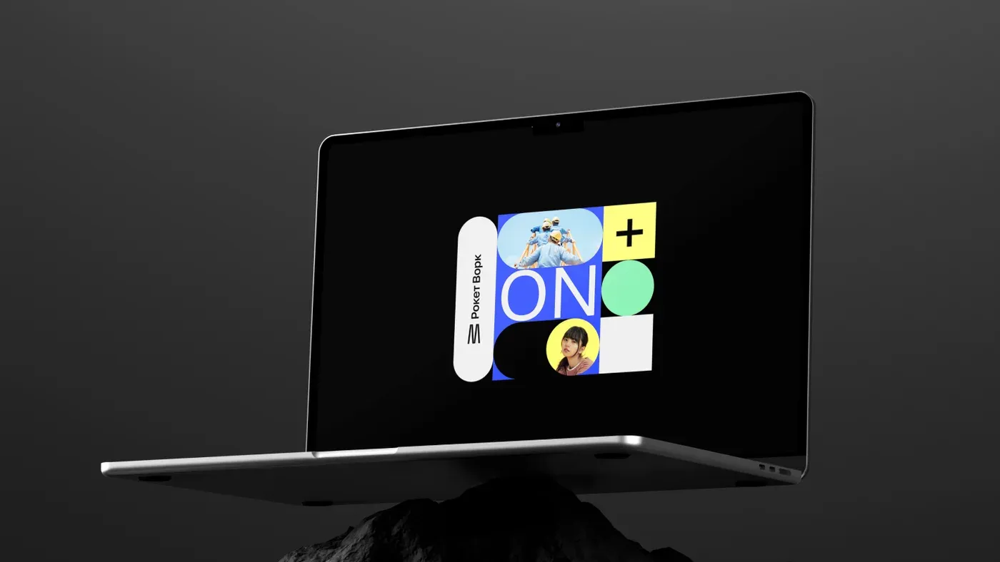
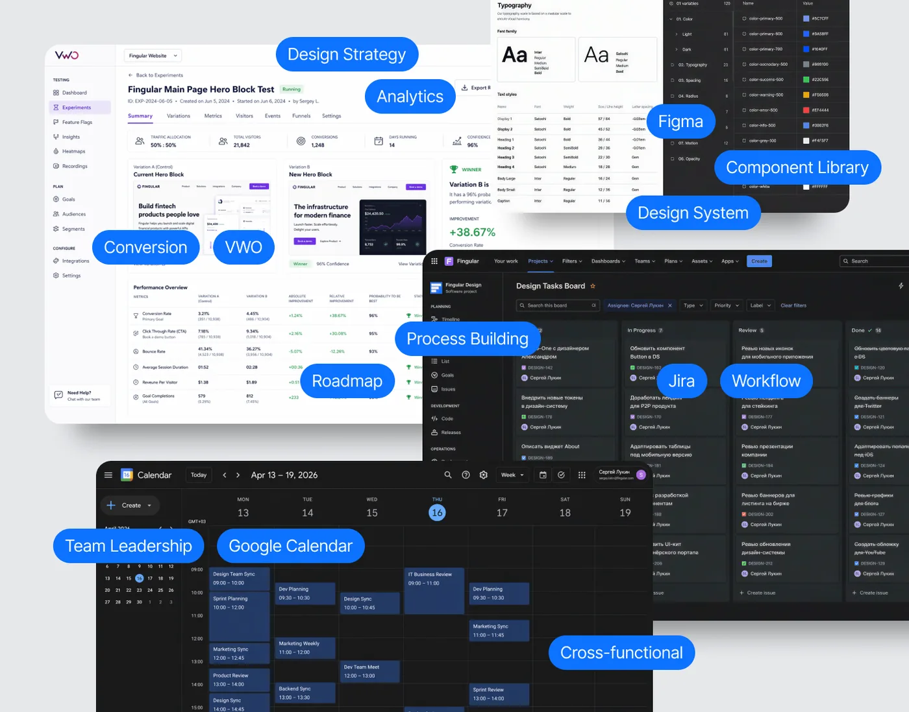
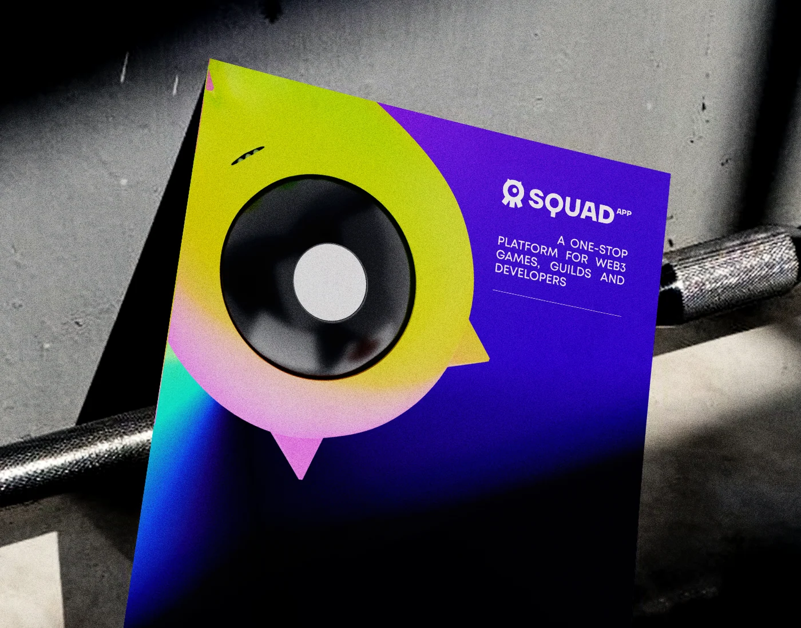
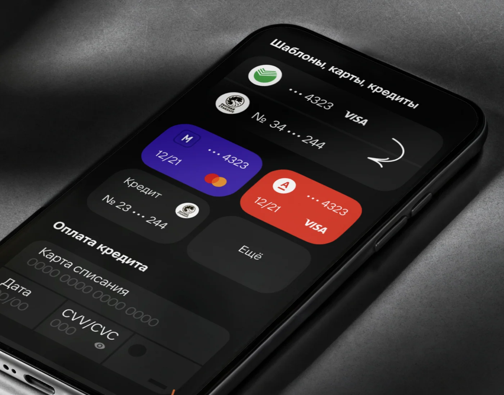
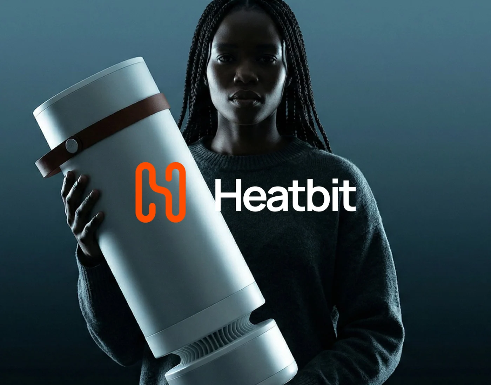

node_modules/

<!DOCTYPE html>
<html lang="ru">
<head>
<meta charset="UTF-8" />
<meta name="viewport" content="width=device-width, initial-scale=1.0" />
<meta name="color-scheme" content="dark" />
<meta name="robots" content="noindex" />
<title>404 · Страница не найдена · Сергей Лукин</title>
<!-- 404 uses ROOT-ABSOLUTE paths: the server serves this page for any missing URL,
     including /projects/xxx — relative paths would resolve from that folder and break. -->
<link rel="icon" href="/Sergey-Lookin/assets/favicon-dark.svg" type="image/svg+xml">
<link rel="icon" href="/Sergey-Lookin/assets/favicon-light.svg" type="image/svg+xml" media="(prefers-color-scheme: light)">
<link rel="apple-touch-icon" href="/Sergey-Lookin/assets/apple-touch-icon.png">
<!-- Fonts self-hosted (@font-face in core.css) — no external Google request -->
<link rel="preload" href="/Sergey-Lookin/assets/fonts/inter-tight-normal-300_700-cyrillic.woff2" as="font" type="font/woff2" crossorigin>
<link rel="preload" href="/Sergey-Lookin/assets/fonts/inter-tight-italic-300_700-cyrillic.woff2" as="font" type="font/woff2" crossorigin>
<link rel="stylesheet" href="/Sergey-Lookin/assets/core.min.css?v=68">
<link rel="stylesheet" href="/Sergey-Lookin/assets/site.min.css?v=68">
</head>
<body class="theme-dark">

<a href="#main" class="skip" data-i18n="skip">Перейти к&nbsp;содержанию</a>
<nav class="top on-dark" id="nav">
  <a class="brand" href="/Sergey-Lookin/" id="navHome" data-i18n="nav.brand" aria-label="На главную">Сергей Лукин <b>—</b> Head of Design</a>
  

    <a href="/Sergey-Lookin/" class="nav-contact" data-i18n="nav.manifesto">Манифест</a>
    ·
    <a href="/Sergey-Lookin/about.html" class="nav-contact" data-i18n="nav.about">Обо мне</a>
    ·
    <a href="/Sergey-Lookin/portfolio.html" class="nav-contact" data-i18n="nav.pf">Портфолио</a>
  

  

    

      <button type="button" data-lang="ru" class="active" aria-pressed="true">RU</button>
      ·
      <button type="button" data-lang="en" aria-pressed="false">EN</button>
    

  

</nav>

<main class="nf" data-dark id="main">
  Ошибка · 404
  <h1 class="nf__big" data-pressure aria-label="404">404</h1>
  
Похоже, такой страницы нет: она переехала, ещё не&nbsp;опубликована или ссылка устарела.

  

    <a class="nf__link" href="/Sergey-Lookin/portfolio.html" data-i18n="nf.cta1">Все проекты →</a>
    <a class="nf__link" href="/Sergey-Lookin/" data-i18n="nf.cta2">На главную →</a>
  

</main>

<footer class="foot">
  
© 2026 Сергей Лукин

  
Ошибка 404

</footer>

</body>
</html>

<!DOCTYPE html>
<html lang="ru">
<head>
<meta charset="UTF-8" />
<meta name="viewport" content="width=device-width, initial-scale=1.0" />
<meta name="color-scheme" content="dark" />
<title>Обо мне · Сергей Лукин</title>
<meta name="description" content="Сергей Лукин — Head of Design / Art Director с 12+ годами опыта. О подходе к дизайну на стыке бренда и продукта и о том, как соединяю смысл, форму и восприятие." />
<meta property="og:type" content="profile" />
<meta property="og:url" content="https://sergeylookin.github.io/Sergey-Lookin/about.html" />
<link rel="canonical" href="https://sergeylookin.github.io/Sergey-Lookin/about.html">
<meta property="og:locale" content="ru_RU" />
<meta property="og:site_name" content="Сергей Лукин — Head of Design" />
<meta property="og:title" content="Обо мне · Сергей Лукин" />
<meta property="og:description" content="Сергей Лукин — Head of Design / Art Director с 12+ годами опыта. О подходе к дизайну на стыке бренда и продукта и о том, как соединяю смысл, форму и восприятие." />
<meta property="og:image" content="https://sergeylookin.github.io/Sergey-Lookin/assets/og/og-cover.png" />
<meta name="twitter:card" content="summary_large_image" />
<meta name="twitter:title" content="Обо мне · Сергей Лукин" />
<meta name="twitter:description" content="Сергей Лукин — Head of Design / Art Director с 12+ годами опыта. О подходе к дизайну на стыке бренда и продукта и о том, как соединяю смысл, форму и восприятие." />
<meta name="twitter:image" content="https://sergeylookin.github.io/Sergey-Lookin/assets/og/og-cover.png" />
<link rel="icon" href="assets/favicon-dark.svg" type="image/svg+xml"><link rel="icon" href="assets/favicon-light.svg" type="image/svg+xml" media="(prefers-color-scheme: light)"><link rel="apple-touch-icon" href="assets/apple-touch-icon.png"><link rel="preload" href="assets/fonts/inter-tight-normal-300_700-cyrillic.woff2" as="font" type="font/woff2" crossorigin><link rel="preload" href="assets/fonts/inter-tight-italic-300_700-cyrillic.woff2" as="font" type="font/woff2" crossorigin><link rel="stylesheet" href="assets/core.min.css?v=68"><link rel="stylesheet" href="assets/site.min.css?v=68"></head>
<body class="theme-dark">
<a class="skip" href="#main">Перейти к содержанию</a>
<nav class="top on-dark" id="nav"><a class="brand" href="index.html" id="navHome" data-i18n="nav.brand" aria-label="На главную">Сергей Лукин <b>—</b> Head of Design</a>
<a href="index.html" class="nav-contact" data-i18n="nav.manifesto">Манифест</a>·<a href="about.html" class="nav-contact is-active" aria-current="page" data-i18n="nav.about">Обо мне</a>·<a href="portfolio.html" class="nav-contact" data-i18n="nav.pf">Портфолио</a>

<button type="button" data-lang="ru" class="active" aria-pressed="true">RU</button>·<button type="button" data-lang="en" aria-pressed="false">EN</button>

Обо мне

</nav>

<main id="main" class="about wrap">
  

    Пропала запятая? Дорисуйте маркером на&nbsp;мониторе
    <h1 class="about__title" data-reveal>
      Приветя&nbsp;Сергей Лукин
    </h1>
    

      
Здесь ждут: «решаю задачи бизнеса», «делаю продающий дизайн». Для&nbsp;веса можно добавить «мыслю стратегически». Всё это даже правда&nbsp;— но&nbsp;это пишут все, а&nbsp;значит, не&nbsp;пишет никто. Дальше без&nbsp;слоганов&nbsp;— то,&nbsp;что&nbsp;видно только изнутри.

      
Внешка не&nbsp;«продаёт». Внешка вызывает желание, внушает доверие, остаётся в&nbsp;памяти&nbsp;— всё, что&nbsp;случается с&nbsp;человеком в&nbsp;первую секунду, ещё до&nbsp;смысла. Если первое впечатление создаёт не&nbsp;визуал, тогда что?

      
Я&nbsp;успел поработать там, где&nbsp;дизайн делают тоннами, и&nbsp;там, где&nbsp;его выверяют по&nbsp;миллиметру. Конвейер научил меня скорости&nbsp;— и&nbsp;тому, что&nbsp;слабое решение в&nbsp;миллионе касаний становится слабым в&nbsp;миллион раз. Миллиметры&nbsp;— тому, что&nbsp;любой компромисс виден лучше всего остального.

      
Моя работа&nbsp;— превратить идею в&nbsp;образ, который сразу точный, живой, эмоциональный и&nbsp;понятный. По&nbsp;отдельности&nbsp;— несложно. Вместе&nbsp;— почти невозможно. Двенадцать лет свожу это в&nbsp;одно.

      
Лучшие решения обычно выглядят так, будто других вариантов никогда не&nbsp;существовало.

    

    

      Связаться
      

        <a class="about__contact" href="https://t.me/Lookin_Sergey" target="_blank" rel="noopener">Telegram@Lookin_Sergey</a>
        <a class="about__contact" href="mailto:lookindn@gmail.com">Emaillookindn@gmail.com</a>
        <a class="about__contact" href="https://www.behance.net/lookin_sergey" target="_blank" rel="noopener">Behancebehance.net/lookin_sergey</a>
      

    

  

  

    <!-- ░ Замени на свой подписанный портрет: сохрани файл как assets/img/about.webp ░ -->
    <!-- Первый экран: eager + fetchpriority (lazy задерживал LCP), width/height против сдвига макета -->
    
  

</main>

<footer class="foot">
© 2026 Сергей Лукин
<button class="ft-top" type="button" id="footTop" data-i18n="ft.top">Наверх ↑</button>
Обо мне
</footer>

</body>
</html>

<!DOCTYPE html>
<html lang="ru">
<head>
<meta charset="UTF-8" />
<meta name="viewport" content="width=device-width, initial-scale=1.0" />
<meta name="color-scheme" content="light dark" />
<meta name="theme-color" content="#0C0D11" media="(prefers-color-scheme: dark)" />
<meta name="theme-color" content="#F2F2F2" media="(prefers-color-scheme: light)" />
<title>Сергей Лукин — Head of Design</title>
<link rel="icon" href="assets/favicon-dark.svg" type="image/svg+xml">
<link rel="icon" href="assets/favicon-light.svg" type="image/svg+xml" media="(prefers-color-scheme: light)">
<link rel="apple-touch-icon" href="assets/apple-touch-icon.png">
<meta name="description" content="Сергей Лукин — Head of Design и арт-директор. Дизайн на стыке бренда, маркетинга, веба и продукта: манифест о подходе, портфолио и отобранные кейсы." />
<meta property="og:locale" content="ru_RU" />
<meta property="og:locale:alternate" content="en_US" />
<!-- ─── OpenGraph / Twitter Card / Schema — relative paths (host-agnostic; works under any domain or sub-path) ─── -->
<meta property="og:type" content="website" />
<meta property="og:url" content="https://sergeylookin.github.io/Sergey-Lookin/" />
<link rel="canonical" href="https://sergeylookin.github.io/Sergey-Lookin/">
<meta property="og:site_name" content="Сергей Лукин — Head of Design" />
<meta property="og:title" content="Сергей Лукин — Head of Design / Art Director" />
<meta property="og:description" content="Дизайн на стыке бренда, маркетинга, веба и продукта. Манифест, портфолио и отобранные кейсы." />
<meta property="og:image" content="https://sergeylookin.github.io/Sergey-Lookin/assets/og/og-cover.png" />
<meta property="og:image:width" content="1200" />
<meta property="og:image:height" content="630" />
<meta property="og:image:alt" content="Сергей Лукин — Head of Design / Art Director" />

<meta name="twitter:card" content="summary_large_image" />
<meta name="twitter:title" content="Сергей Лукин — Head of Design / Art Director" />
<meta name="twitter:description" content="Дизайн на стыке бренда, маркетинга, веба и продукта. Манифест, портфолио и кейсы." />
<meta name="twitter:image" content="https://sergeylookin.github.io/Sergey-Lookin/assets/og/og-cover.png" />

<!-- ─────────────────────────────────────────────────────────────────────────── -->
<!-- Fonts self-hosted (@font-face in core.css) — no external Google request.
     Preload the two above-the-fold Cyrillic faces (RU default) to avoid a swap flash. -->
<link rel="preload" href="assets/fonts/inter-tight-normal-300_700-cyrillic.woff2" as="font" type="font/woff2" crossorigin>
<link rel="preload" href="assets/fonts/inter-tight-italic-300_700-cyrillic.woff2" as="font" type="font/woff2" crossorigin>
<link rel="stylesheet" href="assets/core.min.css?v=68">
<link rel="stylesheet" href="assets/manifest.min.css?v=68">
</head>
<body>

<i></i><i></i><i></i><i></i><i></i>

<a href="#hero" class="skip-link" data-i18n="skip">Перейти к&nbsp;содержанию</a>
<nav class="top" id="nav">
<a class="brand" href="index.html" id="navHome" data-i18n="nav.brand" aria-label="На главную">Сергей Лукин <b>—</b> Head of Design</a>

<a href="index.html" class="nav-contact is-active" aria-current="page" data-i18n="nav.manifesto">Манифест</a>
·
<a href="about.html" class="nav-contact" data-i18n="nav.about">Обо мне</a>
·
<a href="portfolio.html" class="nav-contact" data-i18n="nav.pf">Портфолио</a>

<button type="button" data-lang="ru" class="active" aria-pressed="true">RU</button>
·
<button type="button" data-lang="en" aria-pressed="false">EN</button>

Манифест · 2026

</nav>
<main id="main">
<section class="hero dark" id="hero">
<canvas class="hero-neuro" aria-hidden="true"></canvas>

Как я&nbsp;строю

<h1 class="hero-title hero-title--corner" aria-label="Как я строю дизайн.">
  <em>дизайн.</em>
</h1>

Философия, выстроенная через годы работы, наблюдений и&nbsp;переосмысления того, каким должен быть дизайн.

№ 01 · 2026

Автор

Сергей Лукин Head of Design / Art Director

Признание

Best New Fintech APAC Tagline Awards

Фокус

Бренд&nbsp;· Маркетинг Веб&nbsp;· Продукт

</section>

<section id="intro">

Дизайн&nbsp;— для людей. Не&nbsp;для портфолио.

<b>00</b> / 11 → Начало

<h2 class="intro-title" data-reveal data-i18n="intro.title">Двенадцать лет дизайна&nbsp;— и&nbsp;всё меньше про&nbsp;макеты.</h2>

От&nbsp;графического дизайнера&nbsp;— до&nbsp;<strong>Head of Design</strong>. От&nbsp;федеральной <strong>enterprise</strong>-студии&nbsp;— до&nbsp;финтеха в&nbsp;Юго-Восточной Азии.

Работаю на&nbsp;стыке бренда, маркетинга, веба и&nbsp;продукта. Собираю единую систему, чтобы компания звучала цельно.

12+ лет · 3 страны · 3 компании

</section>

<section id="pain">

«Просто нарисуйте»&nbsp;— начало слабого проекта.

<b>01</b> / 11 → Симптомы

<header class="sec-head sec-head--new" data-reveal>

<h2 class="sec-title" data-i18n="pain.title">Знакомая ситуация?</h2>

Симптомы, по&nbsp;которым видно: дизайн перестал работать на&nbsp;бизнес.

</header>

<ol>
<li data-stagger>01
Маркетинг, продукт и&nbsp;разработка работают в&nbsp;разные стороны.
Размывает фокус. Замедляет запуск.</li>
<li data-stagger>02
Каждый запуск собирают заново&nbsp;— прошлые проекты не&nbsp;ускоряют новые.
Темп не&nbsp;превращается в&nbsp;скорость.</li>
<li data-stagger>03
Команда занята, но&nbsp;система не&nbsp;становится сильнее.
Знание не&nbsp;превращается в&nbsp;систему.</li>
<li data-stagger>04
Бренд теряется в&nbsp;каналах. Стиль зависит от&nbsp;исполнителя.
Узнаваемость падает, доверие&nbsp;тает.</li>
<li data-stagger>05
Руководитель тонет в&nbsp;правках. Стратегии остаётся всё меньше.
Стратегические решения откладываются.</li>
</ol>

Хаос редко выглядит как хаос. Чаще&nbsp;— как временное решение, которое осталось навсегда.

Это не&nbsp;лечится одной кнопкой. И&nbsp;не&nbsp;парой макетов.

</section>

<section id="partner">

Самый долгий спор моей карьеры.

<b>02</b> / 11 → Подход

<header class="sec-head sec-head--new" data-reveal>

<h2 class="sec-title" data-i18n="partner.title">Соавтор, а&nbsp;не&nbsp;подрядчик.</h2>

Дизайн вступает в&nbsp;задачу до&nbsp;того, как написан бриф. Иначе он&nbsp;уже исправляет, а&nbsp;не&nbsp;решает.

</header>

Сервис

Получает задачу и&nbsp;возвращает макет

<ul>
<li data-i18n="partner.svc.1">Получает бриф «в&nbsp;финальной упаковке»</li>
<li data-i18n="partner.svc.2">Спрашивает «как», не «зачем»</li>
<li data-i18n="partner.svc.3">Решает то, что ему дали</li>
<li data-i18n="partner.svc.4">Стоит на&nbsp;конце пайплайна</li>
</ul>

Партнёр

Влияет на&nbsp;решение от&nbsp;идеи до&nbsp;запуска

<ul>
<li data-i18n="partner.prt.1">Влияет на&nbsp;постановку задачи</li>
<li data-i18n="partner.prt.2">Идёт к&nbsp;маркетингу, продукту, владельцу</li>
<li data-i18n="partner.prt.3">Меняет «что делаем», а&nbsp;не&nbsp;только «как»</li>
<li data-i18n="partner.prt.4">Стоит в&nbsp;начале пайплайна</li>
</ul>

Дизайн&nbsp;— соавтор бизнеса. Голос за&nbsp;столом, где принимают решения.

</section>

<section id="principles">

То, что не&nbsp;помещается в&nbsp;портфолио.

<b>03</b> / 11 → Принципы

<header class="sec-head sec-head--new" data-reveal>

<h2 class="sec-title" data-i18n="pr.title">Во&nbsp;что я&nbsp;верю.</h2>

Четыре утверждения, на&nbsp;которых стоит всё остальное.

</header>

01

Форма не&nbsp;спасает <em>слабую мысль</em>

Сначала задача, контекст и&nbsp;решение. Потом визуальный язык, который делает это точным и&nbsp;видимым.

02

Система работает <em>без автора</em>

Правила, компоненты и&nbsp;логика должны выдерживать новые задачи, новых людей и&nbsp;новые каналы.

03

Красиво и&nbsp;работает&nbsp;— <em>не&nbsp;два требования, а&nbsp;одно.</em>

Дизайн должен помогать доверию, скорости, конверсии и&nbsp;узнаваемости.

04

Команда понимает не&nbsp;только что, но&nbsp;и&nbsp;<em>почему</em>

Команда должна понимать критерии, язык, ограничения и&nbsp;причину каждого решения.

</section>

<section id="audience">

Впечатление создают не&nbsp;картинки. Дизайн.

<b>04</b> / 11 → Аудитория

<header class="sec-head sec-head--new" data-reveal>

<h2 class="sec-title" data-i18n="aud.title">Это люди, а&nbsp;не&nbsp;цифры.</h2>

У&nbsp;аналитики нет настроения. У&nbsp;человека — есть.

</header>

01
Первое впечатление

Реакция&nbsp;— раньше понимания.

0.5с&nbsp;впечатление·10с&nbsp;до&nbsp;решения·38%&nbsp;уходят·94%&nbsp;—&nbsp;дизайн

Похоже на&nbsp;скам
Сделано как у&nbsp;банка
Не&nbsp;понятно, кому это
Чувствую профессионализм
Это не&nbsp;для меня
Выглядит как мошенники
Серьёзная компания
Хочу разобраться
Боюсь обмана
Доверие с&nbsp;первой секунды
Видно, что вложились
Странная эстетика
Похоже на&nbsp;скам
Сделано как у&nbsp;банка
Не&nbsp;понятно, кому это
Чувствую профессионализм
Это не&nbsp;для меня
Выглядит как мошенники
Серьёзная компания
Хочу разобраться
Боюсь обмана
Доверие с&nbsp;первой секунды
Видно, что вложились
Странная эстетика

02
Решение в&nbsp;моменте

На&nbsp;хороший дизайн не&nbsp;смотрят&nbsp;— его ощущают.

01:42&nbsp;сессия·44%&nbsp;бросают форму·27%&nbsp;drop-off·+27%&nbsp;возврат

Зачем им столько данных
Не&nbsp;понимаю, что от&nbsp;меня хотят
Сделали бы&nbsp;проще
Слишком много шагов
Где найти то, что нужно
Сначала покажите, ради чего
Зачем мне это
Сначала бы&nbsp;понять цену
Можно без регистрации?
Не&nbsp;успел понять&nbsp;— уже форма
Не&nbsp;разобрался
Лень читать всё это
Зачем им столько данных
Не&nbsp;понимаю, что от&nbsp;меня хотят
Сделали бы&nbsp;проще
Слишком много шагов
Где найти то, что нужно
Сначала покажите, ради чего
Зачем мне это
Сначала бы&nbsp;понять цену
Можно без регистрации?
Не&nbsp;успел понять&nbsp;— уже форма
Не&nbsp;разобрался
Лень читать всё это

03
След в&nbsp;памяти

Память хранит чувство, не&nbsp;интерфейс.

+31%&nbsp;делятся·48%&nbsp;возвращаются·+19%&nbsp;узнаваемость·+11&nbsp;NPS

Скину коллегам, грамотно сделано
У&nbsp;них реально удобно
Запомнил их&nbsp;с&nbsp;первой минуты
Один из&nbsp;лучших, что видел
Расскажу в&nbsp;команде
Сам бы&nbsp;так не&nbsp;сделал
Вернусь к&nbsp;ним точно
Сразу поделился ссылкой
Сделано на&nbsp;уровне
Помню, как было приятно
Это конкурентам пример
Запомнил название
Скину коллегам, грамотно сделано
У&nbsp;них реально удобно
Запомнил их&nbsp;с&nbsp;первой минуты
Один из&nbsp;лучших, что видел
Расскажу в&nbsp;команде
Сам бы&nbsp;так не&nbsp;сделал
Вернусь к&nbsp;ним точно
Сразу поделился ссылкой
Сделано на&nbsp;уровне
Помню, как было приятно
Это конкурентам пример
Запомнил название

Человек чувствует раньше, чем&nbsp;читает. Если первое ощущение слабое, функциям приходится заново доказывать <em>доверие</em>.

</section>

<section id="brand">

Дизайнер почти никогда не&nbsp;работает свободно&nbsp;— он всё время торгуется с&nbsp;ограничениями.

<b>05</b> / 11 → Бренд-стратегия

<header class="sec-head sec-head--new" data-reveal>

<h2 class="sec-title" data-i18n="br.title">Как складывается бренд.</h2>

Бренд&nbsp;— не&nbsp;логотип. Это повторяемые решения: как звучим, как выглядим, как двигаемся, как держим качество.

</header>

<svg viewBox="0 0 64 64" fill="currentColor" xmlns="http://www.w3.org/2000/svg" aria-hidden="true"><path class="bicon-spark-core" d="M 32 12 Q 32 30 46 32 Q 32 34 32 52 Q 32 34 18 32 Q 32 30 32 12 Z"/><path class="bicon-spark-sat bicon-spark-a-fill" d="M 52 6 Q 52 10.5 57 11 Q 52 11.5 52 16 Q 52 11.5 47 11 Q 52 10.5 52 6 Z"/><path class="bicon-spark-sat bicon-spark-a-line" d="M 52 6 Q 52 10.5 57 11 Q 52 11.5 52 16 Q 52 11.5 47 11 Q 52 10.5 52 6 Z" fill="none" stroke="currentColor" stroke-width="1.3"/><path class="bicon-spark-sat bicon-spark-b-fill" d="M 12 48 Q 12 52.5 17 53 Q 12 53.5 12 58 Q 12 53.5 7 53 Q 12 52.5 12 48 Z"/><path class="bicon-spark-sat bicon-spark-b-line" d="M 12 48 Q 12 52.5 17 53 Q 12 53.5 12 58 Q 12 53.5 7 53 Q 12 52.5 12 48 Z" fill="none" stroke="currentColor" stroke-width="1.3"/><path class="bicon-spark-sat bicon-spark-c-fill" d="M 14 15 Q 14 17.5 17 18 Q 14 18.5 14 21 Q 14 18.5 11 18 Q 14 17.5 14 15 Z"/><path class="bicon-spark-sat bicon-spark-c-line" d="M 14 15 Q 14 17.5 17 18 Q 14 18.5 14 21 Q 14 18.5 11 18 Q 14 17.5 14 15 Z" fill="none" stroke="currentColor" stroke-width="1.3"/></svg>

Контекст

Рынок, конкуренты, аудитория, цели бизнеса. Что знаем точно, а&nbsp;что только предполагаем.

<svg viewBox="0 0 64 64" fill="currentColor" xmlns="http://www.w3.org/2000/svg" aria-hidden="true"><circle class="bicon-pos-dot bicon-pos-d1"  cx="57"    cy="32"    r="1.4"/><circle class="bicon-pos-dot bicon-pos-d2"  cx="53.65" cy="44.5"  r="1.4"/><circle class="bicon-pos-dot bicon-pos-d3"  cx="44.5"  cy="53.65" r="1.4"/><circle class="bicon-pos-dot bicon-pos-d4"  cx="32"    cy="57"    r="1.4"/><circle class="bicon-pos-dot bicon-pos-d5"  cx="19.5"  cy="53.65" r="1.4"/><circle class="bicon-pos-dot bicon-pos-d6"  cx="10.35" cy="44.5"  r="1.4"/><circle class="bicon-pos-dot bicon-pos-d7"  cx="7"     cy="32"    r="1.4"/><circle class="bicon-pos-dot bicon-pos-d8"  cx="10.35" cy="19.5"  r="1.4"/><circle class="bicon-pos-dot bicon-pos-d9"  cx="19.5"  cy="10.35" r="1.4"/><circle class="bicon-pos-dot bicon-pos-d10" cx="32"    cy="7"     r="1.4"/><circle class="bicon-pos-dot bicon-pos-d11" cx="44.5"  cy="10.35" r="1.4"/><circle class="bicon-pos-dot bicon-pos-d12" cx="53.65" cy="19.5"  r="1.4"/><path class="bicon-compass" d="M 32 22 L 40 42 L 32 38 L 24 42 Z" stroke="currentColor" stroke-width="1.5" stroke-linejoin="round"/></svg>

Позиция

Для кого мы, против кого, и&nbsp;о&nbsp;чём мы&nbsp;принципиально молчим. Без второго первое не&nbsp;работает.

<svg viewBox="0 0 64 64" fill="currentColor" xmlns="http://www.w3.org/2000/svg" aria-hidden="true"><rect class="bicon-eq bicon-eq-1" x="7" y="28" width="2.5" height="8" rx="1.25"/><rect class="bicon-eq bicon-eq-2" x="14" y="23" width="2.5" height="18" rx="1.25"/><rect class="bicon-eq bicon-eq-3" x="21" y="18" width="2.5" height="28" rx="1.25"/><rect class="bicon-eq bicon-eq-4" x="28" y="25" width="2.5" height="14" rx="1.25"/><rect class="bicon-eq bicon-eq-5" x="35" y="20" width="2.5" height="24" rx="1.25"/><rect class="bicon-eq bicon-eq-6" x="42" y="27" width="2.5" height="10" rx="1.25"/><rect class="bicon-eq bicon-eq-7" x="49" y="23" width="2.5" height="18" rx="1.25"/><rect class="bicon-eq bicon-eq-8" x="56" y="29" width="2.5" height="6" rx="1.25"/></svg>

Голос

Как звучит бренд в&nbsp;письме, в&nbsp;баннере, в&nbsp;техподдержке. Тон, который узнают.

<svg viewBox="0 0 64 64" fill="currentColor" xmlns="http://www.w3.org/2000/svg" aria-hidden="true"><text class="bicon-aa-letter" x="22" y="46" text-anchor="middle" font-family="Fraunces,Georgia,serif" font-size="44" fill="currentColor">A</text><text class="bicon-aa-letter" x="44" y="46" text-anchor="middle" font-family="Fraunces,Georgia,serif" font-size="32" fill="currentColor">a</text></svg>

Визуальный язык

Типографика, цвет, образ, motion, фотостиль. Не&nbsp;«логотип и&nbsp;палитра», а&nbsp;целая грамматика.

<svg viewBox="0 0 64 64" fill="currentColor" xmlns="http://www.w3.org/2000/svg" aria-hidden="true"><line class="bicon-sys-ray bicon-sys-r1" x1="54" y1="32" x2="40" y2="32" stroke="currentColor" stroke-width="1.5" stroke-linecap="round"/><line class="bicon-sys-ray bicon-sys-r2" x1="43" y1="13" x2="36" y2="25" stroke="currentColor" stroke-width="1.5" stroke-linecap="round"/><line class="bicon-sys-ray bicon-sys-r3" x1="21" y1="13" x2="28" y2="25" stroke="currentColor" stroke-width="1.5" stroke-linecap="round"/><line class="bicon-sys-ray bicon-sys-r4" x1="10" y1="32" x2="24" y2="32" stroke="currentColor" stroke-width="1.5" stroke-linecap="round"/><line class="bicon-sys-ray bicon-sys-r5" x1="21" y1="51" x2="28" y2="39" stroke="currentColor" stroke-width="1.5" stroke-linecap="round"/><line class="bicon-sys-ray bicon-sys-r6" x1="43" y1="51" x2="36" y2="39" stroke="currentColor" stroke-width="1.5" stroke-linecap="round"/><circle cx="56" cy="32" r="2"/><circle cx="44" cy="11" r="2"/><circle cx="20" cy="11" r="2"/><circle cx="8" cy="32" r="2"/><circle cx="20" cy="53" r="2"/><circle cx="44" cy="53" r="2"/><circle cx="32" cy="32" r="5"/></svg>

Система

Как айдентика разворачивается на&nbsp;сайт, соцсети, продукт, презентации, наружку.

<svg viewBox="0 0 64 64" fill="currentColor" xmlns="http://www.w3.org/2000/svg" aria-hidden="true"><circle class="bicon-ripple" cx="32" cy="32" r="27" fill="none" stroke="currentColor" stroke-width="1.5"/><circle class="bicon-ripple bicon-ripple-2" cx="32" cy="32" r="27" fill="none" stroke="currentColor" stroke-width="1.5"/><circle cx="32" cy="32" r="4"/></svg>

Запуск

Замеры, итерации, доля голоса, brand recall. Бренд&nbsp;— это не&nbsp;запуск. Это поддержка.

</section>
<section id="evaluation">

Работа закончена, когда работает в&nbsp;реальности.

<b>06</b> / 11 → Оценка

<header class="sec-head sec-head--new" data-reveal>

<h2 class="sec-title" data-i18n="ev.title">Как оцениваю работу.</h2>

Четыре уровня. Решение проходит проверку только если работает на&nbsp;всех четырёх.

</header>

Уровень 1

Логика

Пользователь понимает: куда нажать, что произойдёт, зачем это нужно. Если требует объяснения — решение слабое.

Понял?

Уровень 2

Форма

Иерархия, контраст, ритм, типографика, баланс. Здесь живёт ремесло — и&nbsp;здесь работает экспрессия.

Сделано?

Уровень 3

Система

Можно ли&nbsp;развернуть на&nbsp;десять каналов? Выдержит ли&nbsp;новые сценарии? Насколько решение едино с&nbsp;брендом?

Выдержит?

Уровень 4

Бизнес

Помогает ли&nbsp;это бизнесу? Конверсии, retention, узнаваемость, скорость.

Сработало?

0<em>%</em>

Стратегия, процессы, команда&nbsp;— то, что делает визуал возможным

/

0<em>%</em>

Визуал&nbsp;— финальная форма того, что было сделано до

Можно нарисовать идеальный экран&nbsp;— и&nbsp;проиграть проект. Можно собрать слабый&nbsp;— и&nbsp;выиграть. Разница в&nbsp;этих 69%.

</section>

<section id="team" class="dark">

Команда ломается от&nbsp;неясности, не&nbsp;от&nbsp;нагрузки.

<b>07</b> / 11 → Команда

<header class="tm-head" data-reveal>
<h2 class="sec-title" data-i18n="tm.title">Как работаю с&nbsp;командой.</h2>
</header>

Подход

Я&nbsp;веду команду&nbsp;— и&nbsp;продолжаю <em>рисовать</em>.

В&nbsp;работе

Остаюсь внутри работы: смотрю макеты, спорю за&nbsp;решения, держу связь с&nbsp;бизнесом.

Принцип

Команда, которая понимает принципы, не&nbsp;ждёт <em>согласований</em> на&nbsp;каждый шаг.

<svg class="look-badge__ring" viewBox="0 0 100 100" aria-hidden="true">
<defs><path id="lookRingPath" d="M50,11 a39,39 0 1,1 0,78 a39,39 0 1,1 0,-78"/></defs>
<text class="lb-ru" xml:space="preserve"><textPath href="#lookRingPath" startOffset="0" textLength="245" lengthAdjust="spacing">СЕРГЕЙ ЛУКИН · HEAD OF DESIGN · </textPath></text>
<text class="lb-en" xml:space="preserve"><textPath href="#lookRingPath" startOffset="0" textLength="245" lengthAdjust="spacing">SERGEY LOOKIN · HEAD OF DESIGN · </textPath></text>
</svg>
<svg class="look-badge__logo" viewBox="0 0 131 140" fill="currentColor" aria-hidden="true">
<path d="M22.8833 70.1523C10.2692 70.1523 0 59.8831 0 47.269V0.65918H21.7975V47.269C21.7975 47.8697 22.2826 48.3549 22.8833 48.3549H62.5392V70.1523H22.8833Z"/>
<path d="M95.461 70.7291C85.6192 70.7291 76.1355 66.5706 69.4588 59.3164C62.7821 52.0621 59.4091 42.2665 60.2177 32.4132C61.6154 15.398 75.5002 1.51323 92.5154 0.115514C93.4972 0.0346542 94.4906 0 95.461 0C105.268 0 114.729 4.1354 121.417 11.355C128.186 18.667 131.49 28.1738 130.727 38.1542C129.399 55.3427 115.445 69.3083 98.2448 70.6252C97.3207 70.6945 96.3851 70.7291 95.461 70.7291ZM95.461 21.7975C94.5484 21.7975 93.6127 21.8899 92.6886 22.0747C87.5598 23.1143 83.3551 27.2151 82.2231 32.2861C81.3221 36.3291 82.3039 40.5107 84.9145 43.7567C87.5483 47.0372 91.3833 48.9201 95.461 48.9201C96.4428 48.9201 97.4362 48.8046 98.4297 48.5851C103.547 47.4415 107.694 43.2022 108.745 38.0156C109.565 33.9726 108.583 29.9989 105.984 26.8223C103.362 23.6226 99.527 21.7859 95.461 21.7859V21.7975Z"/>
<path d="M35.3701 139.579C25.5284 139.579 16.0447 135.42 9.36798 128.166C2.67972 120.923 -0.681728 111.116 0.115318 101.275C1.51304 84.2593 15.3978 70.3746 32.413 68.9768C33.3949 68.896 34.3883 68.8613 35.3586 68.8613C45.1657 68.8613 54.6263 72.9967 61.3146 80.2163C68.0837 87.5284 71.3874 97.0352 70.6134 107.016C69.285 124.204 55.3309 138.17 38.1309 139.487C37.2068 139.556 36.2712 139.59 35.347 139.59L35.3701 139.579ZM35.3701 90.6588C34.4576 90.6588 33.5219 90.7512 32.5978 90.936C27.469 91.9757 23.2643 96.0764 22.1323 101.147C21.2312 105.19 22.2131 109.372 24.8237 112.618C27.4574 115.899 31.2925 117.781 35.3586 117.781C36.3405 117.781 37.3339 117.666 38.3273 117.446C43.4446 116.303 47.5915 112.064 48.6427 106.877C49.4628 102.834 48.481 98.8603 45.8819 95.6836C43.2597 92.4839 39.4247 90.6472 35.3586 90.6472L35.3701 90.6588Z"/>
<path d="M106.088 139.645L98.7871 125.691C97.9439 124.154 97.2046 122.791 96.5577 121.578C95.2177 119.072 93.82 116.484 93.1616 115.745C92.919 115.71 92.3992 115.653 91.2787 115.653C90.8744 115.653 90.447 115.653 89.985 115.664V139.633H68.1875V70.1401H89.985V94.0284C90.5048 94.0284 90.9899 94.0399 91.4404 94.0399C92.4339 94.0399 92.9306 93.9937 93.1616 93.959C93.8085 93.2082 95.1369 90.7362 96.4306 88.3451C97.1122 87.086 97.8861 85.6421 98.7987 83.9902L106.088 70.0361H130.681L117.997 94.3634C117.639 94.9987 117.2 95.8535 116.703 96.8469C115.548 99.1456 114.104 102.01 112.198 104.817C114.15 107.694 115.617 110.651 116.796 113.007C117.246 113.92 117.651 114.74 118.032 115.41L130.704 139.599H106.088V139.645Z"/>
</svg>

</section>

<section id="mentor" class="dark">

Скиллы можно нанять. Сильную команду — только вырастить.

<b>08</b> / 11 → Менторство

<svg class="mentor-lines" aria-hidden="true"></svg>
<h2 class="mentor-core" data-i18n="mentor.title">Менторство</h2>

<button class="msat" data-side="left"  data-i18n="mentor.sat.1"  data-desc-ru="Регулярный диалог тет-а-тет. Место, где можно говорить честно — не для протокола." data-desc-en="A regular conversation, just the two of us. The place where things can be said honestly — off the record." type="button">1:1 созвоны</button>
<button class="msat" data-side="left"  data-i18n="mentor.sat.2"  data-desc-ru="Работаем вместе над одной задачей. Показываю не результат — ход мысли." data-desc-en="We work the same task together. I show the thinking, not the outcome." type="button">Парные сессии</button>
<button class="msat" data-side="left"  data-i18n="mentor.sat.3"  data-desc-ru="Не «нравится / не нравится». А «почему так» и «где можно лучше»." data-desc-en="Not “like” or “don’t like.” Why it’s done this way — and where it could be better." type="button">Ревью макетов</button>
<button class="msat" data-side="left"  data-i18n="mentor.sat.5"  data-desc-ru="Учу аргументировать перед бизнесом. Дизайн без защиты — просто картинка." data-desc-en="Learning to argue the work in front of the business. Design that can’t be defended is just a picture." type="button">Защита решений</button>
<button class="msat" data-side="left"  data-i18n="mentor.sat.6"  data-desc-ru="Стыки с продуктом, разработкой, маркетингом. Дизайнер не работает в вакууме." data-desc-en="The seams with product, engineering, marketing. Designers don’t work in a vacuum." type="button">Кросс-команды</button>
<button class="msat" data-side="left"  data-i18n="mentor.sat.7"  data-desc-ru="Не насмотренность ради насмотренности. Умение видеть приём — и переносить его в свою задачу." data-desc-en="Not collecting for the sake of it. Seeing the move — and bringing it into your own work." type="button">Референсы</button>
<button class="msat" data-side="left"  data-i18n="mentor.sat.19" data-desc-ru="Короткие выступления внутри команды. Систематизирую опыт, чтобы он не лежал в одной голове." data-desc-en="Short talks inside the team. Turning experience into something the team owns, not just one head." type="button">Лекции</button>
<button class="msat" data-side="left"  data-i18n="mentor.sat.20" data-desc-ru="Свои и чужие. Что сработало, что нет — и почему именно так." data-desc-en="Ours and theirs. What worked, what didn’t — and why exactly." type="button">Разбор кейсов</button>
<button class="msat" data-side="left"  data-i18n="mentor.sat.16" data-desc-ru="Мыслить системой, а не отдельным макетом. Айдентика начинается с логики — не со стиля." data-desc-en="Thinking in systems, not in single mockups. Identity starts with logic, not style." type="button">Брендинг</button>
<button class="msat" data-side="left"  data-i18n="mentor.sat.25" data-desc-ru="Конкретно и по делу. Без «молодец» — и без «переделай всё»." data-desc-en="Specific, on the work. No “nice job” — and no “redo everything.”" type="button">Похвала и&nbsp;критика</button>
<button class="msat" data-side="right" data-i18n="mentor.sat.8"  data-desc-ru="Где сейчас. Куда идём. Что прокачиваем по пути." data-desc-en="Where you are now. Where you’re going. What you sharpen on the way." type="button">План развития</button>
<button class="msat" data-side="right" data-i18n="mentor.sat.9"  data-desc-ru="Прозрачные критерии для junior, middle, senior. Чтобы рост не зависел от настроения руководителя." data-desc-en="Transparent criteria for junior, middle, senior. So growth doesn’t depend on the lead’s mood." type="button">Грейды</button>
<button class="msat" data-side="right" data-i18n="mentor.sat.11" data-desc-ru="Учу читать данные. Принимать решения — не только вкусом." data-desc-en="Learning to read the data. Not deciding by taste alone." type="button">Аналитика</button>
<button class="msat" data-side="right" data-i18n="mentor.sat.12" data-desc-ru="Коммуникация, переговоры, обратная связь. Половина успеха дизайнера — вне Figma." data-desc-en="Communication, negotiation, feedback. Half of a designer’s success lives outside Figma." type="button">Софт-скиллы</button>
<button class="msat" data-side="right" data-i18n="mentor.sat.14" data-desc-ru="Помогаю выбрать траекторию. Вглубь экспертизы — или вширь, в менеджмент." data-desc-en="Helping pick the path. Deeper into craft — or wider into management." type="button">Карьера</button>
<button class="msat" data-side="right" data-i18n="mentor.sat.15" data-desc-ru="База, которую почти все недоучили. Возвращаемся к ней снова и снова." data-desc-en="The foundation almost everyone half-learned. We come back to it again and again." type="button">Типографика</button>
<button class="msat" data-side="right" data-i18n="mentor.sat.17" data-desc-ru="Когда стоит выйти за пределы статики. И — главное — когда не стоит." data-desc-en="When to step beyond static. And, more importantly, when not to." type="button">Моушн и&nbsp;3D</button>
<button class="msat" data-side="right" data-i18n="mentor.sat.18" data-desc-ru="Формулируем гипотезы. Проверяем на пользователях — не на коллегах." data-desc-en="We form hypotheses. We test them on users — not on coworkers." type="button">UX-исследования</button>
<button class="msat" data-side="right" data-i18n="mentor.sat.21" data-desc-ru="Формат менторства под человека. Кому-то план, кому-то вопросы, кому-то пауза." data-desc-en="Mentorship shaped to the person. Some need a plan, some need questions, some need silence." type="button">Психотип</button>
<button class="msat" data-side="right" data-i18n="mentor.sat.22" data-desc-ru="Слышать до того, как объяснили. Без этого менторство — инструкция." data-desc-en="Hearing what wasn’t said. Without it, mentorship is just an instruction manual." type="button">Эмпатия</button>

</section>

<section id="ds">

Видят результат. Не&nbsp;видят работу.

<b>09</b> / 11 → Ремесло

<header class="sec-head sec-head--new" data-reveal>

<h2 class="sec-title" data-i18n="ds.title">Не&nbsp;наука. Не&nbsp;искусство.</h2>

Что человек чувствует, но&nbsp;описать не&nbsp;может.

</header>

<article class="craft-card" data-craft-i="1">
01
Один брендовый красный.

Со&nbsp;стороныОдин брендовый красный.

Тысячи оттенков одного красного. Тёплый&nbsp;— про доверие. Холодный&nbsp;— про тревогу. Светлый исчезнет, тёмный раздавит. Без контекста и&nbsp;пары рядом цвет ничего не&nbsp;значит.

</article>
<article class="craft-card" data-craft-i="2">
02
Одна кнопка на&nbsp;экране.

Со&nbsp;стороныОдна кнопка на&nbsp;экране.

Девять состояний. Восемь не&nbsp;видны на&nbsp;скриншоте. Кнопка живёт в&nbsp;движении&nbsp;— не&nbsp;в&nbsp;макете. Хорошая отвечает. Плохая молчит.

</article>
<article class="craft-card" data-craft-i="3">
03
Один шрифт.

Со&nbsp;стороныОдин шрифт.

Восемнадцать начертаний&nbsp;— для тела, заголовков, цифр, цитат. Размер повышает голос. У&nbsp;типографики свои законы. Чтение&nbsp;— единственное, что умеем только мы.

</article>
<article class="craft-card" data-craft-i="4">
04
Одна композиция на&nbsp;странице.

Со&nbsp;стороныОдна композиция на&nbsp;странице.

Сетка. Иерархия. Ритм. Воздух между блоками&nbsp;— тоже элемент. То, что глаз видит раньше слова и&nbsp;на&nbsp;что отвечает раньше мысли.

</article>
<article class="craft-card" data-craft-i="5">
05
Задача нарисовать макет.

Со&nbsp;стороныЗадача нарисовать макет.

Собрать цвет, кнопку, шрифт и&nbsp;ритм&nbsp;— в&nbsp;одно ощущение. Чтобы человек посмотрел и&nbsp;захотел, не&nbsp;зная почему. И&nbsp;не&nbsp;смог описать словами.

</article>

Все говорят про дизайн. Никто не&nbsp;знает, что это.

</section>

<section id="results">

Сильный дизайн выдерживает реальность.

<b>10</b> / 11 → Результаты

<header class="sec-head sec-head--new">

<h2 class="sec-title" data-i18n="rs.title">Что получает бизнес.</h2>

Что меняется внутри команды и&nbsp;в&nbsp;восприятии продукта.

</header>

<article class="rs-panel" data-i="0">

01

BRAND
<h3 class="rs-card__title" data-i18n="rs.1.t">Один бренд во&nbsp;всех касаниях</h3>

Лендинг, продукт, реклама, презентация&nbsp;— части одной системы. Клиент видит зрелость, а&nbsp;не&nbsp;пять разных компаний.

</article>
<article class="rs-panel" data-i="1">

02

SPEED
<h3 class="rs-card__title" data-i18n="rs.2.t">Релизы быстрее в&nbsp;разы</h3>

Когда команда опирается на&nbsp;систему, дизайн перестаёт быть бутылочным горлом. То, что раньше шло месяц, выходит за&nbsp;неделю.

</article>
<article class="rs-panel" data-i="2">

03

FOCUS
<h3 class="rs-card__title" data-i18n="rs.3.t">Команды&nbsp;— в&nbsp;одну сторону</h3>

Маркетинг, продукт, разработка опираются на&nbsp;одни принципы. Меньше политики&nbsp;— больше работы для рынка.

</article>
<article class="rs-panel" data-i="3">

04

TRUST
<h3 class="rs-card__title" data-i18n="rs.4.t">Бренд воспринимается дороже</h3>

Когда касания согласованны, цена ощущается оправданной. Премиум&nbsp;— это не&nbsp;позолота, а&nbsp;порядок.

</article>
<article class="rs-panel" data-i="4">

05

CRITERIA
<h3 class="rs-card__title" data-i18n="rs.5.t">Решения по&nbsp;критериям, а&nbsp;не по&nbsp;вкусу</h3>

Дизайн перестаёт быть личным мнением. Спор переходит из&nbsp;«мне не&nbsp;нравится» в&nbsp;«это работает».

</article>

</section>

<section id="companies">

Двенадцать лет в&nbsp;трёх главах.

<b>11</b> / 11 → Опыт

<header class="sec-head sec-head--new" data-reveal>

<h2 class="sec-title" data-i18n="co.title">Где работал и&nbsp;над чем.</h2>

Три места работы за&nbsp;12+ лет. От&nbsp;федеральных корпораций до&nbsp;глобального финтеха в&nbsp;ЮВА.

</header>

2023→Now

Fingular

Head of Design

Глобальный необанк, штаб-квартира в&nbsp;Сингапуре. Пересобрал команду с&nbsp;2 до&nbsp;11, построил две дизайн-системы и&nbsp;15+ бренд-айдентик.

Best New Fintech APAC 2024 · The Next 100 Global Companies

2021—2023

Choise.com (ex-Crypterium)

Lead Designer

Web3-экосистема: MetaFi-криптобанк, 750K+ пользователей в&nbsp;170+ странах, и&nbsp;Chobies NTO. Ребрендинг Crypterium&nbsp;→ Choise.com без потери аудитории.

CHO-токен: ATH $1,38 TOP-500 CoinMarketCap

2015—2021

Veonix

Арт-директор

Московская enterprise-студия. 200+ проектов для федеральных брендов, аудитория 10M+ в&nbsp;день. Команда выросла с&nbsp;5 до&nbsp;50+ человек.

Tagline Awards Удержание клиентов&nbsp;— 70%

Бренды, с&nbsp;которыми работал

SberGazpromLukoilRosneftPepsiMacCoffeeMcDonald'sMetroSportmasterSiburBeelineCTCL'ÉtoileKasperskyKiaRosatomEvrazDarkside

</section>

<section id="cta" class="dark">

Если зацепил подход
Автор&nbsp;· Сергей Лукин

<h2 class="cta-title" data-reveal-num data-i18n="cta.title">Давайте <em>поговорим</em>.</h2>

Не&nbsp;обязательно о&nbsp;работе. Для начала&nbsp;— просто познакомиться. Остальное потом.

<a class="cta-mega-item" href="https://t.me/Lookin_Sergey" target="_blank" rel="noopener">
01
↗
Telegram
@Lookin_Sergey
</a>
<a class="cta-mega-item" href="mailto:lookindn@gmail.com">
02
↗
Email
lookindn@gmail.com
</a>
<a class="cta-mega-item" href="https://www.behance.net/lookin_sergey" target="_blank" rel="noopener">
03
↗
Behance
behance.net/lookin_sergey
</a>

</section>
</main>

<footer class="foot">

© 2026 Сергей Лукин

<button class="ft-top" type="button" id="footTop" data-i18n="ft.top">Наверх ↑</button>

Дизайн-манифест

</footer>

<!-- ─── Mobile burger menu (pages + language) + footer cleanup ─── -->
<!-- Former inline <style> moved to assets/core.min.css (shared burger/dropdown)
     and assets/manifest.min.css (anti-flicker + manifest-only mobile tweaks). -->

</body>
</html>

{
  "name": "portfolio",
  "version": "1.0.0",
  "description": "Sergey Lukin — Head of Design portfolio (static site + small build tooling)",
  "private": true,
  "type": "commonjs",
  "scripts": {
    "build": "node tools/minify.mjs && node tools/build-pages.mjs",
    "check": "node tools/build-pages.mjs --check",
    "minify": "node tools/minify.mjs",
    "images": "node tools/build-images.mjs --build",
    "srcset": "node tools/inject-srcset.mjs"
  },
  "license": "ISC",
  "devDependencies": {
    "esbuild": "^0.28.1",
    "lighthouse": "^13.4.0",
    "postcss": "^8.5.19",
    "postcss-selector-parser": "^7.1.4",
    "sharp": "^0.35.3"
  }
}

{
  "name": "portfolio",
  "version": "1.0.0",
  "lockfileVersion": 3,
  "requires": true,
  "packages": {
    "": {
      "name": "portfolio",
      "version": "1.0.0",
      "license": "ISC",
      "devDependencies": {
        "esbuild": "^0.28.1",
        "lighthouse": "^13.4.0",
        "postcss": "^8.5.19",
        "postcss-selector-parser": "^7.1.4",
        "sharp": "^0.35.3"
      }
    },
    "node_modules/@emnapi/runtime": {
      "version": "1.11.2",
      "resolved": "https://registry.npmjs.org/@emnapi/runtime/-/runtime-1.11.2.tgz",
      "integrity": "sha512-kyOl3X0DuTiT1h2ft8r2fYO8JYtU9a9Xis/zBSiGArNaagCOWx90N1k2wxp18czFDH+OgcWGb5ZP/XMt3dcyPA==",
      "dev": true,
      "license": "MIT",
      "optional": true,
      "dependencies": {
        "tslib": "^2.4.0"
      }
    },
    "node_modules/@esbuild/aix-ppc64": {
      "version": "0.28.1",
      "resolved": "https://registry.npmjs.org/@esbuild/aix-ppc64/-/aix-ppc64-0.28.1.tgz",
      "integrity": "sha512-Svl7tq8k/08+p6CXPpRjQ1fKX+1odH/BQbb48fV6fj3CWHhsoIOoY87w1oHXm0qEpkIK3ZfVgp0hed3XBXzXMQ==",
      "cpu": [
        "ppc64"
      ],
      "dev": true,
      "license": "MIT",
      "optional": true,
      "os": [
        "aix"
      ],
      "engines": {
        "node": ">=18"
      }
    },
    "node_modules/@esbuild/android-arm": {
      "version": "0.28.1",
      "resolved": "https://registry.npmjs.org/@esbuild/android-arm/-/android-arm-0.28.1.tgz",
      "integrity": "sha512-0k2F129Xdio1TdJfzJ8sy1Q47vUD2NnwdhiAf7drUN1EBTfPf4hsFCtmMgu/6m8JSzsBrlmVjudMBQqOfG8usQ==",
      "cpu": [
        "arm"
      ],
      "dev": true,
      "license": "MIT",
      "optional": true,
      "os": [
        "android"
      ],
      "engines": {
        "node": ">=18"
      }
    },
    "node_modules/@esbuild/android-arm64": {
      "version": "0.28.1",
      "resolved": "https://registry.npmjs.org/@esbuild/android-arm64/-/android-arm64-0.28.1.tgz",
      "integrity": "sha512-34EGEbCIAgosYz6goLcopX6Mo7NyGv9tfwEM2/7Ce2VcVRk568iSvniGWcUXIy7wEDR1wzolcxcriFVrWYcwBg==",
      "cpu": [
        "arm64"
      ],
      "dev": true,
      "license": "MIT",
      "optional": true,
      "os": [
        "android"
      ],
      "engines": {
        "node": ">=18"
      }
    },
    "node_modules/@esbuild/android-x64": {
      "version": "0.28.1",
      "resolved": "https://registry.npmjs.org/@esbuild/android-x64/-/android-x64-0.28.1.tgz",
      "integrity": "sha512-dbwY7ltSMDWsRatcRpCnES4F+im88OCUgGZjy52shC7GqHRE/cYlxNbB4Z4UpJswpcc4Qxd2oE/ufM0p61IKng==",
      "cpu": [
        "x64"
      ],
      "dev": true,
      "license": "MIT",
      "optional": true,
      "os": [
        "android"
      ],
      "engines": {
        "node": ">=18"
      }
    },
    "node_modules/@esbuild/darwin-arm64": {
      "version": "0.28.1",
      "resolved": "https://registry.npmjs.org/@esbuild/darwin-arm64/-/darwin-arm64-0.28.1.tgz",
      "integrity": "sha512-TZbWkQY7kvTAXbXUT7uVACR5cMHsDiSz9z7ZKAX/RTq/WJEk3QyRr0wZpNhBDX+/0CtdqUIJlOiodQcta6tY3Q==",
      "cpu": [
        "arm64"
      ],
      "dev": true,
      "license": "MIT",
      "optional": true,
      "os": [
        "darwin"
      ],
      "engines": {
        "node": ">=18"
      }
    },
    "node_modules/@esbuild/darwin-x64": {
      "version": "0.28.1",
      "resolved": "https://registry.npmjs.org/@esbuild/darwin-x64/-/darwin-x64-0.28.1.tgz",
      "integrity": "sha512-zfdzgK9ACBNZLI/CyHTOx81SyNbM6YXn7rxSgX97VjyiPl9W1i4Ka4fgKECEoFCKGpvBj5qArWIGgQjOwkgskQ==",
      "cpu": [
        "x64"
      ],
      "dev": true,
      "license": "MIT",
      "optional": true,
      "os": [
        "darwin"
      ],
      "engines": {
        "node": ">=18"
      }
    },
    "node_modules/@esbuild/freebsd-arm64": {
      "version": "0.28.1",
      "resolved": "https://registry.npmjs.org/@esbuild/freebsd-arm64/-/freebsd-arm64-0.28.1.tgz",
      "integrity": "sha512-wG2EA8ENdEI0qhkSZMjfqrdY+ziCYCPMmtZjjIwOmXFjmyzEHn+UUxk5of+SYsjtfs3VpnlC7QLzSI5hY/rOAw==",
      "cpu": [
        "arm64"
      ],
      "dev": true,
      "license": "MIT",
      "optional": true,
      "os": [
        "freebsd"
      ],
      "engines": {
        "node": ">=18"
      }
    },
    "node_modules/@esbuild/freebsd-x64": {
      "version": "0.28.1",
      "resolved": "https://registry.npmjs.org/@esbuild/freebsd-x64/-/freebsd-x64-0.28.1.tgz",
      "integrity": "sha512-i7dZ9vQgnvSCzi/rYCXNgtF/U+eKZNJBzu3eTQbRgHnM7tNSizLOkRFAl3qzVc/Op/u5YkHHa4pf/3DOYHthLQ==",
      "cpu": [
        "x64"
      ],
      "dev": true,
      "license": "MIT",
      "optional": true,
      "os": [
        "freebsd"
      ],
      "engines": {
        "node": ">=18"
      }
    },
    "node_modules/@esbuild/linux-arm": {
      "version": "0.28.1",
      "resolved": "https://registry.npmjs.org/@esbuild/linux-arm/-/linux-arm-0.28.1.tgz",
      "integrity": "sha512-qVXBOHQS+d5Y722GwJzJUtOLlX7km3CraOaGormF1pDtPd2C/l1SHRPgjLunLGe51Sh5YYWKMFDyV4SxgMQYTQ==",
      "cpu": [
        "arm"
      ],
      "dev": true,
      "license": "MIT",
      "optional": true,
      "os": [
        "linux"
      ],
      "engines": {
        "node": ">=18"
      }
    },
    "node_modules/@esbuild/linux-arm64": {
      "version": "0.28.1",
      "resolved": "https://registry.npmjs.org/@esbuild/linux-arm64/-/linux-arm64-0.28.1.tgz",
      "integrity": "sha512-yHs+0uc8+nvEAfAfxrWQKK5peSNzBc4PegcMO0EJ2hT71uA7vB8Ihg2e77R2P7SG5uYjPbHlLLmve4LLLRCf0g==",
      "cpu": [
        "arm64"
      ],
      "dev": true,
      "license": "MIT",
      "optional": true,
      "os": [
        "linux"
      ],
      "engines": {
        "node": ">=18"
      }
    },
    "node_modules/@esbuild/linux-ia32": {
      "version": "0.28.1",
      "resolved": "https://registry.npmjs.org/@esbuild/linux-ia32/-/linux-ia32-0.28.1.tgz",
      "integrity": "sha512-d1z4ZuP0ajrfz/FhGT4vv278rX8KnPPJx8i5+AtK7TYbx9Le9F1hyzurZpkEyjkGa9dUGhQow4C1NmeGvqxN2w==",
      "cpu": [
        "ia32"
      ],
      "dev": true,
      "license": "MIT",
      "optional": true,
      "os": [
        "linux"
      ],
      "engines": {
        "node": ">=18"
      }
    },
    "node_modules/@esbuild/linux-loong64": {
      "version": "0.28.1",
      "resolved": "https://registry.npmjs.org/@esbuild/linux-loong64/-/linux-loong64-0.28.1.tgz",
      "integrity": "sha512-M5sRjUVZrkm1OAPR3dlOYzNmN+loZKGVi1VUQGrwuqLcbR6qeAz+famMhjASeH3YVKvZz+zT1jlh/keC3Rj/lg==",
      "cpu": [
        "loong64"
      ],
      "dev": true,
      "license": "MIT",
      "optional": true,
      "os": [
        "linux"
      ],
      "engines": {
        "node": ">=18"
      }
    },
    "node_modules/@esbuild/linux-mips64el": {
      "version": "0.28.1",
      "resolved": "https://registry.npmjs.org/@esbuild/linux-mips64el/-/linux-mips64el-0.28.1.tgz",
      "integrity": "sha512-mRObBZeHh2OxcBFPWE/FjylkRgZdYuiTR3vaTozquCGOH14iP9oN4x4Ge81CoIDYQrXmIxpFumJBu5MtZpnQJQ==",
      "cpu": [
        "mips64el"
      ],
      "dev": true,
      "license": "MIT",
      "optional": true,
      "os": [
        "linux"
      ],
      "engines": {
        "node": ">=18"
      }
    },
    "node_modules/@esbuild/linux-ppc64": {
      "version": "0.28.1",
      "resolved": "https://registry.npmjs.org/@esbuild/linux-ppc64/-/linux-ppc64-0.28.1.tgz",
      "integrity": "sha512-slScBsMAb3GFDcdrCgLwZtPYRoH2H/youv10QiZyRjmsP48fznoveWytSgCI/R0ZcUgpc0ZhIUEx6LHts8yrfQ==",
      "cpu": [
        "ppc64"
      ],
      "dev": true,
      "license": "MIT",
      "optional": true,
      "os": [
        "linux"
      ],
      "engines": {
        "node": ">=18"
      }
    },
    "node_modules/@esbuild/linux-riscv64": {
      "version": "0.28.1",
      "resolved": "https://registry.npmjs.org/@esbuild/linux-riscv64/-/linux-riscv64-0.28.1.tgz",
      "integrity": "sha512-kw0owk1o0GFETUJyW0jc0G4Yzs0BHZn0JDZ8JRT088vjJYX777BAs1fDGxAC+q831qOs2DTC96mNsG2opdfyyQ==",
      "cpu": [
        "riscv64"
      ],
      "dev": true,
      "license": "MIT",
      "optional": true,
      "os": [
        "linux"
      ],
      "engines": {
        "node": ">=18"
      }
    },
    "node_modules/@esbuild/linux-s390x": {
      "version": "0.28.1",
      "resolved": "https://registry.npmjs.org/@esbuild/linux-s390x/-/linux-s390x-0.28.1.tgz",
      "integrity": "sha512-/lAIjX8aYFRByhh6L5rYtPEDRqa9de/4V/juOXcta5frjvzXO4/sqEtyytse0g3zZFuWu5cDN0MkLz2qRDD2Ag==",
      "cpu": [
        "s390x"
      ],
      "dev": true,
      "license": "MIT",
      "optional": true,
      "os": [
        "linux"
      ],
      "engines": {
        "node": ">=18"
      }
    },
    "node_modules/@esbuild/linux-x64": {
      "version": "0.28.1",
      "resolved": "https://registry.npmjs.org/@esbuild/linux-x64/-/linux-x64-0.28.1.tgz",
      "integrity": "sha512-u/anNYF2mmVOEDwLtnQ1wOr3EZ9sTNGLWrsYGYwHWzGA3Si84IOkHXlbWTD1NB+9/1lcnweYKO54uhxZydNzfA==",
      "cpu": [
        "x64"
      ],
      "dev": true,
      "license": "MIT",
      "optional": true,
      "os": [
        "linux"
      ],
      "engines": {
        "node": ">=18"
      }
    },
    "node_modules/@esbuild/netbsd-arm64": {
      "version": "0.28.1",
      "resolved": "https://registry.npmjs.org/@esbuild/netbsd-arm64/-/netbsd-arm64-0.28.1.tgz",
      "integrity": "sha512-oks0DYbLwWMmaakTsCb+zL4E+aHRVLom9IJZOAthMQEPiQmydXHkziYEsGYRx0uNV/IjEKGAV941JzH02pflqw==",
      "cpu": [
        "arm64"
      ],
      "dev": true,
      "license": "MIT",
      "optional": true,
      "os": [
        "netbsd"
      ],
      "engines": {
        "node": ">=18"
      }
    },
    "node_modules/@esbuild/netbsd-x64": {
      "version": "0.28.1",
      "resolved": "https://registry.npmjs.org/@esbuild/netbsd-x64/-/netbsd-x64-0.28.1.tgz",
      "integrity": "sha512-aeL6lAnN89Hz43Mlh1G8ARasbuoYvSITDEx0tHh5b7jJnHcssqgjy9Yx430GDpmCa6OyrKoS0aNRjKundRizGg==",
      "cpu": [
        "x64"
      ],
      "dev": true,
      "license": "MIT",
      "optional": true,
      "os": [
        "netbsd"
      ],
      "engines": {
        "node": ">=18"
      }
    },
    "node_modules/@esbuild/openbsd-arm64": {
      "version": "0.28.1",
      "resolved": "https://registry.npmjs.org/@esbuild/openbsd-arm64/-/openbsd-arm64-0.28.1.tgz",
      "integrity": "sha512-MEFJe5C3R8pwXdZ5Y21oo6m7ePiS0d9pWucn99O/wvyJZChoIQKrQDxKrGeW8F5+T0okTHesAmDeiHDTIq0V/Q==",
      "cpu": [
        "arm64"
      ],
      "dev": true,
      "license": "MIT",
      "optional": true,
      "os": [
        "openbsd"
      ],
      "engines": {
        "node": ">=18"
      }
    },
    "node_modules/@esbuild/openbsd-x64": {
      "version": "0.28.1",
      "resolved": "https://registry.npmjs.org/@esbuild/openbsd-x64/-/openbsd-x64-0.28.1.tgz",
      "integrity": "sha512-i/ZLIOafE0Z8cI/XANJAixoJL/uRAoS2xOA3rb0xN+KK0K177cMAsQYkzHtBrtMXAKuAc7HGgcWiZ/sRC1Nxgw==",
      "cpu": [
        "x64"
      ],
      "dev": true,
      "license": "MIT",
      "optional": true,
      "os": [
        "openbsd"
      ],
      "engines": {
        "node": ">=18"
      }
    },
    "node_modules/@esbuild/openharmony-arm64": {
      "version": "0.28.1",
      "resolved": "https://registry.npmjs.org/@esbuild/openharmony-arm64/-/openharmony-arm64-0.28.1.tgz",
      "integrity": "sha512-ge+Z7EXFNt2BO1oAMsVpiQ8EwndV9i1xXerAeTIK7AtPs3bKFXQM7nlRxDSIUIMeueR1CNXxqztLzdNeReKBJg==",
      "cpu": [
        "arm64"
      ],
      "dev": true,
      "license": "MIT",
      "optional": true,
      "os": [
        "openharmony"
      ],
      "engines": {
        "node": ">=18"
      }
    },
    "node_modules/@esbuild/sunos-x64": {
      "version": "0.28.1",
      "resolved": "https://registry.npmjs.org/@esbuild/sunos-x64/-/sunos-x64-0.28.1.tgz",
      "integrity": "sha512-BEjgtECkL3vY+SaSQ6nzVfiALUeFxpawyp8Jmf5PtYhf1Ug40N1h/hxlhts+f1FvSvarEigdxS3BlSMI2PJLcQ==",
      "cpu": [
        "x64"
      ],
      "dev": true,
      "license": "MIT",
      "optional": true,
      "os": [
        "sunos"
      ],
      "engines": {
        "node": ">=18"
      }
    },
    "node_modules/@esbuild/win32-arm64": {
      "version": "0.28.1",
      "resolved": "https://registry.npmjs.org/@esbuild/win32-arm64/-/win32-arm64-0.28.1.tgz",
      "integrity": "sha512-lCv9eK/H6ZJWbE7bh2nw54CZ9M2nupBxJcTsdk/QQnWkdSjKGuxmmH8/GWrlT1eMmZfn4dGcCjRte397WqfQXA==",
      "cpu": [
        "arm64"
      ],
      "dev": true,
      "license": "MIT",
      "optional": true,
      "os": [
        "win32"
      ],
      "engines": {
        "node": ">=18"
      }
    },
    "node_modules/@esbuild/win32-ia32": {
      "version": "0.28.1",
      "resolved": "https://registry.npmjs.org/@esbuild/win32-ia32/-/win32-ia32-0.28.1.tgz",
      "integrity": "sha512-zvb/mB2bSCoJOpoCBgYKKpX6YM6mJBlBUVUtVj41DlZJVEB6/0CKlRYxP5wWl1C1ILiCoAU5wZZ4q1P3qeS6Eg==",
      "cpu": [
        "ia32"
      ],
      "dev": true,
      "license": "MIT",
      "optional": true,
      "os": [
        "win32"
      ],
      "engines": {
        "node": ">=18"
      }
    },
    "node_modules/@esbuild/win32-x64": {
      "version": "0.28.1",
      "resolved": "https://registry.npmjs.org/@esbuild/win32-x64/-/win32-x64-0.28.1.tgz",
      "integrity": "sha512-bm4Mowrv+GXMlpWX++EcXw/iLyd1o3+bJkC2DkWXYVvgZCqD/bSj9ctZeAMC3cIxgjRVR2Dufaiu4YPxr5gW1A==",
      "cpu": [
        "x64"
      ],
      "dev": true,
      "license": "MIT",
      "optional": true,
      "os": [
        "win32"
      ],
      "engines": {
        "node": ">=18"
      }
    },
    "node_modules/@formatjs/ecma402-abstract": {
      "version": "2.3.6",
      "resolved": "https://registry.npmjs.org/@formatjs/ecma402-abstract/-/ecma402-abstract-2.3.6.tgz",
      "integrity": "sha512-HJnTFeRM2kVFVr5gr5kH1XP6K0JcJtE7Lzvtr3FS/so5f1kpsqqqxy5JF+FRaO6H2qmcMfAUIox7AJteieRtVw==",
      "dev": true,
      "license": "MIT",
      "dependencies": {
        "@formatjs/fast-memoize": "2.2.7",
        "@formatjs/intl-localematcher": "0.6.2",
        "decimal.js": "^10.4.3",
        "tslib": "^2.8.0"
      }
    },
    "node_modules/@formatjs/fast-memoize": {
      "version": "2.2.7",
      "resolved": "https://registry.npmjs.org/@formatjs/fast-memoize/-/fast-memoize-2.2.7.tgz",
      "integrity": "sha512-Yabmi9nSvyOMrlSeGGWDiH7rf3a7sIwplbvo/dlz9WCIjzIQAfy1RMf4S0X3yG724n5Ghu2GmEl5NJIV6O9sZQ==",
      "dev": true,
      "license": "MIT",
      "dependencies": {
        "tslib": "^2.8.0"
      }
    },
    "node_modules/@formatjs/icu-messageformat-parser": {
      "version": "2.11.4",
      "resolved": "https://registry.npmjs.org/@formatjs/icu-messageformat-parser/-/icu-messageformat-parser-2.11.4.tgz",
      "integrity": "sha512-7kR78cRrPNB4fjGFZg3Rmj5aah8rQj9KPzuLsmcSn4ipLXQvC04keycTI1F7kJYDwIXtT2+7IDEto842CfZBtw==",
      "dev": true,
      "license": "MIT",
      "dependencies": {
        "@formatjs/ecma402-abstract": "2.3.6",
        "@formatjs/icu-skeleton-parser": "1.8.16",
        "tslib": "^2.8.0"
      }
    },
    "node_modules/@formatjs/icu-skeleton-parser": {
      "version": "1.8.16",
      "resolved": "https://registry.npmjs.org/@formatjs/icu-skeleton-parser/-/icu-skeleton-parser-1.8.16.tgz",
      "integrity": "sha512-H13E9Xl+PxBd8D5/6TVUluSpxGNvFSlN/b3coUp0e0JpuWXXnQDiavIpY3NnvSp4xhEMoXyyBvVfdFX8jglOHQ==",
      "dev": true,
      "license": "MIT",
      "dependencies": {
        "@formatjs/ecma402-abstract": "2.3.6",
        "tslib": "^2.8.0"
      }
    },
    "node_modules/@formatjs/intl-localematcher": {
      "version": "0.6.2",
      "resolved": "https://registry.npmjs.org/@formatjs/intl-localematcher/-/intl-localematcher-0.6.2.tgz",
      "integrity": "sha512-XOMO2Hupl0wdd172Y06h6kLpBz6Dv+J4okPLl4LPtzbr8f66WbIoy4ev98EBuZ6ZK4h5ydTN6XneT4QVpD7cdA==",
      "dev": true,
      "license": "MIT",
      "dependencies": {
        "tslib": "^2.8.0"
      }
    },
    "node_modules/@img/colour": {
      "version": "1.1.0",
      "resolved": "https://registry.npmjs.org/@img/colour/-/colour-1.1.0.tgz",
      "integrity": "sha512-Td76q7j57o/tLVdgS746cYARfSyxk8iEfRxewL9h4OMzYhbW4TAcppl0mT4eyqXddh6L/jwoM75mo7ixa/pCeQ==",
      "dev": true,
      "license": "MIT",
      "engines": {
        "node": ">=18"
      }
    },
    "node_modules/@img/sharp-darwin-arm64": {
      "version": "0.35.3",
      "resolved": "https://registry.npmjs.org/@img/sharp-darwin-arm64/-/sharp-darwin-arm64-0.35.3.tgz",
      "integrity": "sha512-RMnFX7YQsMoh7lWfcM4NEHHymBX/rLuKNPVM84XE9ONPcaSCDgE7CHIHpSgPcO2xcRthgBy1HfNO319mwhIAkg==",
      "cpu": [
        "arm64"
      ],
      "dev": true,
      "license": "Apache-2.0",
      "optional": true,
      "os": [
        "darwin"
      ],
      "engines": {
        "node": ">=20.9.0"
      },
      "funding": {
        "url": "https://opencollective.com/libvips"
      },
      "optionalDependencies": {
        "@img/sharp-libvips-darwin-arm64": "1.3.2"
      }
    },
    "node_modules/@img/sharp-darwin-x64": {
      "version": "0.35.3",
      "resolved": "https://registry.npmjs.org/@img/sharp-darwin-x64/-/sharp-darwin-x64-0.35.3.tgz",
      "integrity": "sha512-Xo+5uFBtLN0BKqieTxiFzFPQAUlBbbH5iBKyRX/z1JrbnYsHTfKJnUfL8+p2TPXr1pXqao4eeL4Rl144uDpK9w==",
      "cpu": [
        "x64"
      ],
      "dev": true,
      "license": "Apache-2.0",
      "optional": true,
      "os": [
        "darwin"
      ],
      "engines": {
        "node": ">=20.9.0"
      },
      "funding": {
        "url": "https://opencollective.com/libvips"
      },
      "optionalDependencies": {
        "@img/sharp-libvips-darwin-x64": "1.3.2"
      }
    },
    "node_modules/@img/sharp-freebsd-wasm32": {
      "version": "0.35.3",
      "resolved": "https://registry.npmjs.org/@img/sharp-freebsd-wasm32/-/sharp-freebsd-wasm32-0.35.3.tgz",
      "integrity": "sha512-lUxcqWIj2wMQ9BrwNjngcr1gWUr5xgaGThBRqPPalIC2n67Cqj1uPh8NnA/ZhAg8hUbKl+kVHKwgUIwe6ZYPrg==",
      "dev": true,
      "license": "Apache-2.0",
      "optional": true,
      "os": [
        "freebsd"
      ],
      "dependencies": {
        "@img/sharp-wasm32": "0.35.3"
      },
      "engines": {
        "node": ">=20.9.0"
      },
      "funding": {
        "url": "https://opencollective.com/libvips"
      }
    },
    "node_modules/@img/sharp-libvips-darwin-arm64": {
      "version": "1.3.2",
      "resolved": "https://registry.npmjs.org/@img/sharp-libvips-darwin-arm64/-/sharp-libvips-darwin-arm64-1.3.2.tgz",
      "integrity": "sha512-9J6ypZFpQBj4YnePGoq/S38w6nz+vqg5WZLrLGY4YuSemdMq47GMLBPO42MzwdGwpg/agZ7xzZcFHa48xlywfg==",
      "cpu": [
        "arm64"
      ],
      "dev": true,
      "license": "LGPL-3.0-or-later",
      "optional": true,
      "os": [
        "darwin"
      ],
      "funding": {
        "url": "https://opencollective.com/libvips"
      }
    },
    "node_modules/@img/sharp-libvips-darwin-x64": {
      "version": "1.3.2",
      "resolved": "https://registry.npmjs.org/@img/sharp-libvips-darwin-x64/-/sharp-libvips-darwin-x64-1.3.2.tgz",
      "integrity": "sha512-m2pW1n6cns9VaubNwsZ+c3CRYjxNQWgJ5gPlnL1nbBcpkBvFm6SCFN5o0psFHI8w9n11NKhFkeEDns98tiqbEw==",
      "cpu": [
        "x64"
      ],
      "dev": true,
      "license": "LGPL-3.0-or-later",
      "optional": true,
      "os": [
        "darwin"
      ],
      "funding": {
        "url": "https://opencollective.com/libvips"
      }
    },
    "node_modules/@img/sharp-libvips-linux-arm": {
      "version": "1.3.2",
      "resolved": "https://registry.npmjs.org/@img/sharp-libvips-linux-arm/-/sharp-libvips-linux-arm-1.3.2.tgz",
      "integrity": "sha512-1eMLzy92I4J6rmi4mAT8yC3HxOtniyGELlzGbNMLLeqe052ahFQ0h6LFq+lh5DsDIdYViIDst08abvSbcEdLXQ==",
      "cpu": [
        "arm"
      ],
      "dev": true,
      "libc": [
        "glibc"
      ],
      "license": "LGPL-3.0-or-later",
      "optional": true,
      "os": [
        "linux"
      ],
      "funding": {
        "url": "https://opencollective.com/libvips"
      }
    },
    "node_modules/@img/sharp-libvips-linux-arm64": {
      "version": "1.3.2",
      "resolved": "https://registry.npmjs.org/@img/sharp-libvips-linux-arm64/-/sharp-libvips-linux-arm64-1.3.2.tgz",
      "integrity": "sha512-dqVSFynCox4C/J8kT16V7SIFAns0IjgLwkvYT7p8LQVmJ5OS5b6tI9IGflxTeuBS//zXeFIUbwt5dwxyZ17cnA==",
      "cpu": [
        "arm64"
      ],
      "dev": true,
      "libc": [
        "glibc"
      ],
      "license": "LGPL-3.0-or-later",
      "optional": true,
      "os": [
        "linux"
      ],
      "funding": {
        "url": "https://opencollective.com/libvips"
      }
    },
    "node_modules/@img/sharp-libvips-linux-ppc64": {
      "version": "1.3.2",
      "resolved": "https://registry.npmjs.org/@img/sharp-libvips-linux-ppc64/-/sharp-libvips-linux-ppc64-1.3.2.tgz",
      "integrity": "sha512-3z0NHDxD6n5I9gc05U1eW1AyRm+Gznzq3naMrthPNqE6oYykcogW0l/jfpJdjYnuNl8R7yI9pNbE1XiUeyq0Aw==",
      "cpu": [
        "ppc64"
      ],
      "dev": true,
      "libc": [
        "glibc"
      ],
      "license": "LGPL-3.0-or-later",
      "optional": true,
      "os": [
        "linux"
      ],
      "funding": {
        "url": "https://opencollective.com/libvips"
      }
    },
    "node_modules/@img/sharp-libvips-linux-riscv64": {
      "version": "1.3.2",
      "resolved": "https://registry.npmjs.org/@img/sharp-libvips-linux-riscv64/-/sharp-libvips-linux-riscv64-1.3.2.tgz",
      "integrity": "sha512-bsb4rI+NldGOsXuej2r8OdSS8+zXDVaCWxyWrcv6kneTOlgAHtZABRzBBCwdsPiD90J4myNJuHpg6kA20ImW/w==",
      "cpu": [
        "riscv64"
      ],
      "dev": true,
      "libc": [
        "glibc"
      ],
      "license": "LGPL-3.0-or-later",
      "optional": true,
      "os": [
        "linux"
      ],
      "funding": {
        "url": "https://opencollective.com/libvips"
      }
    },
    "node_modules/@img/sharp-libvips-linux-s390x": {
      "version": "1.3.2",
      "resolved": "https://registry.npmjs.org/@img/sharp-libvips-linux-s390x/-/sharp-libvips-linux-s390x-1.3.2.tgz",
      "integrity": "sha512-/ABshyj8gCpyIrNXnHn4LorDJ0HHm1VhXPBlxZ8zAtfVPAaSafXPGn+sUSIRiwaSBy0mmFjSjiXI5mkcwdChKQ==",
      "cpu": [
        "s390x"
      ],
      "dev": true,
      "libc": [
        "glibc"
      ],
      "license": "LGPL-3.0-or-later",
      "optional": true,
      "os": [
        "linux"
      ],
      "funding": {
        "url": "https://opencollective.com/libvips"
      }
    },
    "node_modules/@img/sharp-libvips-linux-x64": {
      "version": "1.3.2",
      "resolved": "https://registry.npmjs.org/@img/sharp-libvips-linux-x64/-/sharp-libvips-linux-x64-1.3.2.tgz",
      "integrity": "sha512-ITPEtgffGJ0S6G9dRyw/366tJQqFRcHWPHhC+Stpg3Z8AEMrDrTr2lhdz4f/Y/HMbRh//7Z5mBzEpVdi62Oc3w==",
      "cpu": [
        "x64"
      ],
      "dev": true,
      "libc": [
        "glibc"
      ],
      "license": "LGPL-3.0-or-later",
      "optional": true,
      "os": [
        "linux"
      ],
      "funding": {
        "url": "https://opencollective.com/libvips"
      }
    },
    "node_modules/@img/sharp-libvips-linuxmusl-arm64": {
      "version": "1.3.2",
      "resolved": "https://registry.npmjs.org/@img/sharp-libvips-linuxmusl-arm64/-/sharp-libvips-linuxmusl-arm64-1.3.2.tgz",
      "integrity": "sha512-zE9EdiUzUmg5mDT5a1rk5fYJ6GWPloTwWBYDS14naqHsL+EaMpDj1AWnpLgh3u0YCORv2Tt50wrcrpYqkP97Kw==",
      "cpu": [
        "arm64"
      ],
      "dev": true,
      "libc": [
        "musl"
      ],
      "license": "LGPL-3.0-or-later",
      "optional": true,
      "os": [
        "linux"
      ],
      "funding": {
        "url": "https://opencollective.com/libvips"
      }
    },
    "node_modules/@img/sharp-libvips-linuxmusl-x64": {
      "version": "1.3.2",
      "resolved": "https://registry.npmjs.org/@img/sharp-libvips-linuxmusl-x64/-/sharp-libvips-linuxmusl-x64-1.3.2.tgz",
      "integrity": "sha512-m0lrLiUt+lBYnCFr8qV/65yMR4E/c7/wf78I5eKTdkEakFAlZ9QlzEM3QIhhAwVeUhLAHLcCq7a7Vszq/oFNZQ==",
      "cpu": [
        "x64"
      ],
      "dev": true,
      "libc": [
        "musl"
      ],
      "license": "LGPL-3.0-or-later",
      "optional": true,
      "os": [
        "linux"
      ],
      "funding": {
        "url": "https://opencollective.com/libvips"
      }
    },
    "node_modules/@img/sharp-linux-arm": {
      "version": "0.35.3",
      "resolved": "https://registry.npmjs.org/@img/sharp-linux-arm/-/sharp-linux-arm-0.35.3.tgz",
      "integrity": "sha512-affVWCTLooy8TSxbDx2qkzuDeaWLNVBA+P//FNBirHsXpP2fuBhk5AuboYUnrDnzoXes8GFjpTx0SBFOCRg+FA==",
      "cpu": [
        "arm"
      ],
      "dev": true,
      "libc": [
        "glibc"
      ],
      "license": "Apache-2.0",
      "optional": true,
      "os": [
        "linux"
      ],
      "engines": {
        "node": ">=20.9.0"
      },
      "funding": {
        "url": "https://opencollective.com/libvips"
      },
      "optionalDependencies": {
        "@img/sharp-libvips-linux-arm": "1.3.2"
      }
    },
    "node_modules/@img/sharp-linux-arm64": {
      "version": "0.35.3",
      "resolved": "https://registry.npmjs.org/@img/sharp-linux-arm64/-/sharp-linux-arm64-0.35.3.tgz",
      "integrity": "sha512-QgKDspHPnrU+GQ55XPhGwyhC8acLVOOSyAvo1oVfFmrIXLkDNmGWzAfDZ4xK8oSA1qBQrALcHX0G5UZni/SuFQ==",
      "cpu": [
        "arm64"
      ],
      "dev": true,
      "libc": [
        "glibc"
      ],
      "license": "Apache-2.0",
      "optional": true,
      "os": [
        "linux"
      ],
      "engines": {
        "node": ">=20.9.0"
      },
      "funding": {
        "url": "https://opencollective.com/libvips"
      },
      "optionalDependencies": {
        "@img/sharp-libvips-linux-arm64": "1.3.2"
      }
    },
    "node_modules/@img/sharp-linux-ppc64": {
      "version": "0.35.3",
      "resolved": "https://registry.npmjs.org/@img/sharp-linux-ppc64/-/sharp-linux-ppc64-0.35.3.tgz",
      "integrity": "sha512-sMd8rDxmpLOwv/7N44klFjOD5DUO7FLdjiXDI0hoxYaf7Ar262dQIEkosE98bps+5HPLtp/EvNqeqQtOycP/IA==",
      "cpu": [
        "ppc64"
      ],
      "dev": true,
      "libc": [
        "glibc"
      ],
      "license": "Apache-2.0",
      "optional": true,
      "os": [
        "linux"
      ],
      "engines": {
        "node": ">=20.9.0"
      },
      "funding": {
        "url": "https://opencollective.com/libvips"
      },
      "optionalDependencies": {
        "@img/sharp-libvips-linux-ppc64": "1.3.2"
      }
    },
    "node_modules/@img/sharp-linux-riscv64": {
      "version": "0.35.3",
      "resolved": "https://registry.npmjs.org/@img/sharp-linux-riscv64/-/sharp-linux-riscv64-0.35.3.tgz",
      "integrity": "sha512-0Eob78yjlYPfL5vMNWAW55l3R9Y6BQS/gOfe0ZcP9mEz9ohhKSt4im1hayiknXgf8AWrFqMvJcKIdmLmEe7yeQ==",
      "cpu": [
        "riscv64"
      ],
      "dev": true,
      "libc": [
        "glibc"
      ],
      "license": "Apache-2.0",
      "optional": true,
      "os": [
        "linux"
      ],
      "engines": {
        "node": ">=20.9.0"
      },
      "funding": {
        "url": "https://opencollective.com/libvips"
      },
      "optionalDependencies": {
        "@img/sharp-libvips-linux-riscv64": "1.3.2"
      }
    },
    "node_modules/@img/sharp-linux-s390x": {
      "version": "0.35.3",
      "resolved": "https://registry.npmjs.org/@img/sharp-linux-s390x/-/sharp-linux-s390x-0.35.3.tgz",
      "integrity": "sha512-KgAxQ0DxpNOq1rG2t5cgTgShJFGSuU7XO45cqC+1NVOuZnP6tlgZRuSYOfNupGkHID0o3cJOsw4DVeJpMovcGw==",
      "cpu": [
        "s390x"
      ],
      "dev": true,
      "libc": [
        "glibc"
      ],
      "license": "Apache-2.0",
      "optional": true,
      "os": [
        "linux"
      ],
      "engines": {
        "node": ">=20.9.0"
      },
      "funding": {
        "url": "https://opencollective.com/libvips"
      },
      "optionalDependencies": {
        "@img/sharp-libvips-linux-s390x": "1.3.2"
      }
    },
    "node_modules/@img/sharp-linux-x64": {
      "version": "0.35.3",
      "resolved": "https://registry.npmjs.org/@img/sharp-linux-x64/-/sharp-linux-x64-0.35.3.tgz",
      "integrity": "sha512-8pqvxubL2PGdhlPy6GLqzDYMUjyRmKAwKHYKixpdJYBUK7PJ0C029XdsnpFIdgRZG68fZiGdHVWcKPvtiPB4cA==",
      "cpu": [
        "x64"
      ],
      "dev": true,
      "libc": [
        "glibc"
      ],
      "license": "Apache-2.0",
      "optional": true,
      "os": [
        "linux"
      ],
      "engines": {
        "node": ">=20.9.0"
      },
      "funding": {
        "url": "https://opencollective.com/libvips"
      },
      "optionalDependencies": {
        "@img/sharp-libvips-linux-x64": "1.3.2"
      }
    },
    "node_modules/@img/sharp-linuxmusl-arm64": {
      "version": "0.35.3",
      "resolved": "https://registry.npmjs.org/@img/sharp-linuxmusl-arm64/-/sharp-linuxmusl-arm64-0.35.3.tgz",
      "integrity": "sha512-Vz0iQjzzcSX3HCbfwFfCSG/9SCIqyO0mH2sXyiHaAYfBk0cRsCWXRyQYX0ovCK/PAQBbTzQ0dsPQHh5MAFL59w==",
      "cpu": [
        "arm64"
      ],
      "dev": true,
      "libc": [
        "musl"
      ],
      "license": "Apache-2.0",
      "optional": true,
      "os": [
        "linux"
      ],
      "engines": {
        "node": ">=20.9.0"
      },
      "funding": {
        "url": "https://opencollective.com/libvips"
      },
      "optionalDependencies": {
        "@img/sharp-libvips-linuxmusl-arm64": "1.3.2"
      }
    },
    "node_modules/@img/sharp-linuxmusl-x64": {
      "version": "0.35.3",
      "resolved": "https://registry.npmjs.org/@img/sharp-linuxmusl-x64/-/sharp-linuxmusl-x64-0.35.3.tgz",
      "integrity": "sha512-6O1NPKcDVj9QEdg7Hx549EX8U0rp6yXQERqru6yRN7fGBn32UvIRJUlWnk+8xDCiG76hXVBbX82NZ/ZKr0euIg==",
      "cpu": [
        "x64"
      ],
      "dev": true,
      "libc": [
        "musl"
      ],
      "license": "Apache-2.0",
      "optional": true,
      "os": [
        "linux"
      ],
      "engines": {
        "node": ">=20.9.0"
      },
      "funding": {
        "url": "https://opencollective.com/libvips"
      },
      "optionalDependencies": {
        "@img/sharp-libvips-linuxmusl-x64": "1.3.2"
      }
    },
    "node_modules/@img/sharp-wasm32": {
      "version": "0.35.3",
      "resolved": "https://registry.npmjs.org/@img/sharp-wasm32/-/sharp-wasm32-0.35.3.tgz",
      "integrity": "sha512-cZ0XkcYGpHZkqW6iCkqTcmUC0CD9DhD5d/qeZlZkfRBn6GnHniZXLUo5+9xw8Iv76YE6LQFN9YNBlKREcCG76w==",
      "dev": true,
      "license": "Apache-2.0 AND LGPL-3.0-or-later AND MIT",
      "optional": true,
      "dependencies": {
        "@emnapi/runtime": "^1.11.1"
      },
      "engines": {
        "node": ">=20.9.0"
      },
      "funding": {
        "url": "https://opencollective.com/libvips"
      }
    },
    "node_modules/@img/sharp-webcontainers-wasm32": {
      "version": "0.35.3",
      "resolved": "https://registry.npmjs.org/@img/sharp-webcontainers-wasm32/-/sharp-webcontainers-wasm32-0.35.3.tgz",
      "integrity": "sha512-2rnq7bX3NzeR2T4YWgz8qiG4h3TSdMe+vN1iQXpJleSJ3SM5zQ8Fy2SyyXAWlbxpEZ2Y+Z4u1BePgJEYbSy80Q==",
      "cpu": [
        "wasm32"
      ],
      "dev": true,
      "license": "Apache-2.0",
      "optional": true,
      "dependencies": {
        "@img/sharp-wasm32": "0.35.3"
      },
      "engines": {
        "node": ">=20.9.0"
      },
      "funding": {
        "url": "https://opencollective.com/libvips"
      }
    },
    "node_modules/@img/sharp-win32-arm64": {
      "version": "0.35.3",
      "resolved": "https://registry.npmjs.org/@img/sharp-win32-arm64/-/sharp-win32-arm64-0.35.3.tgz",
      "integrity": "sha512-4bPwFdMbeC4JQ8L8LOyWp6nsHcboP5fxkp6iPOXz2Vg49R42TuMs2whkJ5OAP4/Ul035qOzy0AecOF9VOscn4w==",
      "cpu": [
        "arm64"
      ],
      "dev": true,
      "license": "Apache-2.0 AND LGPL-3.0-or-later",
      "optional": true,
      "os": [
        "win32"
      ],
      "engines": {
        "node": ">=20.9.0"
      },
      "funding": {
        "url": "https://opencollective.com/libvips"
      }
    },
    "node_modules/@img/sharp-win32-ia32": {
      "version": "0.35.3",
      "resolved": "https://registry.npmjs.org/@img/sharp-win32-ia32/-/sharp-win32-ia32-0.35.3.tgz",
      "integrity": "sha512-r53mXsBN6lFUDiST764SvgwUdHAqM4rPAiDzAmf4fLoB6X/rkfyTrLCg6+g17wJJiCmB3JYgHuUldCWUIRFSXw==",
      "cpu": [
        "ia32"
      ],
      "dev": true,
      "license": "Apache-2.0 AND LGPL-3.0-or-later",
      "optional": true,
      "os": [
        "win32"
      ],
      "engines": {
        "node": "^20.9.0"
      },
      "funding": {
        "url": "https://opencollective.com/libvips"
      }
    },
    "node_modules/@img/sharp-win32-x64": {
      "version": "0.35.3",
      "resolved": "https://registry.npmjs.org/@img/sharp-win32-x64/-/sharp-win32-x64-0.35.3.tgz",
      "integrity": "sha512-D4y1vNeZrIIJCN+uHaWVtH86B+aCrdMYYjicy9pXHvbGZeGYLLSd3wdVuC37FxVXlU1ARsk84eKWfWMXGYEqvA==",
      "cpu": [
        "x64"
      ],
      "dev": true,
      "license": "Apache-2.0 AND LGPL-3.0-or-later",
      "optional": true,
      "os": [
        "win32"
      ],
      "engines": {
        "node": ">=20.9.0"
      },
      "funding": {
        "url": "https://opencollective.com/libvips"
      }
    },
    "node_modules/@opentelemetry/api": {
      "version": "1.9.1",
      "resolved": "https://registry.npmjs.org/@opentelemetry/api/-/api-1.9.1.tgz",
      "integrity": "sha512-gLyJlPHPZYdAk1JENA9LeHejZe1Ti77/pTeFm/nMXmQH/HFZlcS/O2XJB+L8fkbrNSqhdtlvjBVjxwUYanNH5Q==",
      "dev": true,
      "license": "Apache-2.0",
      "engines": {
        "node": ">=8.0.0"
      }
    },
    "node_modules/@opentelemetry/api-logs": {
      "version": "0.57.2",
      "resolved": "https://registry.npmjs.org/@opentelemetry/api-logs/-/api-logs-0.57.2.tgz",
      "integrity": "sha512-uIX52NnTM0iBh84MShlpouI7UKqkZ7MrUszTmaypHBu4r7NofznSnQRfJ+uUeDtQDj6w8eFGg5KBLDAwAPz1+A==",
      "dev": true,
      "license": "Apache-2.0",
      "dependencies": {
        "@opentelemetry/api": "^1.3.0"
      },
      "engines": {
        "node": ">=14"
      }
    },
    "node_modules/@opentelemetry/context-async-hooks": {
      "version": "1.30.1",
      "resolved": "https://registry.npmjs.org/@opentelemetry/context-async-hooks/-/context-async-hooks-1.30.1.tgz",
      "integrity": "sha512-s5vvxXPVdjqS3kTLKMeBMvop9hbWkwzBpu+mUO2M7sZtlkyDJGwFe33wRKnbaYDo8ExRVBIIdwIGrqpxHuKttA==",
      "dev": true,
      "license": "Apache-2.0",
      "engines": {
        "node": ">=14"
      },
      "peerDependencies": {
        "@opentelemetry/api": ">=1.0.0 <1.10.0"
      }
    },
    "node_modules/@opentelemetry/core": {
      "version": "1.30.1",
      "resolved": "https://registry.npmjs.org/@opentelemetry/core/-/core-1.30.1.tgz",
      "integrity": "sha512-OOCM2C/QIURhJMuKaekP3TRBxBKxG/TWWA0TL2J6nXUtDnuCtccy49LUJF8xPFXMX+0LMcxFpCo8M9cGY1W6rQ==",
      "dev": true,
      "license": "Apache-2.0",
      "dependencies": {
        "@opentelemetry/semantic-conventions": "1.28.0"
      },
      "engines": {
        "node": ">=14"
      },
      "peerDependencies": {
        "@opentelemetry/api": ">=1.0.0 <1.10.0"
      }
    },
    "node_modules/@opentelemetry/core/node_modules/@opentelemetry/semantic-conventions": {
      "version": "1.28.0",
      "resolved": "https://registry.npmjs.org/@opentelemetry/semantic-conventions/-/semantic-conventions-1.28.0.tgz",
      "integrity": "sha512-lp4qAiMTD4sNWW4DbKLBkfiMZ4jbAboJIGOQr5DvciMRI494OapieI9qiODpOt0XBr1LjIDy1xAGAnVs5supTA==",
      "dev": true,
      "license": "Apache-2.0",
      "engines": {
        "node": ">=14"
      }
    },
    "node_modules/@opentelemetry/instrumentation": {
      "version": "0.57.2",
      "resolved": "https://registry.npmjs.org/@opentelemetry/instrumentation/-/instrumentation-0.57.2.tgz",
      "integrity": "sha512-BdBGhQBh8IjZ2oIIX6F2/Q3LKm/FDDKi6ccYKcBTeilh6SNdNKveDOLk73BkSJjQLJk6qe4Yh+hHw1UPhCDdrg==",
      "dev": true,
      "license": "Apache-2.0",
      "dependencies": {
        "@opentelemetry/api-logs": "0.57.2",
        "@types/shimmer": "^1.2.0",
        "import-in-the-middle": "^1.8.1",
        "require-in-the-middle": "^7.1.1",
        "semver": "^7.5.2",
        "shimmer": "^1.2.1"
      },
      "engines": {
        "node": ">=14"
      },
      "peerDependencies": {
        "@opentelemetry/api": "^1.3.0"
      }
    },
    "node_modules/@opentelemetry/instrumentation-amqplib": {
      "version": "0.46.1",
      "resolved": "https://registry.npmjs.org/@opentelemetry/instrumentation-amqplib/-/instrumentation-amqplib-0.46.1.tgz",
      "integrity": "sha512-AyXVnlCf/xV3K/rNumzKxZqsULyITJH6OVLiW6730JPRqWA7Zc9bvYoVNpN6iOpTU8CasH34SU/ksVJmObFibQ==",
      "dev": true,
      "license": "Apache-2.0",
      "dependencies": {
        "@opentelemetry/core": "^1.8.0",
        "@opentelemetry/instrumentation": "^0.57.1",
        "@opentelemetry/semantic-conventions": "^1.27.0"
      },
      "engines": {
        "node": ">=14"
      },
      "peerDependencies": {
        "@opentelemetry/api": "^1.3.0"
      }
    },
    "node_modules/@opentelemetry/instrumentation-connect": {
      "version": "0.43.1",
      "resolved": "https://registry.npmjs.org/@opentelemetry/instrumentation-connect/-/instrumentation-connect-0.43.1.tgz",
      "integrity": "sha512-ht7YGWQuV5BopMcw5Q2hXn3I8eG8TH0J/kc/GMcW4CuNTgiP6wCu44BOnucJWL3CmFWaRHI//vWyAhaC8BwePw==",
      "dev": true,
      "license": "Apache-2.0",
      "dependencies": {
        "@opentelemetry/core": "^1.8.0",
        "@opentelemetry/instrumentation": "^0.57.1",
        "@opentelemetry/semantic-conventions": "^1.27.0",
        "@types/connect": "3.4.38"
      },
      "engines": {
        "node": ">=14"
      },
      "peerDependencies": {
        "@opentelemetry/api": "^1.3.0"
      }
    },
    "node_modules/@opentelemetry/instrumentation-dataloader": {
      "version": "0.16.1",
      "resolved": "https://registry.npmjs.org/@opentelemetry/instrumentation-dataloader/-/instrumentation-dataloader-0.16.1.tgz",
      "integrity": "sha512-K/qU4CjnzOpNkkKO4DfCLSQshejRNAJtd4esgigo/50nxCB6XCyi1dhAblUHM9jG5dRm8eu0FB+t87nIo99LYQ==",
      "dev": true,
      "license": "Apache-2.0",
      "dependencies": {
        "@opentelemetry/instrumentation": "^0.57.1"
      },
      "engines": {
        "node": ">=14"
      },
      "peerDependencies": {
        "@opentelemetry/api": "^1.3.0"
      }
    },
    "node_modules/@opentelemetry/instrumentation-express": {
      "version": "0.47.1",
      "resolved": "https://registry.npmjs.org/@opentelemetry/instrumentation-express/-/instrumentation-express-0.47.1.tgz",
      "integrity": "sha512-QNXPTWteDclR2B4pDFpz0TNghgB33UMjUt14B+BZPmtH1MwUFAfLHBaP5If0Z5NZC+jaH8oF2glgYjrmhZWmSw==",
      "dev": true,
      "license": "Apache-2.0",
      "dependencies": {
        "@opentelemetry/core": "^1.8.0",
        "@opentelemetry/instrumentation": "^0.57.1",
        "@opentelemetry/semantic-conventions": "^1.27.0"
      },
      "engines": {
        "node": ">=14"
      },
      "peerDependencies": {
        "@opentelemetry/api": "^1.3.0"
      }
    },
    "node_modules/@opentelemetry/instrumentation-fs": {
      "version": "0.19.1",
      "resolved": "https://registry.npmjs.org/@opentelemetry/instrumentation-fs/-/instrumentation-fs-0.19.1.tgz",
      "integrity": "sha512-6g0FhB3B9UobAR60BGTcXg4IHZ6aaYJzp0Ki5FhnxyAPt8Ns+9SSvgcrnsN2eGmk3RWG5vYycUGOEApycQL24A==",
      "dev": true,
      "license": "Apache-2.0",
      "dependencies": {
        "@opentelemetry/core": "^1.8.0",
        "@opentelemetry/instrumentation": "^0.57.1"
      },
      "engines": {
        "node": ">=14"
      },
      "peerDependencies": {
        "@opentelemetry/api": "^1.3.0"
      }
    },
    "node_modules/@opentelemetry/instrumentation-generic-pool": {
      "version": "0.43.1",
      "resolved": "https://registry.npmjs.org/@opentelemetry/instrumentation-generic-pool/-/instrumentation-generic-pool-0.43.1.tgz",
      "integrity": "sha512-M6qGYsp1cURtvVLGDrPPZemMFEbuMmCXgQYTReC/IbimV5sGrLBjB+/hANUpRZjX67nGLdKSVLZuQQAiNz+sww==",
      "dev": true,
      "license": "Apache-2.0",
      "dependencies": {
        "@opentelemetry/instrumentation": "^0.57.1"
      },
      "engines": {
        "node": ">=14"
      },
      "peerDependencies": {
        "@opentelemetry/api": "^1.3.0"
      }
    },
    "node_modules/@opentelemetry/instrumentation-graphql": {
      "version": "0.47.1",
      "resolved": "https://registry.npmjs.org/@opentelemetry/instrumentation-graphql/-/instrumentation-graphql-0.47.1.tgz",
      "integrity": "sha512-EGQRWMGqwiuVma8ZLAZnExQ7sBvbOx0N/AE/nlafISPs8S+QtXX+Viy6dcQwVWwYHQPAcuY3bFt3xgoAwb4ZNQ==",
      "dev": true,
      "license": "Apache-2.0",
      "dependencies": {
        "@opentelemetry/instrumentation": "^0.57.1"
      },
      "engines": {
        "node": ">=14"
      },
      "peerDependencies": {
        "@opentelemetry/api": "^1.3.0"
      }
    },
    "node_modules/@opentelemetry/instrumentation-hapi": {
      "version": "0.45.2",
      "resolved": "https://registry.npmjs.org/@opentelemetry/instrumentation-hapi/-/instrumentation-hapi-0.45.2.tgz",
      "integrity": "sha512-7Ehow/7Wp3aoyCrZwQpU7a2CnoMq0XhIcioFuKjBb0PLYfBfmTsFTUyatlHu0fRxhwcRsSQRTvEhmZu8CppBpQ==",
      "dev": true,
      "license": "Apache-2.0",
      "dependencies": {
        "@opentelemetry/core": "^1.8.0",
        "@opentelemetry/instrumentation": "^0.57.1",
        "@opentelemetry/semantic-conventions": "^1.27.0"
      },
      "engines": {
        "node": ">=14"
      },
      "peerDependencies": {
        "@opentelemetry/api": "^1.3.0"
      }
    },
    "node_modules/@opentelemetry/instrumentation-http": {
      "version": "0.57.2",
      "resolved": "https://registry.npmjs.org/@opentelemetry/instrumentation-http/-/instrumentation-http-0.57.2.tgz",
      "integrity": "sha512-1Uz5iJ9ZAlFOiPuwYg29Bf7bJJc/GeoeJIFKJYQf67nTVKFe8RHbEtxgkOmK4UGZNHKXcpW4P8cWBYzBn1USpg==",
      "dev": true,
      "license": "Apache-2.0",
      "dependencies": {
        "@opentelemetry/core": "1.30.1",
        "@opentelemetry/instrumentation": "0.57.2",
        "@opentelemetry/semantic-conventions": "1.28.0",
        "forwarded-parse": "2.1.2",
        "semver": "^7.5.2"
      },
      "engines": {
        "node": ">=14"
      },
      "peerDependencies": {
        "@opentelemetry/api": "^1.3.0"
      }
    },
    "node_modules/@opentelemetry/instrumentation-http/node_modules/@opentelemetry/semantic-conventions": {
      "version": "1.28.0",
      "resolved": "https://registry.npmjs.org/@opentelemetry/semantic-conventions/-/semantic-conventions-1.28.0.tgz",
      "integrity": "sha512-lp4qAiMTD4sNWW4DbKLBkfiMZ4jbAboJIGOQr5DvciMRI494OapieI9qiODpOt0XBr1LjIDy1xAGAnVs5supTA==",
      "dev": true,
      "license": "Apache-2.0",
      "engines": {
        "node": ">=14"
      }
    },
    "node_modules/@opentelemetry/instrumentation-ioredis": {
      "version": "0.47.1",
      "resolved": "https://registry.npmjs.org/@opentelemetry/instrumentation-ioredis/-/instrumentation-ioredis-0.47.1.tgz",
      "integrity": "sha512-OtFGSN+kgk/aoKgdkKQnBsQFDiG8WdCxu+UrHr0bXScdAmtSzLSraLo7wFIb25RVHfRWvzI5kZomqJYEg/l1iA==",
      "dev": true,
      "license": "Apache-2.0",
      "dependencies": {
        "@opentelemetry/instrumentation": "^0.57.1",
        "@opentelemetry/redis-common": "^0.36.2",
        "@opentelemetry/semantic-conventions": "^1.27.0"
      },
      "engines": {
        "node": ">=14"
      },
      "peerDependencies": {
        "@opentelemetry/api": "^1.3.0"
      }
    },
    "node_modules/@opentelemetry/instrumentation-kafkajs": {
      "version": "0.7.1",
      "resolved": "https://registry.npmjs.org/@opentelemetry/instrumentation-kafkajs/-/instrumentation-kafkajs-0.7.1.tgz",
      "integrity": "sha512-OtjaKs8H7oysfErajdYr1yuWSjMAectT7Dwr+axIoZqT9lmEOkD/H/3rgAs8h/NIuEi2imSXD+vL4MZtOuJfqQ==",
      "dev": true,
      "license": "Apache-2.0",
      "dependencies": {
        "@opentelemetry/instrumentation": "^0.57.1",
        "@opentelemetry/semantic-conventions": "^1.27.0"
      },
      "engines": {
        "node": ">=14"
      },
      "peerDependencies": {
        "@opentelemetry/api": "^1.3.0"
      }
    },
    "node_modules/@opentelemetry/instrumentation-knex": {
      "version": "0.44.1",
      "resolved": "https://registry.npmjs.org/@opentelemetry/instrumentation-knex/-/instrumentation-knex-0.44.1.tgz",
      "integrity": "sha512-U4dQxkNhvPexffjEmGwCq68FuftFK15JgUF05y/HlK3M6W/G2iEaACIfXdSnwVNe9Qh0sPfw8LbOPxrWzGWGMQ==",
      "dev": true,
      "license": "Apache-2.0",
      "dependencies": {
        "@opentelemetry/instrumentation": "^0.57.1",
        "@opentelemetry/semantic-conventions": "^1.27.0"
      },
      "engines": {
        "node": ">=14"
      },
      "peerDependencies": {
        "@opentelemetry/api": "^1.3.0"
      }
    },
    "node_modules/@opentelemetry/instrumentation-koa": {
      "version": "0.47.1",
      "resolved": "https://registry.npmjs.org/@opentelemetry/instrumentation-koa/-/instrumentation-koa-0.47.1.tgz",
      "integrity": "sha512-l/c+Z9F86cOiPJUllUCt09v+kICKvT+Vg1vOAJHtHPsJIzurGayucfCMq2acd/A/yxeNWunl9d9eqZ0G+XiI6A==",
      "dev": true,
      "license": "Apache-2.0",
      "dependencies": {
        "@opentelemetry/core": "^1.8.0",
        "@opentelemetry/instrumentation": "^0.57.1",
        "@opentelemetry/semantic-conventions": "^1.27.0"
      },
      "engines": {
        "node": ">=14"
      },
      "peerDependencies": {
        "@opentelemetry/api": "^1.3.0"
      }
    },
    "node_modules/@opentelemetry/instrumentation-lru-memoizer": {
      "version": "0.44.1",
      "resolved": "https://registry.npmjs.org/@opentelemetry/instrumentation-lru-memoizer/-/instrumentation-lru-memoizer-0.44.1.tgz",
      "integrity": "sha512-5MPkYCvG2yw7WONEjYj5lr5JFehTobW7wX+ZUFy81oF2lr9IPfZk9qO+FTaM0bGEiymwfLwKe6jE15nHn1nmHg==",
      "dev": true,
      "license": "Apache-2.0",
      "dependencies": {
        "@opentelemetry/instrumentation": "^0.57.1"
      },
      "engines": {
        "node": ">=14"
      },
      "peerDependencies": {
        "@opentelemetry/api": "^1.3.0"
      }
    },
    "node_modules/@opentelemetry/instrumentation-mongodb": {
      "version": "0.52.0",
      "resolved": "https://registry.npmjs.org/@opentelemetry/instrumentation-mongodb/-/instrumentation-mongodb-0.52.0.tgz",
      "integrity": "sha512-1xmAqOtRUQGR7QfJFfGV/M2kC7wmI2WgZdpru8hJl3S0r4hW0n3OQpEHlSGXJAaNFyvT+ilnwkT+g5L4ljHR6g==",
      "dev": true,
      "license": "Apache-2.0",
      "dependencies": {
        "@opentelemetry/instrumentation": "^0.57.1",
        "@opentelemetry/semantic-conventions": "^1.27.0"
      },
      "engines": {
        "node": ">=14"
      },
      "peerDependencies": {
        "@opentelemetry/api": "^1.3.0"
      }
    },
    "node_modules/@opentelemetry/instrumentation-mongoose": {
      "version": "0.46.1",
      "resolved": "https://registry.npmjs.org/@opentelemetry/instrumentation-mongoose/-/instrumentation-mongoose-0.46.1.tgz",
      "integrity": "sha512-3kINtW1LUTPkiXFRSSBmva1SXzS/72we/jL22N+BnF3DFcoewkdkHPYOIdAAk9gSicJ4d5Ojtt1/HeibEc5OQg==",
      "dev": true,
      "license": "Apache-2.0",
      "dependencies": {
        "@opentelemetry/core": "^1.8.0",
        "@opentelemetry/instrumentation": "^0.57.1",
        "@opentelemetry/semantic-conventions": "^1.27.0"
      },
      "engines": {
        "node": ">=14"
      },
      "peerDependencies": {
        "@opentelemetry/api": "^1.3.0"
      }
    },
    "node_modules/@opentelemetry/instrumentation-mysql": {
      "version": "0.45.1",
      "resolved": "https://registry.npmjs.org/@opentelemetry/instrumentation-mysql/-/instrumentation-mysql-0.45.1.tgz",
      "integrity": "sha512-TKp4hQ8iKQsY7vnp/j0yJJ4ZsP109Ht6l4RHTj0lNEG1TfgTrIH5vJMbgmoYXWzNHAqBH2e7fncN12p3BP8LFg==",
      "dev": true,
      "license": "Apache-2.0",
      "dependencies": {
        "@opentelemetry/instrumentation": "^0.57.1",
        "@opentelemetry/semantic-conventions": "^1.27.0",
        "@types/mysql": "2.15.26"
      },
      "engines": {
        "node": ">=14"
      },
      "peerDependencies": {
        "@opentelemetry/api": "^1.3.0"
      }
    },
    "node_modules/@opentelemetry/instrumentation-mysql2": {
      "version": "0.45.2",
      "resolved": "https://registry.npmjs.org/@opentelemetry/instrumentation-mysql2/-/instrumentation-mysql2-0.45.2.tgz",
      "integrity": "sha512-h6Ad60FjCYdJZ5DTz1Lk2VmQsShiViKe0G7sYikb0GHI0NVvApp2XQNRHNjEMz87roFttGPLHOYVPlfy+yVIhQ==",
      "dev": true,
      "license": "Apache-2.0",
      "dependencies": {
        "@opentelemetry/instrumentation": "^0.57.1",
        "@opentelemetry/semantic-conventions": "^1.27.0",
        "@opentelemetry/sql-common": "^0.40.1"
      },
      "engines": {
        "node": ">=14"
      },
      "peerDependencies": {
        "@opentelemetry/api": "^1.3.0"
      }
    },
    "node_modules/@opentelemetry/instrumentation-pg": {
      "version": "0.51.1",
      "resolved": "https://registry.npmjs.org/@opentelemetry/instrumentation-pg/-/instrumentation-pg-0.51.1.tgz",
      "integrity": "sha512-QxgjSrxyWZc7Vk+qGSfsejPVFL1AgAJdSBMYZdDUbwg730D09ub3PXScB9d04vIqPriZ+0dqzjmQx0yWKiCi2Q==",
      "dev": true,
      "license": "Apache-2.0",
      "dependencies": {
        "@opentelemetry/core": "^1.26.0",
        "@opentelemetry/instrumentation": "^0.57.1",
        "@opentelemetry/semantic-conventions": "^1.27.0",
        "@opentelemetry/sql-common": "^0.40.1",
        "@types/pg": "8.6.1",
        "@types/pg-pool": "2.0.6"
      },
      "engines": {
        "node": ">=14"
      },
      "peerDependencies": {
        "@opentelemetry/api": "^1.3.0"
      }
    },
    "node_modules/@opentelemetry/instrumentation-redis-4": {
      "version": "0.46.1",
      "resolved": "https://registry.npmjs.org/@opentelemetry/instrumentation-redis-4/-/instrumentation-redis-4-0.46.1.tgz",
      "integrity": "sha512-UMqleEoabYMsWoTkqyt9WAzXwZ4BlFZHO40wr3d5ZvtjKCHlD4YXLm+6OLCeIi/HkX7EXvQaz8gtAwkwwSEvcQ==",
      "dev": true,
      "license": "Apache-2.0",
      "dependencies": {
        "@opentelemetry/instrumentation": "^0.57.1",
        "@opentelemetry/redis-common": "^0.36.2",
        "@opentelemetry/semantic-conventions": "^1.27.0"
      },
      "engines": {
        "node": ">=14"
      },
      "peerDependencies": {
        "@opentelemetry/api": "^1.3.0"
      }
    },
    "node_modules/@opentelemetry/instrumentation-tedious": {
      "version": "0.18.1",
      "resolved": "https://registry.npmjs.org/@opentelemetry/instrumentation-tedious/-/instrumentation-tedious-0.18.1.tgz",
      "integrity": "sha512-5Cuy/nj0HBaH+ZJ4leuD7RjgvA844aY2WW+B5uLcWtxGjRZl3MNLuxnNg5DYWZNPO+NafSSnra0q49KWAHsKBg==",
      "dev": true,
      "license": "Apache-2.0",
      "dependencies": {
        "@opentelemetry/instrumentation": "^0.57.1",
        "@opentelemetry/semantic-conventions": "^1.27.0",
        "@types/tedious": "^4.0.14"
      },
      "engines": {
        "node": ">=14"
      },
      "peerDependencies": {
        "@opentelemetry/api": "^1.3.0"
      }
    },
    "node_modules/@opentelemetry/instrumentation-undici": {
      "version": "0.10.1",
      "resolved": "https://registry.npmjs.org/@opentelemetry/instrumentation-undici/-/instrumentation-undici-0.10.1.tgz",
      "integrity": "sha512-rkOGikPEyRpMCmNu9AQuV5dtRlDmJp2dK5sw8roVshAGoB6hH/3QjDtRhdwd75SsJwgynWUNRUYe0wAkTo16tQ==",
      "dev": true,
      "license": "Apache-2.0",
      "dependencies": {
        "@opentelemetry/core": "^1.8.0",
        "@opentelemetry/instrumentation": "^0.57.1"
      },
      "engines": {
        "node": ">=14"
      },
      "peerDependencies": {
        "@opentelemetry/api": "^1.7.0"
      }
    },
    "node_modules/@opentelemetry/redis-common": {
      "version": "0.36.2",
      "resolved": "https://registry.npmjs.org/@opentelemetry/redis-common/-/redis-common-0.36.2.tgz",
      "integrity": "sha512-faYX1N0gpLhej/6nyp6bgRjzAKXn5GOEMYY7YhciSfCoITAktLUtQ36d24QEWNA1/WA1y6qQunCe0OhHRkVl9g==",
      "dev": true,
      "license": "Apache-2.0",
      "engines": {
        "node": ">=14"
      }
    },
    "node_modules/@opentelemetry/resources": {
      "version": "1.30.1",
      "resolved": "https://registry.npmjs.org/@opentelemetry/resources/-/resources-1.30.1.tgz",
      "integrity": "sha512-5UxZqiAgLYGFjS4s9qm5mBVo433u+dSPUFWVWXmLAD4wB65oMCoXaJP1KJa9DIYYMeHu3z4BZcStG3LC593cWA==",
      "dev": true,
      "license": "Apache-2.0",
      "dependencies": {
        "@opentelemetry/core": "1.30.1",
        "@opentelemetry/semantic-conventions": "1.28.0"
      },
      "engines": {
        "node": ">=14"
      },
      "peerDependencies": {
        "@opentelemetry/api": ">=1.0.0 <1.10.0"
      }
    },
    "node_modules/@opentelemetry/resources/node_modules/@opentelemetry/semantic-conventions": {
      "version": "1.28.0",
      "resolved": "https://registry.npmjs.org/@opentelemetry/semantic-conventions/-/semantic-conventions-1.28.0.tgz",
      "integrity": "sha512-lp4qAiMTD4sNWW4DbKLBkfiMZ4jbAboJIGOQr5DvciMRI494OapieI9qiODpOt0XBr1LjIDy1xAGAnVs5supTA==",
      "dev": true,
      "license": "Apache-2.0",
      "engines": {
        "node": ">=14"
      }
    },
    "node_modules/@opentelemetry/sdk-trace-base": {
      "version": "1.30.1",
      "resolved": "https://registry.npmjs.org/@opentelemetry/sdk-trace-base/-/sdk-trace-base-1.30.1.tgz",
      "integrity": "sha512-jVPgBbH1gCy2Lb7X0AVQ8XAfgg0pJ4nvl8/IiQA6nxOsPvS+0zMJaFSs2ltXe0J6C8dqjcnpyqINDJmU30+uOg==",
      "dev": true,
      "license": "Apache-2.0",
      "dependencies": {
        "@opentelemetry/core": "1.30.1",
        "@opentelemetry/resources": "1.30.1",
        "@opentelemetry/semantic-conventions": "1.28.0"
      },
      "engines": {
        "node": ">=14"
      },
      "peerDependencies": {
        "@opentelemetry/api": ">=1.0.0 <1.10.0"
      }
    },
    "node_modules/@opentelemetry/sdk-trace-base/node_modules/@opentelemetry/semantic-conventions": {
      "version": "1.28.0",
      "resolved": "https://registry.npmjs.org/@opentelemetry/semantic-conventions/-/semantic-conventions-1.28.0.tgz",
      "integrity": "sha512-lp4qAiMTD4sNWW4DbKLBkfiMZ4jbAboJIGOQr5DvciMRI494OapieI9qiODpOt0XBr1LjIDy1xAGAnVs5supTA==",
      "dev": true,
      "license": "Apache-2.0",
      "engines": {
        "node": ">=14"
      }
    },
    "node_modules/@opentelemetry/semantic-conventions": {
      "version": "1.43.0",
      "resolved": "https://registry.npmjs.org/@opentelemetry/semantic-conventions/-/semantic-conventions-1.43.0.tgz",
      "integrity": "sha512-eSYWTm620tTk45EKSedaUL8MFYI8hW164hIXsgIHyxu3VobUB3fFCu5t0hQby6OoWRPsG1KkKUG2M5UadiLiVg==",
      "dev": true,
      "license": "Apache-2.0",
      "engines": {
        "node": ">=14"
      }
    },
    "node_modules/@opentelemetry/sql-common": {
      "version": "0.40.1",
      "resolved": "https://registry.npmjs.org/@opentelemetry/sql-common/-/sql-common-0.40.1.tgz",
      "integrity": "sha512-nSDlnHSqzC3pXn/wZEZVLuAuJ1MYMXPBwtv2qAbCa3847SaHItdE7SzUq/Jtb0KZmh1zfAbNi3AAMjztTT4Ugg==",
      "dev": true,
      "license": "Apache-2.0",
      "dependencies": {
        "@opentelemetry/core": "^1.1.0"
      },
      "engines": {
        "node": ">=14"
      },
      "peerDependencies": {
        "@opentelemetry/api": "^1.1.0"
      }
    },
    "node_modules/@paulirish/trace_engine": {
      "version": "0.0.65",
      "resolved": "https://registry.npmjs.org/@paulirish/trace_engine/-/trace_engine-0.0.65.tgz",
      "integrity": "sha512-Qsm6F5C8xf6ZzQXbQc2+wcpe6sggfs/gvc/ytqSurdvYg3kyW0ECHCqE0CWBKZpqgjVfPNX9c7SCS3r2nEIRGg==",
      "dev": true,
      "license": "BSD-3-Clause",
      "dependencies": {
        "legacy-javascript": "latest",
        "third-party-web": "latest"
      }
    },
    "node_modules/@prisma/instrumentation": {
      "version": "6.11.1",
      "resolved": "https://registry.npmjs.org/@prisma/instrumentation/-/instrumentation-6.11.1.tgz",
      "integrity": "sha512-mrZOev24EDhnefmnZX7WVVT7v+r9LttPRqf54ONvj6re4XMF7wFTpK2tLJi4XHB7fFp/6xhYbgRel8YV7gQiyA==",
      "dev": true,
      "license": "Apache-2.0",
      "dependencies": {
        "@opentelemetry/instrumentation": "^0.52.0 || ^0.53.0 || ^0.54.0 || ^0.55.0 || ^0.56.0 || ^0.57.0"
      },
      "peerDependencies": {
        "@opentelemetry/api": "^1.8"
      }
    },
    "node_modules/@puppeteer/browsers": {
      "version": "3.0.6",
      "resolved": "https://registry.npmjs.org/@puppeteer/browsers/-/browsers-3.0.6.tgz",
      "integrity": "sha512-B/gKoqlFkzhvzsI6jo9K1cZz9o5ypviVv/xu8CwA4grZzyVwN+XfkT+tu8T1zrauuEXv6VhS2oGX+6NL95WcKA==",
      "dev": true,
      "license": "Apache-2.0",
      "dependencies": {
        "modern-tar": "^0.7.6",
        "yargs": "^18.0.0"
      },
      "bin": {
        "browsers": "lib/main-cli.js"
      },
      "engines": {
        "node": ">=22.12.0"
      },
      "peerDependencies": {
        "proxy-agent": ">=8.0.1",
        "yauzl": "^2.10.0 || ^3.4.0"
      },
      "peerDependenciesMeta": {
        "proxy-agent": {
          "optional": true
        },
        "yauzl": {
          "optional": true
        }
      }
    },
    "node_modules/@puppeteer/browsers/node_modules/ansi-regex": {
      "version": "6.2.2",
      "resolved": "https://registry.npmjs.org/ansi-regex/-/ansi-regex-6.2.2.tgz",
      "integrity": "sha512-Bq3SmSpyFHaWjPk8If9yc6svM8c56dB5BAtW4Qbw5jHTwwXXcTLoRMkpDJp6VL0XzlWaCHTXrkFURMYmD0sLqg==",
      "dev": true,
      "license": "MIT",
      "engines": {
        "node": ">=12"
      },
      "funding": {
        "url": "https://github.com/chalk/ansi-regex?sponsor=1"
      }
    },
    "node_modules/@puppeteer/browsers/node_modules/ansi-styles": {
      "version": "6.2.3",
      "resolved": "https://registry.npmjs.org/ansi-styles/-/ansi-styles-6.2.3.tgz",
      "integrity": "sha512-4Dj6M28JB+oAH8kFkTLUo+a2jwOFkuqb3yucU0CANcRRUbxS0cP0nZYCGjcc3BNXwRIsUVmDGgzawme7zvJHvg==",
      "dev": true,
      "license": "MIT",
      "engines": {
        "node": ">=12"
      },
      "funding": {
        "url": "https://github.com/chalk/ansi-styles?sponsor=1"
      }
    },
    "node_modules/@puppeteer/browsers/node_modules/cliui": {
      "version": "9.0.1",
      "resolved": "https://registry.npmjs.org/cliui/-/cliui-9.0.1.tgz",
      "integrity": "sha512-k7ndgKhwoQveBL+/1tqGJYNz097I7WOvwbmmU2AR5+magtbjPWQTS1C5vzGkBC8Ym8UWRzfKUzUUqFLypY4Q+w==",
      "dev": true,
      "license": "ISC",
      "dependencies": {
        "string-width": "^7.2.0",
        "strip-ansi": "^7.1.0",
        "wrap-ansi": "^9.0.0"
      },
      "engines": {
        "node": ">=20"
      }
    },
    "node_modules/@puppeteer/browsers/node_modules/emoji-regex": {
      "version": "10.6.0",
      "resolved": "https://registry.npmjs.org/emoji-regex/-/emoji-regex-10.6.0.tgz",
      "integrity": "sha512-toUI84YS5YmxW219erniWD0CIVOo46xGKColeNQRgOzDorgBi1v4D71/OFzgD9GO2UGKIv1C3Sp8DAn0+j5w7A==",
      "dev": true,
      "license": "MIT"
    },
    "node_modules/@puppeteer/browsers/node_modules/string-width": {
      "version": "7.2.0",
      "resolved": "https://registry.npmjs.org/string-width/-/string-width-7.2.0.tgz",
      "integrity": "sha512-tsaTIkKW9b4N+AEj+SVA+WhJzV7/zMhcSu78mLKWSk7cXMOSHsBKFWUs0fWwq8QyK3MgJBQRX6Gbi4kYbdvGkQ==",
      "dev": true,
      "license": "MIT",
      "dependencies": {
        "emoji-regex": "^10.3.0",
        "get-east-asian-width": "^1.0.0",
        "strip-ansi": "^7.1.0"
      },
      "engines": {
        "node": ">=18"
      },
      "funding": {
        "url": "https://github.com/sponsors/sindresorhus"
      }
    },
    "node_modules/@puppeteer/browsers/node_modules/strip-ansi": {
      "version": "7.2.0",
      "resolved": "https://registry.npmjs.org/strip-ansi/-/strip-ansi-7.2.0.tgz",
      "integrity": "sha512-yDPMNjp4WyfYBkHnjIRLfca1i6KMyGCtsVgoKe/z1+6vukgaENdgGBZt+ZmKPc4gavvEZ5OgHfHdrazhgNyG7w==",
      "dev": true,
      "license": "MIT",
      "dependencies": {
        "ansi-regex": "^6.2.2"
      },
      "engines": {
        "node": ">=12"
      },
      "funding": {
        "url": "https://github.com/chalk/strip-ansi?sponsor=1"
      }
    },
    "node_modules/@puppeteer/browsers/node_modules/wrap-ansi": {
      "version": "9.0.2",
      "resolved": "https://registry.npmjs.org/wrap-ansi/-/wrap-ansi-9.0.2.tgz",
      "integrity": "sha512-42AtmgqjV+X1VpdOfyTGOYRi0/zsoLqtXQckTmqTeybT+BDIbM/Guxo7x3pE2vtpr1ok6xRqM9OpBe+Jyoqyww==",
      "dev": true,
      "license": "MIT",
      "dependencies": {
        "ansi-styles": "^6.2.1",
        "string-width": "^7.0.0",
        "strip-ansi": "^7.1.0"
      },
      "engines": {
        "node": ">=18"
      },
      "funding": {
        "url": "https://github.com/chalk/wrap-ansi?sponsor=1"
      }
    },
    "node_modules/@puppeteer/browsers/node_modules/yargs": {
      "version": "18.0.0",
      "resolved": "https://registry.npmjs.org/yargs/-/yargs-18.0.0.tgz",
      "integrity": "sha512-4UEqdc2RYGHZc7Doyqkrqiln3p9X2DZVxaGbwhn2pi7MrRagKaOcIKe8L3OxYcbhXLgLFUS3zAYuQjKBQgmuNg==",
      "dev": true,
      "license": "MIT",
      "dependencies": {
        "cliui": "^9.0.1",
        "escalade": "^3.1.1",
        "get-caller-file": "^2.0.5",
        "string-width": "^7.2.0",
        "y18n": "^5.0.5",
        "yargs-parser": "^22.0.0"
      },
      "engines": {
        "node": "^20.19.0 || ^22.12.0 || >=23"
      }
    },
    "node_modules/@puppeteer/browsers/node_modules/yargs-parser": {
      "version": "22.0.0",
      "resolved": "https://registry.npmjs.org/yargs-parser/-/yargs-parser-22.0.0.tgz",
      "integrity": "sha512-rwu/ClNdSMpkSrUb+d6BRsSkLUq1fmfsY6TOpYzTwvwkg1/NRG85KBy3kq++A8LKQwX6lsu+aWad+2khvuXrqw==",
      "dev": true,
      "license": "ISC",
      "engines": {
        "node": "^20.19.0 || ^22.12.0 || >=23"
      }
    },
    "node_modules/@sentry/core": {
      "version": "9.47.1",
      "resolved": "https://registry.npmjs.org/@sentry/core/-/core-9.47.1.tgz",
      "integrity": "sha512-KX62+qIt4xgy8eHKHiikfhz2p5fOciXd0Cl+dNzhgPFq8klq4MGMNaf148GB3M/vBqP4nw/eFvRMAayFCgdRQw==",
      "dev": true,
      "license": "MIT",
      "engines": {
        "node": ">=18"
      }
    },
    "node_modules/@sentry/node": {
      "version": "9.47.1",
      "resolved": "https://registry.npmjs.org/@sentry/node/-/node-9.47.1.tgz",
      "integrity": "sha512-CDbkasBz3fnWRKSFs6mmaRepM2pa+tbZkrqhPWifFfIkJDidtVW40p6OnquTvPXyPAszCnDZRnZT14xyvNmKPQ==",
      "dev": true,
      "license": "MIT",
      "dependencies": {
        "@opentelemetry/api": "^1.9.0",
        "@opentelemetry/context-async-hooks": "^1.30.1",
        "@opentelemetry/core": "^1.30.1",
        "@opentelemetry/instrumentation": "^0.57.2",
        "@opentelemetry/instrumentation-amqplib": "^0.46.1",
        "@opentelemetry/instrumentation-connect": "0.43.1",
        "@opentelemetry/instrumentation-dataloader": "0.16.1",
        "@opentelemetry/instrumentation-express": "0.47.1",
        "@opentelemetry/instrumentation-fs": "0.19.1",
        "@opentelemetry/instrumentation-generic-pool": "0.43.1",
        "@opentelemetry/instrumentation-graphql": "0.47.1",
        "@opentelemetry/instrumentation-hapi": "0.45.2",
        "@opentelemetry/instrumentation-http": "0.57.2",
        "@opentelemetry/instrumentation-ioredis": "0.47.1",
        "@opentelemetry/instrumentation-kafkajs": "0.7.1",
        "@opentelemetry/instrumentation-knex": "0.44.1",
        "@opentelemetry/instrumentation-koa": "0.47.1",
        "@opentelemetry/instrumentation-lru-memoizer": "0.44.1",
        "@opentelemetry/instrumentation-mongodb": "0.52.0",
        "@opentelemetry/instrumentation-mongoose": "0.46.1",
        "@opentelemetry/instrumentation-mysql": "0.45.1",
        "@opentelemetry/instrumentation-mysql2": "0.45.2",
        "@opentelemetry/instrumentation-pg": "0.51.1",
        "@opentelemetry/instrumentation-redis-4": "0.46.1",
        "@opentelemetry/instrumentation-tedious": "0.18.1",
        "@opentelemetry/instrumentation-undici": "0.10.1",
        "@opentelemetry/resources": "^1.30.1",
        "@opentelemetry/sdk-trace-base": "^1.30.1",
        "@opentelemetry/semantic-conventions": "^1.34.0",
        "@prisma/instrumentation": "6.11.1",
        "@sentry/core": "9.47.1",
        "@sentry/node-core": "9.47.1",
        "@sentry/opentelemetry": "9.47.1",
        "import-in-the-middle": "^1.14.2",
        "minimatch": "^9.0.0"
      },
      "engines": {
        "node": ">=18"
      }
    },
    "node_modules/@sentry/node-core": {
      "version": "9.47.1",
      "resolved": "https://registry.npmjs.org/@sentry/node-core/-/node-core-9.47.1.tgz",
      "integrity": "sha512-7TEOiCGkyShJ8CKtsri9lbgMCbB+qNts2Xq37itiMPN2m+lIukK3OX//L8DC5nfKYZlgikrefS63/vJtm669hQ==",
      "dev": true,
      "license": "MIT",
      "dependencies": {
        "@sentry/core": "9.47.1",
        "@sentry/opentelemetry": "9.47.1",
        "import-in-the-middle": "^1.14.2"
      },
      "engines": {
        "node": ">=18"
      },
      "peerDependencies": {
        "@opentelemetry/api": "^1.9.0",
        "@opentelemetry/context-async-hooks": "^1.30.1 || ^2.0.0",
        "@opentelemetry/core": "^1.30.1 || ^2.0.0",
        "@opentelemetry/instrumentation": ">=0.57.1 <1",
        "@opentelemetry/resources": "^1.30.1 || ^2.0.0",
        "@opentelemetry/sdk-trace-base": "^1.30.1 || ^2.0.0",
        "@opentelemetry/semantic-conventions": "^1.34.0"
      }
    },
    "node_modules/@sentry/opentelemetry": {
      "version": "9.47.1",
      "resolved": "https://registry.npmjs.org/@sentry/opentelemetry/-/opentelemetry-9.47.1.tgz",
      "integrity": "sha512-STtFpjF7lwzeoedDJV+5XA6P89BfmFwFftmHSGSe3UTI8z8IoiR5yB6X2vCjSPvXlfeOs13qCNNCEZyznxM8Xw==",
      "dev": true,
      "license": "MIT",
      "dependencies": {
        "@sentry/core": "9.47.1"
      },
      "engines": {
        "node": ">=18"
      },
      "peerDependencies": {
        "@opentelemetry/api": "^1.9.0",
        "@opentelemetry/context-async-hooks": "^1.30.1 || ^2.0.0",
        "@opentelemetry/core": "^1.30.1 || ^2.0.0",
        "@opentelemetry/sdk-trace-base": "^1.30.1 || ^2.0.0",
        "@opentelemetry/semantic-conventions": "^1.34.0"
      }
    },
    "node_modules/@types/connect": {
      "version": "3.4.38",
      "resolved": "https://registry.npmjs.org/@types/connect/-/connect-3.4.38.tgz",
      "integrity": "sha512-K6uROf1LD88uDQqJCktA4yzL1YYAK6NgfsI0v/mTgyPKWsX1CnJ0XPSDhViejru1GcRkLWb8RlzFYJRqGUbaug==",
      "dev": true,
      "license": "MIT",
      "dependencies": {
        "@types/node": "*"
      }
    },
    "node_modules/@types/mysql": {
      "version": "2.15.26",
      "resolved": "https://registry.npmjs.org/@types/mysql/-/mysql-2.15.26.tgz",
      "integrity": "sha512-DSLCOXhkvfS5WNNPbfn2KdICAmk8lLc+/PNvnPnF7gOdMZCxopXduqv0OQ13y/yA/zXTSikZZqVgybUxOEg6YQ==",
      "dev": true,
      "license": "MIT",
      "dependencies": {
        "@types/node": "*"
      }
    },
    "node_modules/@types/node": {
      "version": "26.1.1",
      "resolved": "https://registry.npmjs.org/@types/node/-/node-26.1.1.tgz",
      "integrity": "sha512-nxAkRSVkN1Y0JC1W8ky/fTfkGsMmcrRsbx+3XoZE+rMOX71kLYTV7fLXpqud1GpbpP5TuffXFqfX7fH2GgZREw==",
      "dev": true,
      "license": "MIT",
      "dependencies": {
        "undici-types": "~8.3.0"
      }
    },
    "node_modules/@types/pg": {
      "version": "8.6.1",
      "resolved": "https://registry.npmjs.org/@types/pg/-/pg-8.6.1.tgz",
      "integrity": "sha512-1Kc4oAGzAl7uqUStZCDvaLFqZrW9qWSjXOmBfdgyBP5La7Us6Mg4GBvRlSoaZMhQF/zSj1C8CtKMBkoiT8eL8w==",
      "dev": true,
      "license": "MIT",
      "dependencies": {
        "@types/node": "*",
        "pg-protocol": "*",
        "pg-types": "^2.2.0"
      }
    },
    "node_modules/@types/pg-pool": {
      "version": "2.0.6",
      "resolved": "https://registry.npmjs.org/@types/pg-pool/-/pg-pool-2.0.6.tgz",
      "integrity": "sha512-TaAUE5rq2VQYxab5Ts7WZhKNmuN78Q6PiFonTDdpbx8a1H0M1vhy3rhiMjl+e2iHmogyMw7jZF4FrE6eJUy5HQ==",
      "dev": true,
      "license": "MIT",
      "dependencies": {
        "@types/pg": "*"
      }
    },
    "node_modules/@types/shimmer": {
      "version": "1.2.0",
      "resolved": "https://registry.npmjs.org/@types/shimmer/-/shimmer-1.2.0.tgz",
      "integrity": "sha512-UE7oxhQLLd9gub6JKIAhDq06T0F6FnztwMNRvYgjeQSBeMc1ZG/tA47EwfduvkuQS8apbkM/lpLpWsaCeYsXVg==",
      "dev": true,
      "license": "MIT"
    },
    "node_modules/@types/tedious": {
      "version": "4.0.14",
      "resolved": "https://registry.npmjs.org/@types/tedious/-/tedious-4.0.14.tgz",
      "integrity": "sha512-KHPsfX/FoVbUGbyYvk1q9MMQHLPeRZhRJZdO45Q4YjvFkv4hMNghCWTvy7rdKessBsmtz4euWCWAB6/tVpI1Iw==",
      "dev": true,
      "license": "MIT",
      "dependencies": {
        "@types/node": "*"
      }
    },
    "node_modules/acorn": {
      "version": "8.17.0",
      "resolved": "https://registry.npmjs.org/acorn/-/acorn-8.17.0.tgz",
      "integrity": "sha512-xRQbDb9BnwDafYNn6Vwl839DYVjqXYb1XVGtWAZ1kcDc6iwAL4hg3B1dZlRiuENFeO2H53gFG3in621AdERVAg==",
      "dev": true,
      "license": "MIT",
      "bin": {
        "acorn": "bin/acorn"
      },
      "engines": {
        "node": ">=0.4.0"
      }
    },
    "node_modules/acorn-import-attributes": {
      "version": "1.9.5",
      "resolved": "https://registry.npmjs.org/acorn-import-attributes/-/acorn-import-attributes-1.9.5.tgz",
      "integrity": "sha512-n02Vykv5uA3eHGM/Z2dQrcD56kL8TyDb2p1+0P83PClMnC/nc+anbQRhIOWnSq4Ke/KvDPrY3C9hDtC/A3eHnQ==",
      "dev": true,
      "license": "MIT",
      "peerDependencies": {
        "acorn": "^8"
      }
    },
    "node_modules/ansi-colors": {
      "version": "4.1.3",
      "resolved": "https://registry.npmjs.org/ansi-colors/-/ansi-colors-4.1.3.tgz",
      "integrity": "sha512-/6w/C21Pm1A7aZitlI5Ni/2J6FFQN8i1Cvz3kHABAAbw93v/NlvKdVOqz7CCWz/3iv/JplRSEEZ83XION15ovw==",
      "dev": true,
      "license": "MIT",
      "engines": {
        "node": ">=6"
      }
    },
    "node_modules/ansi-regex": {
      "version": "5.0.1",
      "resolved": "https://registry.npmjs.org/ansi-regex/-/ansi-regex-5.0.1.tgz",
      "integrity": "sha512-quJQXlTSUGL2LH9SUXo8VwsY4soanhgo6LNSm84E1LBcE8s3O0wpdiRzyR9z/ZZJMlMWv37qOOb9pdJlMUEKFQ==",
      "dev": true,
      "license": "MIT",
      "engines": {
        "node": ">=8"
      }
    },
    "node_modules/ansi-styles": {
      "version": "4.3.0",
      "resolved": "https://registry.npmjs.org/ansi-styles/-/ansi-styles-4.3.0.tgz",
      "integrity": "sha512-zbB9rCJAT1rbjiVDb2hqKFHNYLxgtk8NURxZ3IZwD3F6NtxbXZQCnnSi1Lkx+IDohdPlFp222wVALIheZJQSEg==",
      "dev": true,
      "license": "MIT",
      "dependencies": {
        "color-convert": "^2.0.1"
      },
      "engines": {
        "node": ">=8"
      },
      "funding": {
        "url": "https://github.com/chalk/ansi-styles?sponsor=1"
      }
    },
    "node_modules/atomically": {
      "version": "2.1.1",
      "resolved": "https://registry.npmjs.org/atomically/-/atomically-2.1.1.tgz",
      "integrity": "sha512-P4w9o2dqARji6P7MHprklbfiArZAWvo07yW7qs3pdljb3BWr12FIB7W+p0zJiuiVsUpRO0iZn1kFFcpPegg0tQ==",
      "dev": true,
      "license": "MIT",
      "dependencies": {
        "stubborn-fs": "^2.0.0",
        "when-exit": "^2.1.4"
      }
    },
    "node_modules/axe-core": {
      "version": "4.12.1",
      "resolved": "https://registry.npmjs.org/axe-core/-/axe-core-4.12.1.tgz",
      "integrity": "sha512-s7iGf5GaVMxEG0ENN9x+xTr7GFZCb1ZP/1uATUpCEK2X78nDB3RwbtFCo9pGAf9ru+VwoQ464DkaLEeRM08wJA==",
      "dev": true,
      "license": "MPL-2.0",
      "engines": {
        "node": ">=4"
      }
    },
    "node_modules/balanced-match": {
      "version": "1.0.2",
      "resolved": "https://registry.npmjs.org/balanced-match/-/balanced-match-1.0.2.tgz",
      "integrity": "sha512-3oSeUO0TMV67hN1AmbXsK4yaqU7tjiHlbxRDZOpH0KW9+CeX4bRAaX0Anxt0tx2MrpRpWwQaPwIlISEJhYU5Pw==",
      "dev": true,
      "license": "MIT"
    },
    "node_modules/brace-expansion": {
      "version": "2.1.2",
      "resolved": "https://registry.npmjs.org/brace-expansion/-/brace-expansion-2.1.2.tgz",
      "integrity": "sha512-w5JZcKgdhDOgOwm8H+KgbosopHMuGcl6qbulwjtz3SM7I7P3yW1eAjzMPLrIE+NQ9vjgANKHWeMHnrT0OXW1oA==",
      "dev": true,
      "license": "MIT",
      "dependencies": {
        "balanced-match": "^1.0.0"
      }
    },
    "node_modules/chrome-launcher": {
      "version": "1.2.1",
      "resolved": "https://registry.npmjs.org/chrome-launcher/-/chrome-launcher-1.2.1.tgz",
      "integrity": "sha512-qmFR5PLMzHyuNJHwOloHPAHhbaNglkfeV/xDtt5b7xiFFyU1I+AZZX0PYseMuhenJSSirgxELYIbswcoc+5H4A==",
      "dev": true,
      "license": "Apache-2.0",
      "dependencies": {
        "@types/node": "*",
        "escape-string-regexp": "^4.0.0",
        "is-wsl": "^2.2.0",
        "lighthouse-logger": "^2.0.1"
      },
      "bin": {
        "print-chrome-path": "bin/print-chrome-path.cjs"
      },
      "engines": {
        "node": ">=12.13.0"
      }
    },
    "node_modules/chromium-bidi": {
      "version": "16.0.1",
      "resolved": "https://registry.npmjs.org/chromium-bidi/-/chromium-bidi-16.0.1.tgz",
      "integrity": "sha512-J63PGu/9PpeCwLIcKYyzWP6yaVL5pxuBc0shlYCYM8BaAkmlwiQboXO1iNbOgSDbVklEyYFfNEcHD8oOAWacUA==",
      "dev": true,
      "license": "Apache-2.0",
      "dependencies": {
        "mitt": "^3.0.1",
        "zod": "^3.24.1"
      },
      "engines": {
        "node": ">=20.19.0 <22.0.0 || >=22.12.0"
      },
      "peerDependencies": {
        "devtools-protocol": "*"
      }
    },
    "node_modules/cjs-module-lexer": {
      "version": "1.4.3",
      "resolved": "https://registry.npmjs.org/cjs-module-lexer/-/cjs-module-lexer-1.4.3.tgz",
      "integrity": "sha512-9z8TZaGM1pfswYeXrUpzPrkx8UnWYdhJclsiYMm6x/w5+nN+8Tf/LnAgfLGQCm59qAOxU8WwHEq2vNwF6i4j+Q==",
      "dev": true,
      "license": "MIT"
    },
    "node_modules/cliui": {
      "version": "8.0.1",
      "resolved": "https://registry.npmjs.org/cliui/-/cliui-8.0.1.tgz",
      "integrity": "sha512-BSeNnyus75C4//NQ9gQt1/csTXyo/8Sb+afLAkzAptFuMsod9HFokGNudZpi/oQV73hnVK+sR+5PVRMd+Dr7YQ==",
      "dev": true,
      "license": "ISC",
      "dependencies": {
        "string-width": "^4.2.0",
        "strip-ansi": "^6.0.1",
        "wrap-ansi": "^7.0.0"
      },
      "engines": {
        "node": ">=12"
      }
    },
    "node_modules/color-convert": {
      "version": "2.0.1",
      "resolved": "https://registry.npmjs.org/color-convert/-/color-convert-2.0.1.tgz",
      "integrity": "sha512-RRECPsj7iu/xb5oKYcsFHSppFNnsj/52OVTRKb4zP5onXwVF3zVmmToNcOfGC+CRDpfK/U584fMg38ZHCaElKQ==",
      "dev": true,
      "license": "MIT",
      "dependencies": {
        "color-name": "~1.1.4"
      },
      "engines": {
        "node": ">=7.0.0"
      }
    },
    "node_modules/color-name": {
      "version": "1.1.4",
      "resolved": "https://registry.npmjs.org/color-name/-/color-name-1.1.4.tgz",
      "integrity": "sha512-dOy+3AuW3a2wNbZHIuMZpTcgjGuLU/uBL/ubcZF9OXbDo8ff4O8yVp5Bf0efS8uEoYo5q4Fx7dY9OgQGXgAsQA==",
      "dev": true,
      "license": "MIT"
    },
    "node_modules/configstore": {
      "version": "7.1.0",
      "resolved": "https://registry.npmjs.org/configstore/-/configstore-7.1.0.tgz",
      "integrity": "sha512-N4oog6YJWbR9kGyXvS7jEykLDXIE2C0ILYqNBZBp9iwiJpoCBWYsuAdW6PPFn6w06jjnC+3JstVvWHO4cZqvRg==",
      "dev": true,
      "license": "BSD-2-Clause",
      "dependencies": {
        "atomically": "^2.0.3",
        "dot-prop": "^9.0.0",
        "graceful-fs": "^4.2.11",
        "xdg-basedir": "^5.1.0"
      },
      "engines": {
        "node": ">=18"
      },
      "funding": {
        "url": "https://github.com/sponsors/sindresorhus"
      }
    },
    "node_modules/csp_evaluator": {
      "version": "1.1.8",
      "resolved": "https://registry.npmjs.org/csp_evaluator/-/csp_evaluator-1.1.8.tgz",
      "integrity": "sha512-EwOnfYuNbTytvbMKsLixTrRgnjOa0WZCxGy8A9nnSYAicrdwn+T/epU/yjgymmOxlgKnvH+8wXt+7p/8ak5Feg==",
      "dev": true,
      "license": "Apache-2.0"
    },
    "node_modules/cssesc": {
      "version": "3.0.0",
      "resolved": "https://registry.npmjs.org/cssesc/-/cssesc-3.0.0.tgz",
      "integrity": "sha512-/Tb/JcjK111nNScGob5MNtsntNM1aCNUDipB/TkwZFhyDrrE47SOx/18wF2bbjgc3ZzCSKW1T5nt5EbFoAz/Vg==",
      "dev": true,
      "license": "MIT",
      "bin": {
        "cssesc": "bin/cssesc"
      },
      "engines": {
        "node": ">=4"
      }
    },
    "node_modules/debug": {
      "version": "4.4.3",
      "resolved": "https://registry.npmjs.org/debug/-/debug-4.4.3.tgz",
      "integrity": "sha512-RGwwWnwQvkVfavKVt22FGLw+xYSdzARwm0ru6DhTVA3umU5hZc28V3kO4stgYryrTlLpuvgI9GiijltAjNbcqA==",
      "dev": true,
      "license": "MIT",
      "dependencies": {
        "ms": "^2.1.3"
      },
      "engines": {
        "node": ">=6.0"
      },
      "peerDependenciesMeta": {
        "supports-color": {
          "optional": true
        }
      }
    },
    "node_modules/decimal.js": {
      "version": "10.6.0",
      "resolved": "https://registry.npmjs.org/decimal.js/-/decimal.js-10.6.0.tgz",
      "integrity": "sha512-YpgQiITW3JXGntzdUmyUR1V812Hn8T1YVXhCu+wO3OpS4eU9l4YdD3qjyiKdV6mvV29zapkMeD390UVEf2lkUg==",
      "dev": true,
      "license": "MIT"
    },
    "node_modules/define-lazy-prop": {
      "version": "2.0.0",
      "resolved": "https://registry.npmjs.org/define-lazy-prop/-/define-lazy-prop-2.0.0.tgz",
      "integrity": "sha512-Ds09qNh8yw3khSjiJjiUInaGX9xlqZDY7JVryGxdxV7NPeuqQfplOpQ66yJFZut3jLa5zOwkXw1g9EI2uKh4Og==",
      "dev": true,
      "license": "MIT",
      "engines": {
        "node": ">=8"
      }
    },
    "node_modules/detect-libc": {
      "version": "2.1.2",
      "resolved": "https://registry.npmjs.org/detect-libc/-/detect-libc-2.1.2.tgz",
      "integrity": "sha512-Btj2BOOO83o3WyH59e8MgXsxEQVcarkUOpEYrubB0urwnN10yQ364rsiByU11nZlqWYZm05i/of7io4mzihBtQ==",
      "dev": true,
      "license": "Apache-2.0",
      "engines": {
        "node": ">=8"
      }
    },
    "node_modules/devtools-protocol": {
      "version": "0.0.1625959",
      "resolved": "https://registry.npmjs.org/devtools-protocol/-/devtools-protocol-0.0.1625959.tgz",
      "integrity": "sha512-wRBSU330hwOLLcb3N4NIe3eFs6MgT6ku3AiZONjnTSJ7f3dVchJfn6nE0Lfos9jK1na15bgp7xLhaCx40Y47NQ==",
      "dev": true,
      "license": "BSD-3-Clause"
    },
    "node_modules/dot-prop": {
      "version": "9.0.0",
      "resolved": "https://registry.npmjs.org/dot-prop/-/dot-prop-9.0.0.tgz",
      "integrity": "sha512-1gxPBJpI/pcjQhKgIU91II6Wkay+dLcN3M6rf2uwP8hRur3HtQXjVrdAK3sjC0piaEuxzMwjXChcETiJl47lAQ==",
      "dev": true,
      "license": "MIT",
      "dependencies": {
        "type-fest": "^4.18.2"
      },
      "engines": {
        "node": ">=18"
      },
      "funding": {
        "url": "https://github.com/sponsors/sindresorhus"
      }
    },
    "node_modules/emoji-regex": {
      "version": "8.0.0",
      "resolved": "https://registry.npmjs.org/emoji-regex/-/emoji-regex-8.0.0.tgz",
      "integrity": "sha512-MSjYzcWNOA0ewAHpz0MxpYFvwg6yjy1NG3xteoqz644VCo/RPgnr1/GGt+ic3iJTzQ8Eu3TdM14SawnVUmGE6A==",
      "dev": true,
      "license": "MIT"
    },
    "node_modules/enquirer": {
      "version": "2.4.1",
      "resolved": "https://registry.npmjs.org/enquirer/-/enquirer-2.4.1.tgz",
      "integrity": "sha512-rRqJg/6gd538VHvR3PSrdRBb/1Vy2YfzHqzvbhGIQpDRKIa4FgV/54b5Q1xYSxOOwKvjXweS26E0Q+nAMwp2pQ==",
      "dev": true,
      "license": "MIT",
      "dependencies": {
        "ansi-colors": "^4.1.1",
        "strip-ansi": "^6.0.1"
      },
      "engines": {
        "node": ">=8.6"
      }
    },
    "node_modules/es-errors": {
      "version": "1.3.0",
      "resolved": "https://registry.npmjs.org/es-errors/-/es-errors-1.3.0.tgz",
      "integrity": "sha512-Zf5H2Kxt2xjTvbJvP2ZWLEICxA6j+hAmMzIlypy4xcBg1vKVnx89Wy0GbS+kf5cwCVFFzdCFh2XSCFNULS6csw==",
      "dev": true,
      "license": "MIT",
      "engines": {
        "node": ">= 0.4"
      }
    },
    "node_modules/esbuild": {
      "version": "0.28.1",
      "resolved": "https://registry.npmjs.org/esbuild/-/esbuild-0.28.1.tgz",
      "integrity": "sha512-HrJrvZv5ayxBzPfwphOoNzkzOIIlifzk0KJrGK2c8R4+LKpMtpYLQeUdjnwjWv/LZlkH2laZk+4w78pi99D4Vw==",
      "dev": true,
      "hasInstallScript": true,
      "license": "MIT",
      "bin": {
        "esbuild": "bin/esbuild"
      },
      "engines": {
        "node": ">=18"
      },
      "optionalDependencies": {
        "@esbuild/aix-ppc64": "0.28.1",
        "@esbuild/android-arm": "0.28.1",
        "@esbuild/android-arm64": "0.28.1",
        "@esbuild/android-x64": "0.28.1",
        "@esbuild/darwin-arm64": "0.28.1",
        "@esbuild/darwin-x64": "0.28.1",
        "@esbuild/freebsd-arm64": "0.28.1",
        "@esbuild/freebsd-x64": "0.28.1",
        "@esbuild/linux-arm": "0.28.1",
        "@esbuild/linux-arm64": "0.28.1",
        "@esbuild/linux-ia32": "0.28.1",
        "@esbuild/linux-loong64": "0.28.1",
        "@esbuild/linux-mips64el": "0.28.1",
        "@esbuild/linux-ppc64": "0.28.1",
        "@esbuild/linux-riscv64": "0.28.1",
        "@esbuild/linux-s390x": "0.28.1",
        "@esbuild/linux-x64": "0.28.1",
        "@esbuild/netbsd-arm64": "0.28.1",
        "@esbuild/netbsd-x64": "0.28.1",
        "@esbuild/openbsd-arm64": "0.28.1",
        "@esbuild/openbsd-x64": "0.28.1",
        "@esbuild/openharmony-arm64": "0.28.1",
        "@esbuild/sunos-x64": "0.28.1",
        "@esbuild/win32-arm64": "0.28.1",
        "@esbuild/win32-ia32": "0.28.1",
        "@esbuild/win32-x64": "0.28.1"
      }
    },
    "node_modules/escalade": {
      "version": "3.2.0",
      "resolved": "https://registry.npmjs.org/escalade/-/escalade-3.2.0.tgz",
      "integrity": "sha512-WUj2qlxaQtO4g6Pq5c29GTcWGDyd8itL8zTlipgECz3JesAiiOKotd8JU6otB3PACgG6xkJUyVhboMS+bje/jA==",
      "dev": true,
      "license": "MIT",
      "engines": {
        "node": ">=6"
      }
    },
    "node_modules/escape-string-regexp": {
      "version": "4.0.0",
      "resolved": "https://registry.npmjs.org/escape-string-regexp/-/escape-string-regexp-4.0.0.tgz",
      "integrity": "sha512-TtpcNJ3XAzx3Gq8sWRzJaVajRs0uVxA2YAkdb1jm2YkPz4G6egUFAyA3n5vtEIZefPk5Wa4UXbKuS5fKkJWdgA==",
      "dev": true,
      "license": "MIT",
      "engines": {
        "node": ">=10"
      },
      "funding": {
        "url": "https://github.com/sponsors/sindresorhus"
      }
    },
    "node_modules/forwarded-parse": {
      "version": "2.1.2",
      "resolved": "https://registry.npmjs.org/forwarded-parse/-/forwarded-parse-2.1.2.tgz",
      "integrity": "sha512-alTFZZQDKMporBH77856pXgzhEzaUVmLCDk+egLgIgHst3Tpndzz8MnKe+GzRJRfvVdn69HhpW7cmXzvtLvJAw==",
      "dev": true,
      "license": "MIT"
    },
    "node_modules/function-bind": {
      "version": "1.1.2",
      "resolved": "https://registry.npmjs.org/function-bind/-/function-bind-1.1.2.tgz",
      "integrity": "sha512-7XHNxH7qX9xG5mIwxkhumTox/MIRNcOgDrxWsMt2pAr23WHp6MrRlN7FBSFpCpr+oVO0F744iUgR82nJMfG2SA==",
      "dev": true,
      "license": "MIT",
      "funding": {
        "url": "https://github.com/sponsors/ljharb"
      }
    },
    "node_modules/get-caller-file": {
      "version": "2.0.5",
      "resolved": "https://registry.npmjs.org/get-caller-file/-/get-caller-file-2.0.5.tgz",
      "integrity": "sha512-DyFP3BM/3YHTQOCUL/w0OZHR0lpKeGrxotcHWcqNEdnltqFwXVfhEBQ94eIo34AfQpo0rGki4cyIiftY06h2Fg==",
      "dev": true,
      "license": "ISC",
      "engines": {
        "node": "6.* || 8.* || >= 10.*"
      }
    },
    "node_modules/get-east-asian-width": {
      "version": "1.6.0",
      "resolved": "https://registry.npmjs.org/get-east-asian-width/-/get-east-asian-width-1.6.0.tgz",
      "integrity": "sha512-QRbvDIbx6YklUe6RxeTeleMR0yv3cYH6PsPZHcnVn7xv7zO1BHN8r0XETu8n6Ye3Q+ahtSarc3WgtNWmehIBfA==",
      "dev": true,
      "license": "MIT",
      "engines": {
        "node": ">=18"
      },
      "funding": {
        "url": "https://github.com/sponsors/sindresorhus"
      }
    },
    "node_modules/graceful-fs": {
      "version": "4.2.11",
      "resolved": "https://registry.npmjs.org/graceful-fs/-/graceful-fs-4.2.11.tgz",
      "integrity": "sha512-RbJ5/jmFcNNCcDV5o9eTnBLJ/HszWV0P73bc+Ff4nS/rJj+YaS6IGyiOL0VoBYX+l1Wrl3k63h/KrH+nhJ0XvQ==",
      "dev": true,
      "license": "ISC"
    },
    "node_modules/hasown": {
      "version": "2.0.4",
      "resolved": "https://registry.npmjs.org/hasown/-/hasown-2.0.4.tgz",
      "integrity": "sha512-T2UbfbBEF32wiepXIsMlTW9+dDYC6wMh/t/vYA4tuOMKqWz/n3vr1NFSxQiyP+zk2mXsoMA/i/7qV6LKut1t1A==",
      "dev": true,
      "license": "MIT",
      "dependencies": {
        "function-bind": "^1.1.2"
      },
      "engines": {
        "node": ">= 0.4"
      }
    },
    "node_modules/http-link-header": {
      "version": "1.1.4",
      "resolved": "https://registry.npmjs.org/http-link-header/-/http-link-header-1.1.4.tgz",
      "integrity": "sha512-xT3GPW6/ZbGuw4UvwHqErSCEjNUlwbQJuZn9/q5U4WEKfp2kENVCAlousG1zLxHeaQ/ffOHUNpWamvkbBW0eNw==",
      "dev": true,
      "license": "MIT",
      "engines": {
        "node": ">=6.0.0"
      }
    },
    "node_modules/image-ssim": {
      "version": "0.2.0",
      "resolved": "https://registry.npmjs.org/image-ssim/-/image-ssim-0.2.0.tgz",
      "integrity": "sha512-W7+sO6/yhxy83L0G7xR8YAc5Z5QFtYEXXRV6EaE8tuYBZJnA3gVgp3q7X7muhLZVodeb9UfvjSbwt9VJwjIYAg==",
      "dev": true,
      "license": "MIT"
    },
    "node_modules/import-in-the-middle": {
      "version": "1.15.0",
      "resolved": "https://registry.npmjs.org/import-in-the-middle/-/import-in-the-middle-1.15.0.tgz",
      "integrity": "sha512-bpQy+CrsRmYmoPMAE/0G33iwRqwW4ouqdRg8jgbH3aKuCtOc8lxgmYXg2dMM92CRiGP660EtBcymH/eVUpCSaA==",
      "dev": true,
      "license": "Apache-2.0",
      "dependencies": {
        "acorn": "^8.14.0",
        "acorn-import-attributes": "^1.9.5",
        "cjs-module-lexer": "^1.2.2",
        "module-details-from-path": "^1.0.3"
      }
    },
    "node_modules/intl-messageformat": {
      "version": "10.7.18",
      "resolved": "https://registry.npmjs.org/intl-messageformat/-/intl-messageformat-10.7.18.tgz",
      "integrity": "sha512-m3Ofv/X/tV8Y3tHXLohcuVuhWKo7BBq62cqY15etqmLxg2DZ34AGGgQDeR+SCta2+zICb1NX83af0GJmbQ1++g==",
      "dev": true,
      "license": "BSD-3-Clause",
      "dependencies": {
        "@formatjs/ecma402-abstract": "2.3.6",
        "@formatjs/fast-memoize": "2.2.7",
        "@formatjs/icu-messageformat-parser": "2.11.4",
        "tslib": "^2.8.0"
      }
    },
    "node_modules/is-core-module": {
      "version": "2.16.2",
      "resolved": "https://registry.npmjs.org/is-core-module/-/is-core-module-2.16.2.tgz",
      "integrity": "sha512-evOr8xfXKxE6qSR0hSXL2r3sd7ALj8+7jQEUvPYcm5sgZFdJ+AYzT6yNmJenvIYQBgIGwfwz08sL8zoL7yq2BA==",
      "dev": true,
      "license": "MIT",
      "dependencies": {
        "hasown": "^2.0.3"
      },
      "engines": {
        "node": ">= 0.4"
      },
      "funding": {
        "url": "https://github.com/sponsors/ljharb"
      }
    },
    "node_modules/is-docker": {
      "version": "2.2.1",
      "resolved": "https://registry.npmjs.org/is-docker/-/is-docker-2.2.1.tgz",
      "integrity": "sha512-F+i2BKsFrH66iaUFc0woD8sLy8getkwTwtOBjvs56Cx4CgJDeKQeqfz8wAYiSb8JOprWhHH5p77PbmYCvvUuXQ==",
      "dev": true,
      "license": "MIT",
      "bin": {
        "is-docker": "cli.js"
      },
      "engines": {
        "node": ">=8"
      },
      "funding": {
        "url": "https://github.com/sponsors/sindresorhus"
      }
    },
    "node_modules/is-fullwidth-code-point": {
      "version": "3.0.0",
      "resolved": "https://registry.npmjs.org/is-fullwidth-code-point/-/is-fullwidth-code-point-3.0.0.tgz",
      "integrity": "sha512-zymm5+u+sCsSWyD9qNaejV3DFvhCKclKdizYaJUuHA83RLjb7nSuGnddCHGv0hk+KY7BMAlsWeK4Ueg6EV6XQg==",
      "dev": true,
      "license": "MIT",
      "engines": {
        "node": ">=8"
      }
    },
    "node_modules/is-wsl": {
      "version": "2.2.0",
      "resolved": "https://registry.npmjs.org/is-wsl/-/is-wsl-2.2.0.tgz",
      "integrity": "sha512-fKzAra0rGJUUBwGBgNkHZuToZcn+TtXHpeCgmkMJMMYx1sQDYaCSyjJBSCa2nH1DGm7s3n1oBnohoVTBaN7Lww==",
      "dev": true,
      "license": "MIT",
      "dependencies": {
        "is-docker": "^2.0.0"
      },
      "engines": {
        "node": ">=8"
      }
    },
    "node_modules/jpeg-js": {
      "version": "0.4.4",
      "resolved": "https://registry.npmjs.org/jpeg-js/-/jpeg-js-0.4.4.tgz",
      "integrity": "sha512-WZzeDOEtTOBK4Mdsar0IqEU5sMr3vSV2RqkAIzUEV2BHnUfKGyswWFPFwK5EeDo93K3FohSHbLAjj0s1Wzd+dg==",
      "dev": true,
      "license": "BSD-3-Clause"
    },
    "node_modules/js-library-detector": {
      "version": "6.7.0",
      "resolved": "https://registry.npmjs.org/js-library-detector/-/js-library-detector-6.7.0.tgz",
      "integrity": "sha512-c80Qupofp43y4cJ7+8TTDN/AsDwLi5oOm/plBrWI+iQt485vKXCco+yVmOwEgdo9VOdsYTuV0UlTeetVPTriXA==",
      "dev": true,
      "license": "MIT",
      "engines": {
        "node": ">=12"
      }
    },
    "node_modules/legacy-javascript": {
      "version": "0.0.1",
      "resolved": "https://registry.npmjs.org/legacy-javascript/-/legacy-javascript-0.0.1.tgz",
      "integrity": "sha512-lPyntS4/aS7jpuvOlitZDFifBCb4W8L/3QU0PLbUTUj+zYah8rfVjYic88yG7ZKTxhS5h9iz7duT8oUXKszLhg==",
      "dev": true,
      "license": "Apache-2.0"
    },
    "node_modules/lighthouse": {
      "version": "13.4.0",
      "resolved": "https://registry.npmjs.org/lighthouse/-/lighthouse-13.4.0.tgz",
      "integrity": "sha512-QumN5pLuQvLLGWpIeUe7+LBH7oHgd0BdD3wIIncVTXe+5wiLBiO2E7pQjNDUWu1si1r0iPKtXOPTZ0sUPXHivA==",
      "dev": true,
      "license": "Apache-2.0",
      "dependencies": {
        "@paulirish/trace_engine": "0.0.65",
        "@sentry/node": "^9.28.1",
        "axe-core": "^4.12.0",
        "chrome-launcher": "^1.2.1",
        "configstore": "^7.0.0",
        "csp_evaluator": "1.1.8",
        "devtools-protocol": "0.0.1625959",
        "enquirer": "^2.3.6",
        "http-link-header": "^1.1.1",
        "intl-messageformat": "^10.5.3",
        "jpeg-js": "^0.4.4",
        "js-library-detector": "^6.7.0",
        "lighthouse-logger": "^2.0.2",
        "lighthouse-stack-packs": "1.12.3",
        "lodash-es": "^4.17.21",
        "lookup-closest-locale": "6.2.0",
        "open": "^8.4.0",
        "puppeteer-core": "^25.0.2",
        "robots-parser": "^3.0.1",
        "speedline-core": "^1.4.3",
        "third-party-web": "^0.29.2",
        "tldts-icann": "^7.4.2",
        "web-features": "^3.30.0",
        "ws": "^7.0.0",
        "yargs": "^17.3.1",
        "yargs-parser": "^21.0.0"
      },
      "bin": {
        "chrome-debug": "core/scripts/manual-chrome-launcher.js",
        "lighthouse": "cli/index.js",
        "smokehouse": "cli/test/smokehouse/frontends/smokehouse-bin.js"
      },
      "engines": {
        "node": ">=22.19"
      }
    },
    "node_modules/lighthouse-logger": {
      "version": "2.0.2",
      "resolved": "https://registry.npmjs.org/lighthouse-logger/-/lighthouse-logger-2.0.2.tgz",
      "integrity": "sha512-vWl2+u5jgOQuZR55Z1WM0XDdrJT6mzMP8zHUct7xTlWhuQs+eV0g+QL0RQdFjT54zVmbhLCP8vIVpy1wGn/gCg==",
      "dev": true,
      "license": "Apache-2.0",
      "dependencies": {
        "debug": "^4.4.1",
        "marky": "^1.2.2"
      }
    },
    "node_modules/lighthouse-stack-packs": {
      "version": "1.12.3",
      "resolved": "https://registry.npmjs.org/lighthouse-stack-packs/-/lighthouse-stack-packs-1.12.3.tgz",
      "integrity": "sha512-d8IsOpE83kbANgnM+Tp8+x6HcMpX9o2ITBiUERssgzAIFdZCQzs/f4k6D0DLQTE59enml9mbAOU52Wu35exWtg==",
      "dev": true,
      "license": "Apache-2.0"
    },
    "node_modules/lodash-es": {
      "version": "4.18.1",
      "resolved": "https://registry.npmjs.org/lodash-es/-/lodash-es-4.18.1.tgz",
      "integrity": "sha512-J8xewKD/Gk22OZbhpOVSwcs60zhd95ESDwezOFuA3/099925PdHJ7OFHNTGtajL3AlZkykD32HykiMo+BIBI8A==",
      "dev": true,
      "license": "MIT"
    },
    "node_modules/lookup-closest-locale": {
      "version": "6.2.0",
      "resolved": "https://registry.npmjs.org/lookup-closest-locale/-/lookup-closest-locale-6.2.0.tgz",
      "integrity": "sha512-/c2kL+Vnp1jnV6K6RpDTHK3dgg0Tu2VVp+elEiJpjfS1UyY7AjOYHohRug6wT0OpoX2qFgNORndE9RqesfVxWQ==",
      "dev": true,
      "license": "MIT"
    },
    "node_modules/marky": {
      "version": "1.3.0",
      "resolved": "https://registry.npmjs.org/marky/-/marky-1.3.0.tgz",
      "integrity": "sha512-ocnPZQLNpvbedwTy9kNrQEsknEfgvcLMvOtz3sFeWApDq1MXH1TqkCIx58xlpESsfwQOnuBO9beyQuNGzVvuhQ==",
      "dev": true,
      "license": "Apache-2.0"
    },
    "node_modules/minimatch": {
      "version": "9.0.9",
      "resolved": "https://registry.npmjs.org/minimatch/-/minimatch-9.0.9.tgz",
      "integrity": "sha512-OBwBN9AL4dqmETlpS2zasx+vTeWclWzkblfZk7KTA5j3jeOONz/tRCnZomUyvNg83wL5Zv9Ss6HMJXAgL8R2Yg==",
      "dev": true,
      "license": "ISC",
      "dependencies": {
        "brace-expansion": "^2.0.2"
      },
      "engines": {
        "node": ">=16 || 14 >=14.17"
      },
      "funding": {
        "url": "https://github.com/sponsors/isaacs"
      }
    },
    "node_modules/mitt": {
      "version": "3.0.1",
      "resolved": "https://registry.npmjs.org/mitt/-/mitt-3.0.1.tgz",
      "integrity": "sha512-vKivATfr97l2/QBCYAkXYDbrIWPM2IIKEl7YPhjCvKlG3kE2gm+uBo6nEXK3M5/Ffh/FLpKExzOQ3JJoJGFKBw==",
      "dev": true,
      "license": "MIT"
    },
    "node_modules/modern-tar": {
      "version": "0.7.6",
      "resolved": "https://registry.npmjs.org/modern-tar/-/modern-tar-0.7.6.tgz",
      "integrity": "sha512-sweCIVXzx1aIGTCdzcMlSZt1h8k5Tmk08VNAuRk3IU28XamGiOH5ypi11g6De2CH7PhYqSSnGy2A/EFhbWnVKg==",
      "dev": true,
      "license": "MIT",
      "engines": {
        "node": ">=18.0.0"
      }
    },
    "node_modules/module-details-from-path": {
      "version": "1.0.4",
      "resolved": "https://registry.npmjs.org/module-details-from-path/-/module-details-from-path-1.0.4.tgz",
      "integrity": "sha512-EGWKgxALGMgzvxYF1UyGTy0HXX/2vHLkw6+NvDKW2jypWbHpjQuj4UMcqQWXHERJhVGKikolT06G3bcKe4fi7w==",
      "dev": true,
      "license": "MIT"
    },
    "node_modules/ms": {
      "version": "2.1.3",
      "resolved": "https://registry.npmjs.org/ms/-/ms-2.1.3.tgz",
      "integrity": "sha512-6FlzubTLZG3J2a/NVCAleEhjzq5oxgHyaCU9yYXvcLsvoVaHJq/s5xXI6/XXP6tz7R9xAOtHnSO/tXtF3WRTlA==",
      "dev": true,
      "license": "MIT"
    },
    "node_modules/nanoid": {
      "version": "3.3.16",
      "resolved": "https://registry.npmjs.org/nanoid/-/nanoid-3.3.16.tgz",
      "integrity": "sha512-bzlKTyNJ7+LdGIIwy8ijFpIqEQIvafahV7eYykJ8Cvh42EdJeODoJ6gUJXpQJvej1BddH8OqTXZNE/KfbWAu8Q==",
      "dev": true,
      "funding": [
        {
          "type": "github",
          "url": "https://github.com/sponsors/ai"
        }
      ],
      "license": "MIT",
      "bin": {
        "nanoid": "bin/nanoid.cjs"
      },
      "engines": {
        "node": "^10 || ^12 || ^13.7 || ^14 || >=15.0.1"
      }
    },
    "node_modules/open": {
      "version": "8.4.2",
      "resolved": "https://registry.npmjs.org/open/-/open-8.4.2.tgz",
      "integrity": "sha512-7x81NCL719oNbsq/3mh+hVrAWmFuEYUqrq/Iw3kUzH8ReypT9QQ0BLoJS7/G9k6N81XjW4qHWtjWwe/9eLy1EQ==",
      "dev": true,
      "license": "MIT",
      "dependencies": {
        "define-lazy-prop": "^2.0.0",
        "is-docker": "^2.1.1",
        "is-wsl": "^2.2.0"
      },
      "engines": {
        "node": ">=12"
      },
      "funding": {
        "url": "https://github.com/sponsors/sindresorhus"
      }
    },
    "node_modules/path-parse": {
      "version": "1.0.7",
      "resolved": "https://registry.npmjs.org/path-parse/-/path-parse-1.0.7.tgz",
      "integrity": "sha512-LDJzPVEEEPR+y48z93A0Ed0yXb8pAByGWo/k5YYdYgpY2/2EsOsksJrq7lOHxryrVOn1ejG6oAp8ahvOIQD8sw==",
      "dev": true,
      "license": "MIT"
    },
    "node_modules/pg-int8": {
      "version": "1.0.1",
      "resolved": "https://registry.npmjs.org/pg-int8/-/pg-int8-1.0.1.tgz",
      "integrity": "sha512-WCtabS6t3c8SkpDBUlb1kjOs7l66xsGdKpIPZsg4wR+B3+u9UAum2odSsF9tnvxg80h4ZxLWMy4pRjOsFIqQpw==",
      "dev": true,
      "license": "ISC",
      "engines": {
        "node": ">=4.0.0"
      }
    },
    "node_modules/pg-protocol": {
      "version": "1.15.0",
      "resolved": "https://registry.npmjs.org/pg-protocol/-/pg-protocol-1.15.0.tgz",
      "integrity": "sha512-cq9sECI5s0+uPUXjbz8ioyPJni6RzsRib0US67i5IoTZKw8fNeYlVE7u8F4dG7vEJJtc5wdD1K189lCCUwqWTQ==",
      "dev": true,
      "license": "MIT"
    },
    "node_modules/pg-types": {
      "version": "2.2.0",
      "resolved": "https://registry.npmjs.org/pg-types/-/pg-types-2.2.0.tgz",
      "integrity": "sha512-qTAAlrEsl8s4OiEQY69wDvcMIdQN6wdz5ojQiOy6YRMuynxenON0O5oCpJI6lshc6scgAY8qvJ2On/p+CXY0GA==",
      "dev": true,
      "license": "MIT",
      "dependencies": {
        "pg-int8": "1.0.1",
        "postgres-array": "~2.0.0",
        "postgres-bytea": "~1.0.0",
        "postgres-date": "~1.0.4",
        "postgres-interval": "^1.1.0"
      },
      "engines": {
        "node": ">=4"
      }
    },
    "node_modules/picocolors": {
      "version": "1.1.1",
      "resolved": "https://registry.npmjs.org/picocolors/-/picocolors-1.1.1.tgz",
      "integrity": "sha512-xceH2snhtb5M9liqDsmEw56le376mTZkEX/jEb/RxNFyegNul7eNslCXP9FDj/Lcu0X8KEyMceP2ntpaHrDEVA==",
      "dev": true,
      "license": "ISC"
    },
    "node_modules/postcss": {
      "version": "8.5.19",
      "resolved": "https://registry.npmjs.org/postcss/-/postcss-8.5.19.tgz",
      "integrity": "sha512-Mz8SaolMd8nB+G13WkORcxQKHZ/NE4xXevtkJHVuG+guo9/wYKlIMTKAqGdEmYOXR2ijPjTYNHssizdaVSUNdQ==",
      "dev": true,
      "funding": [
        {
          "type": "opencollective",
          "url": "https://opencollective.com/postcss/"
        },
        {
          "type": "tidelift",
          "url": "https://tidelift.com/funding/github/npm/postcss"
        },
        {
          "type": "github",
          "url": "https://github.com/sponsors/ai"
        }
      ],
      "license": "MIT",
      "dependencies": {
        "nanoid": "^3.3.12",
        "picocolors": "^1.1.1",
        "source-map-js": "^1.2.1"
      },
      "engines": {
        "node": "^10 || ^12 || >=14"
      }
    },
    "node_modules/postcss-selector-parser": {
      "version": "7.1.4",
      "resolved": "https://registry.npmjs.org/postcss-selector-parser/-/postcss-selector-parser-7.1.4.tgz",
      "integrity": "sha512-HeP7D2wyhkR+XaK6v4W8oRF62Dsz4flyuczALJp61GckGm42u1saSSJ/0auvcBqxs3jMRFEcPK34At/0JBKdOg==",
      "dev": true,
      "license": "MIT",
      "dependencies": {
        "cssesc": "^3.0.0",
        "util-deprecate": "^1.0.2"
      },
      "engines": {
        "node": ">=4"
      }
    },
    "node_modules/postgres-array": {
      "version": "2.0.0",
      "resolved": "https://registry.npmjs.org/postgres-array/-/postgres-array-2.0.0.tgz",
      "integrity": "sha512-VpZrUqU5A69eQyW2c5CA1jtLecCsN2U/bD6VilrFDWq5+5UIEVO7nazS3TEcHf1zuPYO/sqGvUvW62g86RXZuA==",
      "dev": true,
      "license": "MIT",
      "engines": {
        "node": ">=4"
      }
    },
    "node_modules/postgres-bytea": {
      "version": "1.0.1",
      "resolved": "https://registry.npmjs.org/postgres-bytea/-/postgres-bytea-1.0.1.tgz",
      "integrity": "sha512-5+5HqXnsZPE65IJZSMkZtURARZelel2oXUEO8rH83VS/hxH5vv1uHquPg5wZs8yMAfdv971IU+kcPUczi7NVBQ==",
      "dev": true,
      "license": "MIT",
      "engines": {
        "node": ">=0.10.0"
      }
    },
    "node_modules/postgres-date": {
      "version": "1.0.7",
      "resolved": "https://registry.npmjs.org/postgres-date/-/postgres-date-1.0.7.tgz",
      "integrity": "sha512-suDmjLVQg78nMK2UZ454hAG+OAW+HQPZ6n++TNDUX+L0+uUlLywnoxJKDou51Zm+zTCjrCl0Nq6J9C5hP9vK/Q==",
      "dev": true,
      "license": "MIT",
      "engines": {
        "node": ">=0.10.0"
      }
    },
    "node_modules/postgres-interval": {
      "version": "1.2.0",
      "resolved": "https://registry.npmjs.org/postgres-interval/-/postgres-interval-1.2.0.tgz",
      "integrity": "sha512-9ZhXKM/rw350N1ovuWHbGxnGh/SNJ4cnxHiM0rxE4VN41wsg8P8zWn9hv/buK00RP4WvlOyr/RBDiptyxVbkZQ==",
      "dev": true,
      "license": "MIT",
      "dependencies": {
        "xtend": "^4.0.0"
      },
      "engines": {
        "node": ">=0.10.0"
      }
    },
    "node_modules/puppeteer-core": {
      "version": "25.3.0",
      "resolved": "https://registry.npmjs.org/puppeteer-core/-/puppeteer-core-25.3.0.tgz",
      "integrity": "sha512-fm+wpUr2oigH1PXZvwgATrM2tYWHMDG8ASzTEe9uukCye4X5Ldx1K5BTHPFKITrIWvQQAQ256d1NpbEveBcKjA==",
      "dev": true,
      "license": "Apache-2.0",
      "dependencies": {
        "@puppeteer/browsers": "3.0.6",
        "chromium-bidi": "16.0.1",
        "devtools-protocol": "0.0.1638949",
        "typed-query-selector": "^2.12.2",
        "webdriver-bidi-protocol": "0.4.2",
        "ws": "^8.21.0"
      },
      "engines": {
        "node": ">=22.12.0"
      }
    },
    "node_modules/puppeteer-core/node_modules/devtools-protocol": {
      "version": "0.0.1638949",
      "resolved": "https://registry.npmjs.org/devtools-protocol/-/devtools-protocol-0.0.1638949.tgz",
      "integrity": "sha512-mXwg4Fqnv0WR4iuAT/gYUmctNkjILwXFHyZ+m7Ty1dfr0ezZt2U3gnrrJTfRobJTHoXf+IbuFvFITzLrLFjwJA==",
      "dev": true,
      "license": "BSD-3-Clause"
    },
    "node_modules/puppeteer-core/node_modules/ws": {
      "version": "8.21.1",
      "resolved": "https://registry.npmjs.org/ws/-/ws-8.21.1.tgz",
      "integrity": "sha512-+0NTnW77fFN/DjQi6k/Sq/Yvk4Sgajw7urW8V+asjXnRgDs9gyGkdb7EzgfhA4goXsRIZKE28fzIXBHEzhuiWw==",
      "dev": true,
      "license": "MIT",
      "engines": {
        "node": ">=10.0.0"
      },
      "peerDependencies": {
        "bufferutil": "^4.0.1",
        "utf-8-validate": ">=5.0.2"
      },
      "peerDependenciesMeta": {
        "bufferutil": {
          "optional": true
        },
        "utf-8-validate": {
          "optional": true
        }
      }
    },
    "node_modules/require-directory": {
      "version": "2.1.1",
      "resolved": "https://registry.npmjs.org/require-directory/-/require-directory-2.1.1.tgz",
      "integrity": "sha512-fGxEI7+wsG9xrvdjsrlmL22OMTTiHRwAMroiEeMgq8gzoLC/PQr7RsRDSTLUg/bZAZtF+TVIkHc6/4RIKrui+Q==",
      "dev": true,
      "license": "MIT",
      "engines": {
        "node": ">=0.10.0"
      }
    },
    "node_modules/require-in-the-middle": {
      "version": "7.5.2",
      "resolved": "https://registry.npmjs.org/require-in-the-middle/-/require-in-the-middle-7.5.2.tgz",
      "integrity": "sha512-gAZ+kLqBdHarXB64XpAe2VCjB7rIRv+mU8tfRWziHRJ5umKsIHN2tLLv6EtMw7WCdP19S0ERVMldNvxYCHnhSQ==",
      "dev": true,
      "license": "MIT",
      "dependencies": {
        "debug": "^4.3.5",
        "module-details-from-path": "^1.0.3",
        "resolve": "^1.22.8"
      },
      "engines": {
        "node": ">=8.6.0"
      }
    },
    "node_modules/resolve": {
      "version": "1.22.12",
      "resolved": "https://registry.npmjs.org/resolve/-/resolve-1.22.12.tgz",
      "integrity": "sha512-TyeJ1zif53BPfHootBGwPRYT1RUt6oGWsaQr8UyZW/eAm9bKoijtvruSDEmZHm92CwS9nj7/fWttqPCgzep8CA==",
      "dev": true,
      "license": "MIT",
      "dependencies": {
        "es-errors": "^1.3.0",
        "is-core-module": "^2.16.1",
        "path-parse": "^1.0.7",
        "supports-preserve-symlinks-flag": "^1.0.0"
      },
      "bin": {
        "resolve": "bin/resolve"
      },
      "engines": {
        "node": ">= 0.4"
      },
      "funding": {
        "url": "https://github.com/sponsors/ljharb"
      }
    },
    "node_modules/robots-parser": {
      "version": "3.0.1",
      "resolved": "https://registry.npmjs.org/robots-parser/-/robots-parser-3.0.1.tgz",
      "integrity": "sha512-s+pyvQeIKIZ0dx5iJiQk1tPLJAWln39+MI5jtM8wnyws+G5azk+dMnMX0qfbqNetKKNgcWWOdi0sfm+FbQbgdQ==",
      "dev": true,
      "license": "MIT",
      "engines": {
        "node": ">=10.0.0"
      }
    },
    "node_modules/semver": {
      "version": "7.8.5",
      "resolved": "https://registry.npmjs.org/semver/-/semver-7.8.5.tgz",
      "integrity": "sha512-Y7/KDsb8LjooZpwaqGyulO6DQlksgCncchHGk+sZIY4SBvUocMBEFH5Ur1fI4dV+Jvl0w6cjvucaIi40puRioA==",
      "dev": true,
      "license": "ISC",
      "bin": {
        "semver": "bin/semver.js"
      },
      "engines": {
        "node": ">=10"
      }
    },
    "node_modules/sharp": {
      "version": "0.35.3",
      "resolved": "https://registry.npmjs.org/sharp/-/sharp-0.35.3.tgz",
      "integrity": "sha512-ej0zVHuZGHCiABXcNxeYhpRnPNPAcvbG8RMdBAhDAxLKkCRVSpK3Iyu7qbqw3JMzoj0REeM6f3tJLtVwl0023Q==",
      "dev": true,
      "license": "Apache-2.0",
      "dependencies": {
        "@img/colour": "^1.1.0",
        "detect-libc": "^2.1.2",
        "semver": "^7.8.5"
      },
      "engines": {
        "node": ">=20.9.0"
      },
      "funding": {
        "url": "https://opencollective.com/libvips"
      },
      "optionalDependencies": {
        "@img/sharp-darwin-arm64": "0.35.3",
        "@img/sharp-darwin-x64": "0.35.3",
        "@img/sharp-freebsd-wasm32": "0.35.3",
        "@img/sharp-libvips-darwin-arm64": "1.3.2",
        "@img/sharp-libvips-darwin-x64": "1.3.2",
        "@img/sharp-libvips-linux-arm": "1.3.2",
        "@img/sharp-libvips-linux-arm64": "1.3.2",
        "@img/sharp-libvips-linux-ppc64": "1.3.2",
        "@img/sharp-libvips-linux-riscv64": "1.3.2",
        "@img/sharp-libvips-linux-s390x": "1.3.2",
        "@img/sharp-libvips-linux-x64": "1.3.2",
        "@img/sharp-libvips-linuxmusl-arm64": "1.3.2",
        "@img/sharp-libvips-linuxmusl-x64": "1.3.2",
        "@img/sharp-linux-arm": "0.35.3",
        "@img/sharp-linux-arm64": "0.35.3",
        "@img/sharp-linux-ppc64": "0.35.3",
        "@img/sharp-linux-riscv64": "0.35.3",
        "@img/sharp-linux-s390x": "0.35.3",
        "@img/sharp-linux-x64": "0.35.3",
        "@img/sharp-linuxmusl-arm64": "0.35.3",
        "@img/sharp-linuxmusl-x64": "0.35.3",
        "@img/sharp-webcontainers-wasm32": "0.35.3",
        "@img/sharp-win32-arm64": "0.35.3",
        "@img/sharp-win32-ia32": "0.35.3",
        "@img/sharp-win32-x64": "0.35.3"
      },
      "peerDependenciesMeta": {
        "@types/node": {
          "optional": true
        }
      }
    },
    "node_modules/shimmer": {
      "version": "1.2.1",
      "resolved": "https://registry.npmjs.org/shimmer/-/shimmer-1.2.1.tgz",
      "integrity": "sha512-sQTKC1Re/rM6XyFM6fIAGHRPVGvyXfgzIDvzoq608vM+jeyVD0Tu1E6Np0Kc2zAIFWIj963V2800iF/9LPieQw==",
      "dev": true,
      "license": "BSD-2-Clause"
    },
    "node_modules/source-map-js": {
      "version": "1.2.1",
      "resolved": "https://registry.npmjs.org/source-map-js/-/source-map-js-1.2.1.tgz",
      "integrity": "sha512-UXWMKhLOwVKb728IUtQPXxfYU+usdybtUrK/8uGE8CQMvrhOpwvzDBwj0QhSL7MQc7vIsISBG8VQ8+IDQxpfQA==",
      "dev": true,
      "license": "BSD-3-Clause",
      "engines": {
        "node": ">=0.10.0"
      }
    },
    "node_modules/speedline-core": {
      "version": "1.4.3",
      "resolved": "https://registry.npmjs.org/speedline-core/-/speedline-core-1.4.3.tgz",
      "integrity": "sha512-DI7/OuAUD+GMpR6dmu8lliO2Wg5zfeh+/xsdyJZCzd8o5JgFUjCeLsBDuZjIQJdwXS3J0L/uZYrELKYqx+PXog==",
      "dev": true,
      "license": "MIT",
      "dependencies": {
        "@types/node": "*",
        "image-ssim": "^0.2.0",
        "jpeg-js": "^0.4.1"
      },
      "engines": {
        "node": ">=8.0"
      }
    },
    "node_modules/string-width": {
      "version": "4.2.3",
      "resolved": "https://registry.npmjs.org/string-width/-/string-width-4.2.3.tgz",
      "integrity": "sha512-wKyQRQpjJ0sIp62ErSZdGsjMJWsap5oRNihHhu6G7JVO/9jIB6UyevL+tXuOqrng8j/cxKTWyWUwvSTriiZz/g==",
      "dev": true,
      "license": "MIT",
      "dependencies": {
        "emoji-regex": "^8.0.0",
        "is-fullwidth-code-point": "^3.0.0",
        "strip-ansi": "^6.0.1"
      },
      "engines": {
        "node": ">=8"
      }
    },
    "node_modules/strip-ansi": {
      "version": "6.0.1",
      "resolved": "https://registry.npmjs.org/strip-ansi/-/strip-ansi-6.0.1.tgz",
      "integrity": "sha512-Y38VPSHcqkFrCpFnQ9vuSXmquuv5oXOKpGeT6aGrr3o3Gc9AlVa6JBfUSOCnbxGGZF+/0ooI7KrPuUSztUdU5A==",
      "dev": true,
      "license": "MIT",
      "dependencies": {
        "ansi-regex": "^5.0.1"
      },
      "engines": {
        "node": ">=8"
      }
    },
    "node_modules/stubborn-fs": {
      "version": "2.0.0",
      "resolved": "https://registry.npmjs.org/stubborn-fs/-/stubborn-fs-2.0.0.tgz",
      "integrity": "sha512-Y0AvSwDw8y+nlSNFXMm2g6L51rBGdAQT20J3YSOqxC53Lo3bjWRtr2BKcfYoAf352WYpsZSTURrA0tqhfgudPA==",
      "dev": true,
      "license": "MIT",
      "dependencies": {
        "stubborn-utils": "^1.0.1"
      }
    },
    "node_modules/stubborn-utils": {
      "version": "1.0.2",
      "resolved": "https://registry.npmjs.org/stubborn-utils/-/stubborn-utils-1.0.2.tgz",
      "integrity": "sha512-zOh9jPYI+xrNOyisSelgym4tolKTJCQd5GBhK0+0xJvcYDcwlOoxF/rnFKQ2KRZknXSG9jWAp66fwP6AxN9STg==",
      "dev": true,
      "license": "MIT"
    },
    "node_modules/supports-preserve-symlinks-flag": {
      "version": "1.0.0",
      "resolved": "https://registry.npmjs.org/supports-preserve-symlinks-flag/-/supports-preserve-symlinks-flag-1.0.0.tgz",
      "integrity": "sha512-ot0WnXS9fgdkgIcePe6RHNk1WA8+muPa6cSjeR3V8K27q9BB1rTE3R1p7Hv0z1ZyAc8s6Vvv8DIyWf681MAt0w==",
      "dev": true,
      "license": "MIT",
      "engines": {
        "node": ">= 0.4"
      },
      "funding": {
        "url": "https://github.com/sponsors/ljharb"
      }
    },
    "node_modules/third-party-web": {
      "version": "0.29.2",
      "resolved": "https://registry.npmjs.org/third-party-web/-/third-party-web-0.29.2.tgz",
      "integrity": "sha512-fegtha91tq2DHphyoiBXVHjVi2YG9zFaRnboT9C28tO1en9Y3wJsfspuy40F+u5wl3hHVbw7cnd1b67kEGHb8g==",
      "dev": true,
      "license": "MIT"
    },
    "node_modules/tldts-core": {
      "version": "7.4.9",
      "resolved": "https://registry.npmjs.org/tldts-core/-/tldts-core-7.4.9.tgz",
      "integrity": "sha512-DxKfPBI52p2msTEu7MPhdpdDTBhhVQg1a/8PjQckeyAvO13eMYElX545grIp6nnTGIMZlRvFZPvFhvI/WIz2Vg==",
      "dev": true,
      "license": "MIT"
    },
    "node_modules/tldts-icann": {
      "version": "7.4.9",
      "resolved": "https://registry.npmjs.org/tldts-icann/-/tldts-icann-7.4.9.tgz",
      "integrity": "sha512-q6gyxCkcFPu5OZd2hi2quysxCG3ejIi53EACesbCEZHhH7FO3HnliqwO5zUs0TV6dA54SxhCrTGAc4ugl7rTiw==",
      "dev": true,
      "license": "MIT",
      "dependencies": {
        "tldts-core": "^7.4.9"
      }
    },
    "node_modules/tslib": {
      "version": "2.8.1",
      "resolved": "https://registry.npmjs.org/tslib/-/tslib-2.8.1.tgz",
      "integrity": "sha512-oJFu94HQb+KVduSUQL7wnpmqnfmLsOA/nAh6b6EH0wCEoK0/mPeXU6c3wKDV83MkOuHPRHtSXKKU99IBazS/2w==",
      "dev": true,
      "license": "0BSD"
    },
    "node_modules/type-fest": {
      "version": "4.41.0",
      "resolved": "https://registry.npmjs.org/type-fest/-/type-fest-4.41.0.tgz",
      "integrity": "sha512-TeTSQ6H5YHvpqVwBRcnLDCBnDOHWYu7IvGbHT6N8AOymcr9PJGjc1GTtiWZTYg0NCgYwvnYWEkVChQAr9bjfwA==",
      "dev": true,
      "license": "(MIT OR CC0-1.0)",
      "engines": {
        "node": ">=16"
      },
      "funding": {
        "url": "https://github.com/sponsors/sindresorhus"
      }
    },
    "node_modules/typed-query-selector": {
      "version": "2.12.2",
      "resolved": "https://registry.npmjs.org/typed-query-selector/-/typed-query-selector-2.12.2.tgz",
      "integrity": "sha512-EOPFbyIub4ngnEdqi2yOcNeDLaX/0jcE1JoAXQDDMIthap7FoN795lc/SHfIq2d416VufXpM8z/lD+WRm2gfOQ==",
      "dev": true,
      "license": "MIT"
    },
    "node_modules/undici-types": {
      "version": "8.3.0",
      "resolved": "https://registry.npmjs.org/undici-types/-/undici-types-8.3.0.tgz",
      "integrity": "sha512-j375ScV60dom+YkPFIfTLcOiPxkN/buHz5GobjLhixFuANaNs3C9l4GmrWqejgXWJ7BbJcFYpTEUkS1Ge8bpZQ==",
      "dev": true,
      "license": "MIT"
    },
    "node_modules/util-deprecate": {
      "version": "1.0.2",
      "resolved": "https://registry.npmjs.org/util-deprecate/-/util-deprecate-1.0.2.tgz",
      "integrity": "sha512-EPD5q1uXyFxJpCrLnCc1nHnq3gOa6DZBocAIiI2TaSCA7VCJ1UJDMagCzIkXNsUYfD1daK//LTEQ8xiIbrHtcw==",
      "dev": true,
      "license": "MIT"
    },
    "node_modules/web-features": {
      "version": "3.34.0",
      "resolved": "https://registry.npmjs.org/web-features/-/web-features-3.34.0.tgz",
      "integrity": "sha512-hvIf75+7/1tlf1AAJHg64kMsvXDnx6gVRGWD6Q1uMjTNAQc0H1kPTra1VW0fGnm28gfudk89KY+14KiWC20EYQ==",
      "dev": true,
      "license": "Apache-2.0"
    },
    "node_modules/webdriver-bidi-protocol": {
      "version": "0.4.2",
      "resolved": "https://registry.npmjs.org/webdriver-bidi-protocol/-/webdriver-bidi-protocol-0.4.2.tgz",
      "integrity": "sha512-VSV+fzfChirL3e7jay2yUC7B4HQCGtEWEg/MSSQbK+qWbqeGlRLlXTzPpYr3XGUvbpDHumWZBJxgesg4N7dbtA==",
      "dev": true,
      "license": "Apache-2.0"
    },
    "node_modules/when-exit": {
      "version": "2.1.5",
      "resolved": "https://registry.npmjs.org/when-exit/-/when-exit-2.1.5.tgz",
      "integrity": "sha512-VGkKJ564kzt6Ms1dbgPP/yuIoQCrsFAnRbptpC5wOEsDaNsbCB2bnfnaA8i/vRs5tjUSEOtIuvl9/MyVsvQZCg==",
      "dev": true,
      "license": "MIT"
    },
    "node_modules/wrap-ansi": {
      "version": "7.0.0",
      "resolved": "https://registry.npmjs.org/wrap-ansi/-/wrap-ansi-7.0.0.tgz",
      "integrity": "sha512-YVGIj2kamLSTxw6NsZjoBxfSwsn0ycdesmc4p+Q21c5zPuZ1pl+NfxVdxPtdHvmNVOQ6XSYG4AUtyt/Fi7D16Q==",
      "dev": true,
      "license": "MIT",
      "dependencies": {
        "ansi-styles": "^4.0.0",
        "string-width": "^4.1.0",
        "strip-ansi": "^6.0.0"
      },
      "engines": {
        "node": ">=10"
      },
      "funding": {
        "url": "https://github.com/chalk/wrap-ansi?sponsor=1"
      }
    },
    "node_modules/ws": {
      "version": "7.5.13",
      "resolved": "https://registry.npmjs.org/ws/-/ws-7.5.13.tgz",
      "integrity": "sha512-rsKI6xDBFVf4r/x8XyChGK04QR/XHroxs/jUcoWvtEZM8TPU/X/uIY9B1CsSzYws9ZJb/6bbBu7dPhFW00CAoA==",
      "dev": true,
      "license": "MIT",
      "engines": {
        "node": ">=8.3.0"
      },
      "peerDependencies": {
        "bufferutil": "^4.0.1",
        "utf-8-validate": "^5.0.2"
      },
      "peerDependenciesMeta": {
        "bufferutil": {
          "optional": true
        },
        "utf-8-validate": {
          "optional": true
        }
      }
    },
    "node_modules/xdg-basedir": {
      "version": "5.1.0",
      "resolved": "https://registry.npmjs.org/xdg-basedir/-/xdg-basedir-5.1.0.tgz",
      "integrity": "sha512-GCPAHLvrIH13+c0SuacwvRYj2SxJXQ4kaVTT5xgL3kPrz56XxkF21IGhjSE1+W0aw7gpBWRGXLCPnPby6lSpmQ==",
      "dev": true,
      "license": "MIT",
      "engines": {
        "node": ">=12"
      },
      "funding": {
        "url": "https://github.com/sponsors/sindresorhus"
      }
    },
    "node_modules/xtend": {
      "version": "4.0.2",
      "resolved": "https://registry.npmjs.org/xtend/-/xtend-4.0.2.tgz",
      "integrity": "sha512-LKYU1iAXJXUgAXn9URjiu+MWhyUXHsvfp7mcuYm9dSUKK0/CjtrUwFAxD82/mCWbtLsGjFIad0wIsod4zrTAEQ==",
      "dev": true,
      "license": "MIT",
      "engines": {
        "node": ">=0.4"
      }
    },
    "node_modules/y18n": {
      "version": "5.0.8",
      "resolved": "https://registry.npmjs.org/y18n/-/y18n-5.0.8.tgz",
      "integrity": "sha512-0pfFzegeDWJHJIAmTLRP2DwHjdF5s7jo9tuztdQxAhINCdvS+3nGINqPd00AphqJR/0LhANUS6/+7SCb98YOfA==",
      "dev": true,
      "license": "ISC",
      "engines": {
        "node": ">=10"
      }
    },
    "node_modules/yargs": {
      "version": "17.7.3",
      "resolved": "https://registry.npmjs.org/yargs/-/yargs-17.7.3.tgz",
      "integrity": "sha512-GZtjxm/J/4TSxuL3FNYjCmLktBTnIw/rVmKSIyKeYAZpmJB2ig9VauCC5xsa82GNKVKDAqpOn3KVzNt0zmrU0g==",
      "dev": true,
      "license": "MIT",
      "dependencies": {
        "cliui": "^8.0.1",
        "escalade": "^3.1.1",
        "get-caller-file": "^2.0.5",
        "require-directory": "^2.1.1",
        "string-width": "^4.2.3",
        "y18n": "^5.0.5",
        "yargs-parser": "^21.1.1"
      },
      "engines": {
        "node": ">=12"
      }
    },
    "node_modules/yargs-parser": {
      "version": "21.1.1",
      "resolved": "https://registry.npmjs.org/yargs-parser/-/yargs-parser-21.1.1.tgz",
      "integrity": "sha512-tVpsJW7DdjecAiFpbIB1e3qxIQsE6NoPc5/eTdrbbIC4h0LVsWhnoa3g+m2HclBIujHzsxZ4VJVA+GUuc2/LBw==",
      "dev": true,
      "license": "ISC",
      "engines": {
        "node": ">=12"
      }
    },
    "node_modules/zod": {
      "version": "3.25.76",
      "resolved": "https://registry.npmjs.org/zod/-/zod-3.25.76.tgz",
      "integrity": "sha512-gzUt/qt81nXsFGKIFcC3YnfEAx5NkunCfnDlvuBSSFS02bcXu4Lmea0AFIUwbLWxWPx3d9p8S5QoaujKcNQxcQ==",
      "dev": true,
      "license": "MIT",
      "funding": {
        "url": "https://github.com/sponsors/colinhacks"
      }
    }
  }
}

<!DOCTYPE html>
<html lang="ru"><head><meta charset="UTF-8" /><meta name="viewport" content="width=device-width, initial-scale=1.0" /><meta name="color-scheme" content="light dark" /><title>Портфолио · Сергей Лукин</title><meta name="description" content="Избранные проекты Сергея Лукина: брендинг, веб-дизайн, дизайн-системы и арт-дирекшн. Десять историй о том, как дизайн работает на бизнес, а не на портфолио." /><meta property="og:type" content="website" />
<meta property="og:url" content="https://sergeylookin.github.io/Sergey-Lookin/portfolio.html" />
<link rel="canonical" href="https://sergeylookin.github.io/Sergey-Lookin/portfolio.html"><meta property="og:locale" content="ru_RU" /><meta property="og:locale:alternate" content="en_US" /><meta property="og:site_name" content="Сергей Лукин — Head of Design" /><meta property="og:title" content="Портфолио · Сергей Лукин" /><meta property="og:description" content="Избранные проекты Сергея Лукина: брендинг, веб-дизайн, дизайн-системы и арт-дирекшн. Десять историй о том, как дизайн работает на бизнес, а не на портфолио." /><meta property="og:image" content="https://sergeylookin.github.io/Sergey-Lookin/assets/og/og-cover.png" /><meta property="og:image:width" content="1200" /><meta property="og:image:height" content="630" /><meta property="og:image:alt" content="Сергей Лукин — Head of Design / Art Director" /><meta name="twitter:card" content="summary_large_image" /><meta name="twitter:title" content="Портфолио · Сергей Лукин" /><meta name="twitter:description" content="Избранные проекты Сергея Лукина: брендинг, веб-дизайн, дизайн-системы и арт-дирекшн. Десять историй о том, как дизайн работает на бизнес, а не на портфолио." /><meta name="twitter:image" content="https://sergeylookin.github.io/Sergey-Lookin/assets/og/og-cover.png" /><meta name="twitter:image:alt" content="Сергей Лукин — Head of Design / Art Director" /><link rel="icon" href="assets/favicon-dark.svg" type="image/svg+xml"><link rel="icon" href="assets/favicon-light.svg" type="image/svg+xml" media="(prefers-color-scheme: light)"><link rel="apple-touch-icon" href="assets/apple-touch-icon.png"><link rel="preload" href="assets/fonts/inter-tight-normal-300_700-cyrillic.woff2" as="font" type="font/woff2" crossorigin><link rel="preload" href="assets/fonts/inter-tight-italic-300_700-cyrillic.woff2" as="font" type="font/woff2" crossorigin><link rel="stylesheet" href="assets/core.min.css?v=68"><link rel="stylesheet" href="assets/site.min.css?v=68"></head>
<body class="theme-dark"><a class="skip" href="#work" data-i18n="skip">Перейти к содержанию</a>
<nav class="top on-dark" id="nav"><a class="brand" href="index.html" id="navHome" data-i18n="nav.brand" aria-label="На главную">Сергей Лукин <b>—</b> Head of Design</a>
<a href="index.html" class="nav-contact" data-i18n="nav.manifesto">Манифест</a>·<a href="about.html" class="nav-contact" data-i18n="nav.about">Обо мне</a>·<a href="portfolio.html" class="nav-contact is-active" aria-current="page" data-i18n="nav.pf">Портфолио</a>

<button type="button" data-lang="ru" class="active" aria-pressed="true">RU</button>·<button type="button" data-lang="en" aria-pressed="false">EN</button>

Портфолио

</nav>
<header class="page-head wrap" id="work"><h1 class="page-title" data-i18n="pf.title">Избранные проекты</h1>
Брендинг, веб-дизайн, дизайн-системы и арт-дирекшн. Десять историй о том, как дизайн работает на бизнес, а не на портфолио.
</header>
<main class="cases wrap">
  <!-- Media of a case can be an image OR a video. For a video preview, replace the 
       inside .case__media with:
       <video poster="assets/img/<slug>-preview.webp" muted loop playsinline preload="metadata"><source src="assets/vid/<slug>.mp4" type="video/mp4"></video>
       The poster is reused for the hover image-trail (desktop) and the slideshow (mobile). -->
  <article class="case" data-reveal>
01<video poster="assets/img/runa-preview.webp" muted loop playsinline preload="none" aria-label="Руна"><source src="assets/vid/runa.mp4?v=68" type="video/mp4"></video>

Брендинг3DТипографика
<h2 class="case__title" data-i18n="c1.title">Руна</h2>
ИИ-ассистент на стыке наследия и технологий.

Арт-дирекшн2025
Смотреть →
</article>
  <article class="case case--flip" data-reveal>
02

Дизайн-системаProductМаркетинг
<h2 class="case__title" data-i18n="c2.title">Rocket Work</h2>
Дизайн-система для продукта и маркетинга.

Дизайнер2023
Смотреть →
</article>
  <article class="case" data-reveal>
03

Арт-дирекшнДизайн-системаМенторство
<h2 class="case__title" data-i18n="c3.title">Fingular</h2>
Финтех-бренд и дизайн-система для APAC.

Head of Design2026
Смотреть →
</article>
  <article class="case case--flip" data-reveal>
04<video poster="assets/img/chobies-preview.webp" muted loop playsinline preload="none" aria-label="Chobies NTO"><source src="assets/vid/chobies.mp4?v=68" type="video/mp4"></video>

БрендингUX/UIВеб-дизайн
<h2 class="case__title" data-i18n="c4.title">Chobies NTO</h2>
Web3-вселенная с NFT-персонажами и минтингом.

Дизайнер2023
Смотреть →
</article>
  <article class="case" data-reveal>
05

БрендингЛендингФотография
<h2 class="case__title" data-i18n="c5.title">Duft: Hookah Flames</h2>
Бренд и лендинг для марки кальянов.

Дизайнер2020
Смотреть →
</article>
  <article class="case case--flip" data-reveal>
06

БрендингUX/UIВеб-дизайн
<h2 class="case__title" data-i18n="c6.title">Squad Gaming</h2>
Бренд и сайт игрового комьюнити.

Ведущий дизайнер2023
Смотреть →
</article>
  <article class="case" data-reveal>
07<video poster="assets/img/mk-preview.webp" muted loop playsinline preload="none" aria-label="Маркетинг-кит"><source src="assets/vid/mk.mp4?v=68" type="video/mp4"></video>

БрендингТипографикаГрафика
<h2 class="case__title" data-i18n="c7.title">Маркетинг-кит</h2>
Продающая презентация, собранная как система.

Арт-директор2023
Смотреть →
</article>
  <article class="case case--flip" data-reveal>
08

ПрезентацииБрендинг
<h2 class="case__title" data-i18n="c8.title">POS Credit</h2>
Бренд и презентации для POS-кредитования.

Дизайнер2021
Смотреть →
</article>
  <article class="case" data-reveal>
09

ЛендингФотографияБрендинг
<h2 class="case__title" data-i18n="c9.title">Heatbit</h2>
Лендинг и съёмка для умного гаджета.

Дизайнер2024
Смотреть →
</article>
  <article class="case case--flip" data-reveal>
10

Веб-дизайнБрендингПриложения
<h2 class="case__title" data-i18n="c10.title">Choise.com</h2>
Веб и бренд для крипто-платформы.

Дизайнер2023
Смотреть →
</article>
</main>
<footer class="foot">
© 2026 Сергей Лукин
<button class="ft-top" type="button" id="footTop" data-i18n="ft.top">Наверх ↑</button>
Портфолио
</footer>
</body></html>
# robots.txt — advisory only (well-behaved bots obey; bad bots ignore).
# Search engines: allowed (keeps the portfolio indexable / good for SEO).
#
# AI policy:
#   • On-demand fetch & AI-search assistants — ALLOWED, so the site can be opened,
#     read, cited and evaluated when someone asks an AI about it (and appear in AI search).
#   • Bulk training / dataset crawlers — BLOCKED, to protect original design work.

User-agent: *
Allow: /

# ─── AI on-demand fetch & search assistants — ALLOWED ───
# (triggered when a user pastes the link into ChatGPT / Perplexity / Claude,
#  or when the site is surfaced in an AI search answer)
User-agent: ChatGPT-User
Allow: /

User-agent: OAI-SearchBot
Allow: /

User-agent: PerplexityBot
Allow: /

User-agent: Perplexity-User
Allow: /

User-agent: Claude-User
Allow: /

User-agent: Claude-SearchBot
Allow: /

# ─── AI training & dataset scrapers — DISALLOWED ───
User-agent: GPTBot
Disallow: /

User-agent: ClaudeBot
Disallow: /

User-agent: anthropic-ai
Disallow: /

User-agent: CCBot
Disallow: /

User-agent: Google-Extended
Disallow: /

User-agent: Bytespider
Disallow: /

User-agent: Amazonbot
Disallow: /

Sitemap: https://sergeylookin.github.io/Sergey-Lookin/sitemap.xml

<?xml version="1.0" encoding="UTF-8"?>
<urlset xmlns="http://www.sitemaps.org/schemas/sitemap/0.9">
  <url><loc>https://sergeylookin.github.io/Sergey-Lookin/</loc></url>
  <url><loc>https://sergeylookin.github.io/Sergey-Lookin/about.html</loc></url>
  <url><loc>https://sergeylookin.github.io/Sergey-Lookin/portfolio.html</loc></url>
  <url><loc>https://sergeylookin.github.io/Sergey-Lookin/projects/01.html</loc></url>
  <url><loc>https://sergeylookin.github.io/Sergey-Lookin/projects/02.html</loc></url>
  <url><loc>https://sergeylookin.github.io/Sergey-Lookin/projects/03.html</loc></url>
  <url><loc>https://sergeylookin.github.io/Sergey-Lookin/projects/04.html</loc></url>
  <url><loc>https://sergeylookin.github.io/Sergey-Lookin/projects/05.html</loc></url>
  <url><loc>https://sergeylookin.github.io/Sergey-Lookin/projects/06.html</loc></url>
  <url><loc>https://sergeylookin.github.io/Sergey-Lookin/projects/07.html</loc></url>
  <url><loc>https://sergeylookin.github.io/Sergey-Lookin/projects/08.html</loc></url>
  <url><loc>https://sergeylookin.github.io/Sergey-Lookin/projects/09.html</loc></url>
  <url><loc>https://sergeylookin.github.io/Sergey-Lookin/projects/10.html</loc></url>
</urlset>
